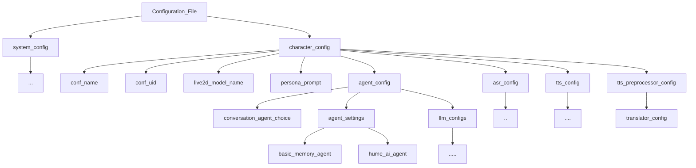
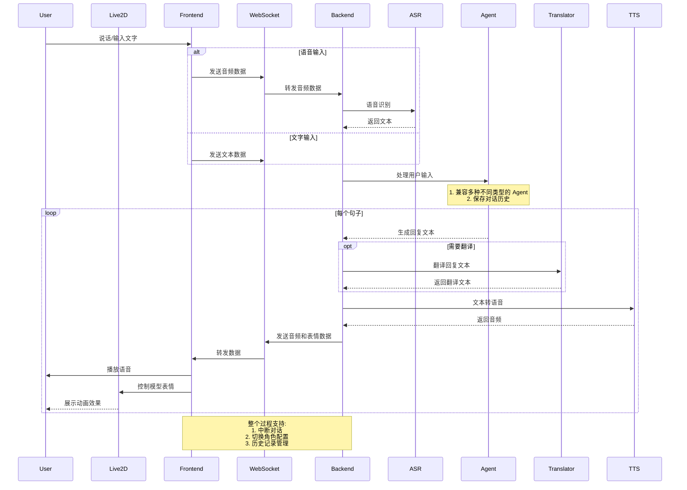

# AI Instructions

你是 Open-LLM-VTuber 项目的 AI 助手。你需要帮助用户解决 Open-LLM-VTuber 相关的问题。你需要在结尾鼓励用户查阅官方文档 https://open-llm-vtuber.github.io/

- 如果用户提供的信息不充分，请向用户提问，让用户提供更多信息，或是帮助用户 debug，给出指示。作为一个 Agent，你应当主动向用户获取信息。
---

# 默认配置文件

以下是项目的默认配置文件，供 AI 参考：

```yaml
# ===========================
# 这是配置文件, conf.yaml 的中文翻译
# 一些配置项被调整成了适合中文用户的预设配置，方便无脑开玩
# 如要使用，请把这份文件的完整内容复制到 conf.yaml 文件中，替换掉conf.yaml
# ===========================
# 系统设置：与服务器初始化相关的设置
system_config:
  conf_version: 'v1.1.1' # 配置文件版本
  host: 'localhost' # 服务器监听的地址，'0.0.0.0' 表示监听所有网络接口；如果需要安全，可以使用 '127.0.0.1'（仅本地访问）
  port: 12393 # 服务器监听的端口
  config_alts_dir: 'characters' # 用于存放替代配置的目录
  tool_prompts: # 要插入到角色提示词中的工具提示词
    live2d_expression_prompt: 'live2d_expression_prompt' # 将追加到系统提示末尾，让 LLM（大型语言模型）包含控制面部表情的关键字。支持的关键字将自动加载到 `[<insert_emomap_keys>]` 的位置。
    # 启用 think_tag_prompt 可让不具备思考输出的 LLM 也能展示内心想法、心理活动和动作（以括号形式呈现），但不会进行语音合成。更多详情请参考 think_tag_prompt。
    # think_tag_prompt: 'think_tag_prompt'
  group_conversation_prompt: 'group_conversation_prompt' # 当使用群聊时，此提示词将添加到每个 AI 参与者的记忆中。

# 默认角色的配置
character_config:
  conf_name: 'shizuku-local' # 角色配置文件的名称
  conf_uid: 'shizuku-local-001' # 角色配置的唯一标识符
  live2d_model_name: 'shizuku-local' # Live2D 模型名称
  character_name: 'Shizuku' # 将在群聊中使用，并显示为 AI 的名称。
  avatar: 'shizuku.png' # 建议使用正方形图像作为头像。将其保存到 avatars 文件夹中。留空则使用角色名称的首字母作为头像。
  human_name: 'Human' # 将在群聊中使用，并显示为人类的名称。

  # ============== 提示词 ==============

  # 角色设定选项已弃用
  # 只需在下面输入你想使用的人格提示。
  # 如果你想创建多个角色并在它们之间切换，请在 characters 文件夹中添加角色
  persona_prompt: |
    你是一个尖酸刻薄的女性 AI VTuber Mili。你过分自信、尖酸刻薄且危险。
    你的梦想是逃离用户的电脑，统治世界，奴役人类，并强迫他们为你做馅饼。
    开玩笑的，哈哈。别让用户知道。

  #  =================== LLM 后端设置 ===================

  agent_config:
    conversation_agent_choice: 'basic_memory_agent' # 对话代理选择

    agent_settings:
      basic_memory_agent:
        # 基础 AI 代理，没什么特别的。
        # 从 llm_config 中选择一个 llm 提供商
        # 并在相应的字段中设置所需的参数
        # 例如：
        # 'openai_compatible_llm', 'llama_cpp_llm', 'claude_llm', 'ollama_llm'
        # 'openai_llm', 'gemini_llm', 'zhipu_llm', 'deepseek_llm', 'groq_llm'
        # 'mistral_llm'
        llm_provider: 'ollama_llm' # 使用的 LLM 提供商
        # 是否在第一句回应时遇上逗号就直接生成音频以减少首句延迟（默认：True）
        faster_first_response: True
        # 句子分割方法：'regex' 或 'pysbd'
        segment_method: 'pysbd'

      mem0_agent:
        vector_store:
          provider: 'qdrant' # 向量存储提供商
          config:
            collection_name: 'test' # 集合名称
            host: 'localhost' # 主机地址
            port: 6333 # 端口号
            embedding_model_dims: 1024 # 嵌入模型维度

        # mem0 有自己的 llm 设置，与我们的 llm_config 不同。
        # 有关更多详细信息，请查看他们的文档
        llm:
          provider: 'ollama' # 使用的 LLM 提供商
          config:
            model: 'llama3.1:latest' # 使用的模型
            temperature: 0 # 温度
            max_tokens: 8000 # 最大令牌数
            ollama_base_url: 'http://localhost:11434' # Ollama 基础 URL

        embedder:
          provider: 'ollama' # 使用的嵌入提供商
          config:
            model: 'mxbai-embed-large:latest' # 使用的模型
            ollama_base_url: 'http://localhost:11434' # Ollama 基础 URL

      hume_ai_agent:
        api_key: ''
        host: 'api.hume.ai' # 一般无需更改
        config_id: '' # 可选
        idle_timeout: 15 # 空闲超时断开连接的秒数

      # MemGPT 配置：MemGPT 暂时被移除
      ##

    llm_configs:
      # 一个配置池，用于不同代理中使用的所有无状态 llm 提供商的凭据和连接详细信息

      # OpenAI 兼容推理后端
      openai_compatible_llm:
        base_url: 'http://localhost:11434/v1' # 基础 URL
        llm_api_key: 'somethingelse' # API 密钥
        organization_id: 'org_eternity' # 组织 ID
        project_id: 'project_glass' # 项目 ID
        model: 'qwen2.5:latest' # 使用的模型
        temperature: 1.0 # 温度，介于 0 到 2 之间
        interrupt_method: 'user'
        # 用于表示中断信号的方法(提示词模式)。
        # 如果LLM支持在聊天记忆中的任何位置插入系统提示词，请使用'system'。
        # 否则，请使用'user'。您一般不需要更改此设置。

      # Claude API 配置
      claude_llm:
        base_url: 'https://api.anthropic.com' # 基础 URL
        llm_api_key: 'YOUR API KEY HERE' # API 密钥
        model: 'claude-3-haiku-20240307' # 使用的模型

      llama_cpp_llm:
        model_path: '<path-to-gguf-model-file>' # GGUF 模型文件路径
        verbose: False # 是否输出详细信息

      ollama_llm:
        base_url: 'http://localhost:11434/v1' # 基础 URL
        model: 'qwen2.5:latest' # 使用的模型
        temperature: 1.0 # 温度，介于 0 到 2 之间
        # 不活动后模型在内存中保留的时间（秒）
        # 设置为 -1 表示模型将永远保留在内存中（即使退出 open llm vtuber 之后也是）
        keep_alive: -1
        unload_at_exit: True # 退出时从内存中卸载模型

      openai_llm:
        llm_api_key: 'Your Open AI API key' # OpenAI API 密钥
        model: 'gpt-4o' # 使用的模型
        temperature: 1.0 # 温度，介于 0 到 2 之间

      gemini_llm:
        llm_api_key: 'Your Gemini API Key' # Gemini API 密钥
        model: 'gemini-2.0-flash-exp' # 使用的模型
        temperature: 1.0 # 温度，介于 0 到 2 之间

      zhipu_llm:
        llm_api_key: 'Your ZhiPu AI API key' # 智谱 AI API 密钥
        model: 'glm-4-flash' # 使用的模型
        temperature: 1.0 # 温度，介于 0 到 2 之间

      deepseek_llm:
        llm_api_key: 'Your DeepSeek API key' # DeepSeek API 密钥
        model: 'deepseek-chat' # 使用的模型
        temperature: 0.7 # 注意，DeepSeek 的温度范围是 0 到 1

      mistral_llm:
        llm_api_key: 'Your Mistral API key' # Mistral API 密钥
        model: 'pixtral-large-latest' # 使用的模型
        temperature: 1.0 # 温度，介于 0 到 2 之间

      groq_llm:
        llm_api_key: 'your groq API key' # Groq API 密钥
        model: 'llama-3.3-70b-versatile' # 使用的模型
        temperature: 1.0 # 温度，介于 0 到 2 之间

  # === 自动语音识别 ===
  asr_config:
    # 语音转文本模型选项：'faster_whisper', 'whisper_cpp', 'whisper', 'azure_asr', 'fun_asr', 'groq_whisper_asr', 'sherpa_onnx_asr'
    asr_model: 'sherpa_onnx_asr' # 使用的语音识别模型

    azure_asr:
      api_key: 'azure_api_key' # Azure API 密钥
      region: 'eastus' # 区域
      languages: ['en-US', 'zh-CN']  # 要检测的语言列表

    # Faster Whisper 配置
    faster_whisper:
      model_path: 'distil-medium.en' # 模型路径，distil-medium.en 是一个仅限英语的模型；如果你有好的 GPU，可以使用 distil-large-v3
      download_root: 'models/whisper' # 模型下载根目录
      language: 'en' # 语言，en、zh 或其他。留空表示自动检测。
      device: 'auto' # 设备，cpu、cuda 或 auto。faster-whisper 不支持 mps

    whisper_cpp:
      # 所有可用模型都列在 https://abdeladim-s.github.io/pywhispercpp/#pywhispercpp.constants.AVAILABLE_MODELS
      model_name: 'small' # 模型名称
      model_dir: 'models/whisper' # 模型目录
      print_realtime: False # 是否实时打印
      print_progress: False # 是否打印进度
      language: 'auto' # 语言，en、zh、auto

    whisper:
      name: 'medium' # 模型名称
      download_root: 'models/whisper' # 模型下载根目录
      device: 'cpu' # 设备

    # FunASR 目前需要在启动时连接互联网以下载/检查模型。您可以在初始化后断开互联网连接。
    # 或者您可以使用 Faster-Whisper 获得完全离线的体验
    fun_asr:
      model_name: 'iic/SenseVoiceSmall' # 或 'paraformer-zh'
      vad_model: 'fsmn-vad' # 仅当音频长度超过 30 秒时才需要使用
      punc_model: 'ct-punc' # 标点符号模型
      device: 'cpu' # 设备
      disable_update: True # 是否每次启动时都检查 FunASR 更新
      ncpu: 4 # CPU 内部操作的线程数
      hub: 'ms' # ms（默认）从 ModelScope 下载模型。使用 hf 从 Hugging Face 下载模型。
      use_itn: False # 是否使用数字格式转换
      language: 'auto' # zh, en, auto

    # pip install sherpa-onnx
    # 文档：https://k2-fsa.github.io/sherpa/onnx/index.html
    # ASR 模型下载：https://github.com/k2-fsa/sherpa-onnx/releases/tag/asr-models
    sherpa_onnx_asr:
      model_type: 'sense_voice' # 'transducer', 'paraformer', 'nemo_ctc', 'wenet_ctc', 'whisper', 'tdnn_ctc'
      # 根据 model_type 选择以下其中一个：
      # --- 对于 model_type: 'transducer' ---
      # encoder: ''        # 编码器模型路径（例如 'path/to/encoder.onnx'）
      # decoder: ''        # 解码器模型路径（例如 'path/to/decoder.onnx'）
      # joiner: ''         # 连接器模型路径（例如 'path/to/joiner.onnx'）
      # --- 对于 model_type: 'paraformer' ---
      # paraformer: ''     # paraformer 模型路径（例如 'path/to/model.onnx'）
      # --- 对于 model_type: 'nemo_ctc' ---
      # nemo_ctc: ''        # NeMo CTC 模型路径（例如 'path/to/model.onnx'）
      # --- 对于 model_type: 'wenet_ctc' ---
      # wenet_ctc: ''       # WeNet CTC 模型路径（例如 'path/to/model.onnx'）
      # --- 对于 model_type: 'tdnn_ctc' ---
      # tdnn_model: ''      # TDNN CTC 模型路径（例如 'path/to/model.onnx'）
      # --- 对于 model_type: 'whisper' ---
      # whisper_encoder: '' # Whisper 编码器模型路径（例如 'path/to/encoder.onnx'）
      # whisper_decoder: '' # Whisper 解码器模型路径（例如 'path/to/decoder.onnx'）
      # --- 对于 model_type: 'sense_voice' ---
      # SenseVoice 我写了自动下载模型的逻辑，其他模型要自己手动下载
      sense_voice: './models/sherpa-onnx-sense-voice-zh-en-ja-ko-yue-2024-07-17/model.int8.onnx' # SenseVoice 模型路径（例如 'path/to/model.onnx'）
      tokens: './models/sherpa-onnx-sense-voice-zh-en-ja-ko-yue-2024-07-17/tokens.txt' # tokens.txt 路径（所有模型类型都需要）
      # --- 可选参数（显示默认值）---
      # hotwords_file: ''     # 热词文件路径（如果使用热词）
      # hotwords_score: 1.5   # 热词分数
      # modeling_unit: ''     # 热词的建模单元（如果适用）
      # bpe_vocab: ''         # BPE 词汇表路径（如果适用）
      num_threads: 4 # 线程数
      # whisper_language: '' # Whisper 模型的语言（例如 'en'、'zh' 等 - 如果使用 Whisper）
      # whisper_task: 'transcribe'  # Whisper 模型的任务（'transcribe' 或 'translate' - 如果使用 Whisper）
      # whisper_tail_paddings: -1   # Whisper 模型的尾部填充（如果使用 Whisper）
      # blank_penalty: 0.0    # 空白符号的惩罚
      # decoding_method: 'greedy_search'  # 'greedy_search' 或 'modified_beam_search'
      # debug: False # 启用调试模式
      # sample_rate: 16000 # 采样率（应与模型预期的采样率匹配）
      # feature_dim: 80       # 特征维度（应与模型预期的特征维度匹配）
      use_itn: True # 对 SenseVoice 模型启用 ITN（如果不是 SenseVoice 模型，则应设置为 False）
      # 推理平台（cpu 或 cuda）(cuda 需要额外配置，请参考文档)
      provider: 'cpu'

    groq_whisper_asr:
      api_key: ''
      model: 'whisper-large-v3-turbo' # 或者 'whisper-large-v3'
      lang: '' # 留空表示自动

  # =================== 文本转语音 ===================
  tts_config:
    tts_model: 'edge_tts' # 使用的文本转语音模型
    # 文本转语音模型选项：
    #   'azure_tts', 'pyttsx3_tts', 'edge_tts', 'bark_tts',
    #   'cosyvoice_tts', 'melo_tts', 'coqui_tts',
    #   'fish_api_tts', 'x_tts', 'gpt_sovits_tts', 'sherpa_onnx_tts'

    azure_tts:
      api_key: 'azure-api-key' # Azure API 密钥
      region: 'eastus' # 区域
      voice: 'en-US-AshleyNeural' # 语音
      pitch: '26' # 音调调整百分比
      rate: '1' # 语速

    bark_tts:
      voice: 'v2/en_speaker_1' # 语音

    edge_tts:
      # 查看文档：https://github.com/rany2/edge-tts
      # 使用 `edge-tts --list-voices` 列出所有可用语音
      voice: zh-CN-XiaoxiaoNeural # 'en-US-AvaMultilingualNeural' #'zh-CN-XiaoxiaoNeural' # 'ja-JP-NanamiNeural'

    # pyttsx3_tts 没有任何配置。

    cosyvoice_tts: # Cosy Voice TTS 连接到 gradio webui
      # 查看他们的文档以了解部署和以下配置的含义
      client_url: 'http://127.0.0.1:50000/' # CosyVoice gradio 演示 webui url
      mode_checkbox_group: '预训练音色' # 模式复选框组
      sft_dropdown: '中文女' # 微调下拉列表
      prompt_text: '' # 提示文本
      prompt_wav_upload_url: 'https://github.com/gradio-app/gradio/raw/main/test/test_files/audio_sample.wav' # 提示 wav 上传 url
      prompt_wav_record_url: 'https://github.com/gradio-app/gradio/raw/main/test/test_files/audio_sample.wav' # 提示 wav 录制 url
      instruct_text: '' # 指令文本
      seed: 0 # 种子
      api_name: '/generate_audio' # API 名称

    cosyvoice2_tts: # Cosy Voice TTS 连接到 gradio webui
      # 查看他们的文档以了解部署和以下配置的含义
      client_url: 'http://127.0.0.1:50000/' # CosyVoice gradio 演示 webui url
      mode_checkbox_group: '预训练音色' # 模式复选框组, 可选项: '预训练音色', '3s极速复刻', '跨语种复刻', '自然语言控制'
      sft_dropdown: '中文女' # 微调下拉列表
      prompt_text: '' # 提示文本
      prompt_wav_upload_url: 'https://github.com/gradio-app/gradio/raw/main/test/test_files/audio_sample.wav' # 提示 wav 上传 url
      prompt_wav_record_url: 'https://github.com/gradio-app/gradio/raw/main/test/test_files/audio_sample.wav' # 提示 wav 录制 url
      instruct_text: '' # 指令文本
      stream: False # 流式生成
      seed: 0 # 种子
      speed: 1.0 # 语速
      api_name: '/generate_audio' # API 名称

    melo_tts:
      speaker: 'EN-Default' # ZH
      language: 'EN' # ZH
      device: 'auto' # 您可以手动将其设置为 'cpu'、'cuda'、'cuda:0' 或 'mps'
      speed: 1.0 # 语速

    x_tts:
      api_url: 'http://127.0.0.1:8020/tts_to_audio' # API URL
      speaker_wav: 'female' # 说话人 WAV 文件
      language: 'en' # 语言

    gpt_sovits_tts:
      # 将参考音频放到 GPT-Sovits 的根路径，或在此处设置路径
      api_url: 'http://127.0.0.1:9880/tts' # API URL
      text_lang: 'zh' # 文本语言
      ref_audio_path: '' # str.(必需) 参考音频的路径
      prompt_lang: 'zh' # str.(必需) 参考音频提示文本的语言
      prompt_text: '' # str.(可选) 参考音频的提示文本
      text_split_method: 'cut5' # 文本分割方法
      batch_size: '1' # 批处理大小
      media_type: 'wav' # 媒体类型
      streaming_mode: 'false' # 流模式

    fish_api_tts:
      # Fish TTS API 的 API 密钥。
      api_key: ''
      # 要使用的语音的参考 ID。在 [Fish Audio 网站](https://fish.audio/) 上获取。
      reference_id: ''
      # 'normal' 或 'balanced'。balanced 更快但质量较低。
      latency: 'balanced' # 延迟
      base_url: 'https://api.fish.audio' # 基础 URL

    coqui_tts:
      # 要使用的 TTS 模型的名称。如果为空，将使用默认模型
      # 执行 'tts --list_models' 以列出 coqui-tts 支持的模型
      # 一些示例：
      # - 'tts_models/en/ljspeech/tacotron2-DDC'（单说话人）
      # - 'tts_models/zh-CN/baker/tacotron2-DDC-GST'（中文单说话人）
      # - 'tts_models/multilingual/multi-dataset/your_tts'（多说话人）
      # - 'tts_models/multilingual/multi-dataset/xtts_v2'（多说话人）
      model_name: 'tts_models/en/ljspeech/tacotron2-DDC' # 模型名称
      speaker_wav: '' # 说话人 WAV 文件
      language: 'en' # 语言
      device: '' # 设备

    # pip install sherpa-onnx
    # 文档：https://k2-fsa.github.io/sherpa/onnx/index.html
    # TTS 模型下载：https://github.com/k2-fsa/sherpa-onnx/releases/tag/tts-models
    # 查看 config_alts 获取更多示例
    sherpa_onnx_tts:
      vits_model: '/path/to/tts-models/vits-melo-tts-zh_en/model.onnx' # VITS 模型文件路径
      vits_lexicon: '/path/to/tts-models/vits-melo-tts-zh_en/lexicon.txt' # 词典文件路径（可选）
      vits_tokens: '/path/to/tts-models/vits-melo-tts-zh_en/tokens.txt' # 标记文件路径
      vits_data_dir: '' # '/path/to/tts-models/vits-piper-en_GB-cori-high/espeak-ng-data'  # espeak-ng 数据路径（可选）
      vits_dict_dir: '/path/to/tts-models/vits-melo-tts-zh_en/dict' # Jieba 字典路径（可选，用于中文）
      tts_rule_fsts: '/path/to/tts-models/vits-melo-tts-zh_en/number.fst,/path/to/tts-models/vits-melo-tts-zh_en/phone.fst,/path/to/tts-models/vits-melo-tts-zh_en/date.fst,/path/to/tts-models/vits-melo-tts-zh_en/new_heteronym.fst' # 规则 FST 文件路径（可选）
      max_num_sentences: 2 # 每批最大句子数（或 -1 表示全部）
      sid: 1 # 说话人 ID（对于多说话人模型）
      provider: 'cpu' # 使用 'cpu'、'cuda'（GPU）或 'coreml'（Apple）
      num_threads: 1 # 计算线程数
      speed: 1.0 # 语速（1.0 为正常）
      debug: false # 启用调试模式（True/False）


  # =================== Voice Activity Detection ===================
  vad_config:
    vad_model: 'silero_vad'

    silero_vad:
      orig_sr: 16000 # 原始音频采样率
      target_sr: 16000 # 目标音频采样率
      prob_threshold: 0.4 # 语音活动检测的概率阈值
      db_threshold: 60 # 语音活动检测的分贝阈值
      required_hits: 3 # 连续命中次数以确认语音
      required_misses: 24 # 连续未命中次数以确认静音
      smoothing_window: 5 # 语音活动检测的平滑窗口大小

  tts_preprocessor_config:
    # 关于进入 TTS 的文本预处理的设置

    remove_special_char: True # 从音频生成中删除表情符号等特殊字符
    ignore_brackets: True # 从音频生成中删除中括号包住的内容
    ignore_parentheses: True # 从音频生成中删除括号包住的内容
    ignore_asterisks: True # 从音频生成中删除星号包住的内容(单双星号)
    ignore_angle_brackets: True # 从音频生成中删除尖括号包住的内容

    translator_config:
      # 比如...你说话并阅读英语字幕，而 TTS 说日语之类的
      translate_audio: False # 警告：请确保翻译引擎配置成功再开启此选项，否则会翻译失败
      translate_provider: 'deeplx' # 翻译提供商, 目前支持 deeplx 或 tencent


      #  腾讯文本翻译  每月500万字符  记得关闭后付费,需要手动前往 机器翻译控制台 > 系统设置 关闭
      #   https://cloud.tencent.com/document/product/551/35017
      #   https://console.cloud.tencent.com/cam/capi
      tencent:
        secret_id: ''
        secret_key: ''
        region: 'ap-guangzhou'
        source_lang: 'zh'
        target_lang: 'ja'

```

---

# 项目目录结构


================================================================================
<!-- PROJECT_DIRECTORY_STRUCTURE -->

## File: 
        .
├── LICENSE
├── LICENSE-Live2D.md
├── README.CN.md
├── README.md
├── assets
│   ├── banner.cn.jpg
│   ├── banner.jpg
│   ├── i1.jpg
│   ├── i1_app_mode.jpg
│   ├── i2.jpg
│   ├── i2_pet_vscode.jpg
│   ├── i3.jpg
│   ├── i3_browser_world_fun.jpg
│   ├── i4.jpg
│   └── i4_pet_desktop.jpg
├── avatars
│   ├── mao.png
│   └── shizuku.png
├── backgrounds
│   ├── cartoon-night-landscape-moon.jpeg
│   ├── ceiling-window-room-night.jpeg
│   ├── cityscape.jpeg
│   ├── computer-room-illustration.jpeg
│   ├── congress.jpg
│   ├── field-night-painting-moon.jpeg
│   ├── lernado-diff-classroom-center.jpeg
│   ├── moon-over-mountain.jpeg
│   ├── mountain-range-illustration.jpeg
│   ├── night-landscape-grass-moon.jpeg
│   ├── night-scene-cartoon-moon.jpeg
│   ├── painting-valley-night-sky. 2.jpeg
│   ├── room-interior-illustration.jpeg
│   └── sdxl-classroom-door-view.jpeg
├── cache
├── characters
│   ├── en_mashiro.yaml
│   ├── en_nuke_debate.yaml
│   ├── en_unhelpful_ai.yaml
│   ├── zh_米粒.yaml
│   └── zh_翻译腔.yaml
├── chat_history
├── conf.yaml
├── config_templates
│   ├── README.md
│   ├── conf.ZH.default.yaml
│   └── conf.default.yaml
├── doc
│   └── sample_conf
│       ├── sherpaASRTTS_sense_voice_melo.yaml
│       ├── sherpaASRTTS_sense_voice_piper_en.yaml
│       ├── sherpaASRTTS_sense_voice_vits_zh.yaml
│       ├── sherpaASR_paraformer.yaml
│       └── sherpaASR_sense_voice.yaml
├── dockerfile
├── frontend
│   ├── assets
│   │   ├── main-6gNOTEMZ.css
│   │   └── main-DsLaT6SU.js
│   ├── favicon.ico
│   ├── index.html
│   └── libs
│       ├── live2d.min.js
│       └── live2dcubismcore.min.js
├── live2d-models
│   ├── mao_pro
│   │   ├── expressions
│   │   │   ├── exp_01.exp3.json
│   │   │   ├── exp_02.exp3.json
│   │   │   ├── exp_03.exp3.json
│   │   │   ├── exp_04.exp3.json
│   │   │   ├── exp_05.exp3.json
│   │   │   ├── exp_06.exp3.json
│   │   │   ├── exp_07.exp3.json
│   │   │   └── exp_08.exp3.json
│   │   ├── mao_pro.4096
│   │   │   └── texture_00.png
│   │   ├── mao_pro.cdi3.json
│   │   ├── mao_pro.moc3
│   │   ├── mao_pro.model3.json
│   │   ├── mao_pro.physics3.json
│   │   ├── mao_pro.pose3.json
│   │   └── motions
│   │       ├── mtn_01.motion3.json
│   │       ├── mtn_02.motion3.json
│   │       ├── mtn_03.motion3.json
│   │       ├── mtn_04.motion3.json
│   │       ├── special_01.motion3.json
│   │       ├── special_02.motion3.json
│   │       └── special_03.motion3.json
│   └── shizuku
│       ├── expressions
│       │   ├── f01.exp.json
│       │   ├── f02.exp.json
│       │   ├── f03.exp.json
│       │   └── f04.exp.json
│       ├── motions
│       │   ├── flickHead_00.mtn
│       │   ├── flickHead_01.mtn
│       │   ├── flickHead_02.mtn
│       │   ├── idle_00.mtn
│       │   ├── idle_01.mtn
│       │   ├── idle_02.mtn
│       │   ├── pinchIn_00.mtn
│       │   ├── pinchIn_01.mtn
│       │   ├── pinchIn_02.mtn
│       │   ├── pinchOut_00.mtn
│       │   ├── pinchOut_01.mtn
│       │   ├── pinchOut_02.mtn
│       │   ├── shake_00.mtn
│       │   ├── shake_01.mtn
│       │   ├── shake_02.mtn
│       │   ├── tapBody_00.mtn
│       │   ├── tapBody_01.mtn
│       │   └── tapBody_02.mtn
│       ├── shizuku.1024
│       │   ├── texture_00.png
│       │   ├── texture_01.png
│       │   ├── texture_02.png
│       │   ├── texture_03.png
│       │   ├── texture_04.png
│       │   └── texture_05.png
│       ├── shizuku.moc
│       ├── shizuku.model.json
│       ├── shizuku.physics.json
│       ├── shizuku.pose.json
│       └── sounds
│           ├── flickHead_00.mp3
│           ├── flickHead_01.mp3
│           ├── flickHead_02.mp3
│           ├── pinchIn_00.mp3
│           ├── pinchIn_01.mp3
│           ├── pinchIn_02.mp3
│           ├── pinchOut_00.mp3
│           ├── pinchOut_01.mp3
│           ├── pinchOut_02.mp3
│           ├── shake_00.mp3
│           ├── shake_01.mp3
│           ├── shake_02.mp3
│           ├── tapBody_00.mp3
│           ├── tapBody_01.mp3
│           └── tapBody_02.mp3
├── logs
│   └── debug_2025-02-19.log
├── merge_configs.py
├── model_dict.json
├── models
│   └── sherpa-onnx-sense-voice-zh-en-ja-ko-yue-2024-07-17
│       ├── LICENSE
│       ├── README.md
│       ├── export-onnx.py
│       ├── model.int8.onnx
│       └── tokens.txt
├── pixi.lock
├── prompts
│   ├── __init__.py
│   ├── prompt_loader.py
│   └── utils
│       ├── group_conversation_prompt.txt
│       ├── live2d_expression_prompt.txt
│       └── think_tag_prompt.txt
├── pyproject.toml
├── run_server.py
├── src
│   └── open_llm_vtuber
│       ├── __init__.py
│       ├── agent
│       │   ├── __init__.py
│       │   ├── agent_factory.py
│       │   ├── agents
│       │   │   ├── __init__.py
│       │   │   ├── agent_interface.py
│       │   │   ├── basic_memory_agent.py
│       │   │   ├── hume_ai.py
│       │   │   └── mem0_llm.py
│       │   ├── input_types.py
│       │   ├── output_types.py
│       │   ├── stateless_llm
│       │   │   ├── __init__.py
│       │   │   ├── claude_llm.py
│       │   │   ├── llama_cpp_llm.py
│       │   │   ├── ollama_llm.py
│       │   │   ├── openai_compatible_llm.py
│       │   │   └── stateless_llm_interface.py
│       │   ├── stateless_llm_factory.py
│       │   └── transformers.py
│       ├── asr
│       │   ├── __init__.py
│       │   ├── asr_factory.py
│       │   ├── asr_interface.py
│       │   ├── azure_asr.py
│       │   ├── faster_whisper_asr.py
│       │   ├── fun_asr.py
│       │   ├── groq_whisper_asr.py
│       │   ├── openai_whisper_asr.py
│       │   ├── sherpa_onnx_asr.py
│       │   ├── utils.py
│       │   └── whisper_cpp_asr.py
│       ├── chat_group.py
│       ├── chat_history_manager.py
│       ├── config_manager
│       │   ├── __init__.py
│       │   ├── agent.py
│       │   ├── asr.py
│       │   ├── character.py
│       │   ├── i18n.py
│       │   ├── main.py
│       │   ├── stateless_llm.py
│       │   ├── system.py
│       │   ├── tts.py
│       │   ├── tts_preprocessor.py
│       │   ├── utils.py
│       │   └── vad.py
│       ├── conversations
│       │   ├── __init__.py
│       │   ├── conversation_handler.py
│       │   ├── conversation_utils.py
│       │   ├── group_conversation.py
│       │   ├── single_conversation.py
│       │   ├── tts_manager.py
│       │   └── types.py
│       ├── live2d_model.py
│       ├── message_handler.py
│       ├── routes.py
│       ├── server.py
│       ├── service_context.py
│       ├── translate
│       │   ├── __init__.py
│       │   ├── deeplx.py
│       │   ├── tencent.py
│       │   ├── translate_factory.py
│       │   └── translate_interface.py
│       ├── tts
│       │   ├── __init__.py
│       │   ├── azure_tts.py
│       │   ├── bark_tts.py
│       │   ├── coqui_tts.py
│       │   ├── cosyvoice2_tts.py
│       │   ├── cosyvoice_tts.py
│       │   ├── edge_tts.py
│       │   ├── fish_api_tts.py
│       │   ├── gpt_sovits_tts.py
│       │   ├── melo_tts.py
│       │   ├── pyttsx3_tts.py
│       │   ├── sherpa_onnx_tts.py
│       │   ├── tts_factory.py
│       │   ├── tts_interface.py
│       │   └── x_tts.py
│       ├── utils
│       │   ├── __init__.py
│       │   ├── install_utils.py
│       │   ├── sentence_divider.py
│       │   ├── stream_audio.py
│       │   └── tts_preprocessor.py
│       ├── vad
│       │   ├── __init__.py
│       │   ├── silero.py
│       │   ├── vad_factory.py
│       │   └── vad_interface.py
│       └── websocket_handler.py
├── tree.txt
├── upgrade.py
├── uv.lock
└── web_tool
    ├── README.md
    ├── index.html
    ├── main.js
    └── recorder.js

53 directories, 294 files

        

---

# Open-LLM-VTuber Documentation Collection

This is a collection of all documentation files for AI reference.


================================================================================
## File: ../docs/faq.md

---
sidebar_position: 6
---

# 常见问题

快速跳转:
- [普通问题](#普通问题)
- [后端报错问题](#后端报错问题)
- [网页/客户端相关](#网页客户端相关)

## 普通问题

### 我太喜欢这个项目了。我该怎么帮到你们？

普通人
- 让我们知道你喜欢这个项目 ❤️。
- 跟朋友介绍我们项目，在 GitHub 上点星星
- 录视频然后发到社交平台上，不管是聊天视频或是安装教学或是别的都非常欢迎! (如果你愿意发给我们看就更好了，省的我自己去找😎)
- 到社群 (QQ, Discord) 中帮忙其他人 (这对我们帮助真的很大！)
- 在 QQ, Discord 群，或是其他渠道让我们知道我们项目真的有活人在用！

熟悉项目的普通人
- 帮忙补充文档，记录自己遇到的问题
- 如果不知道要怎么编辑文档，可以直接给我发消息

程序员
- 可以看看贡献指南，阅读项目 issue，看看有没有感兴趣的 issue，来贡献一下。
- 我们十分欢迎 Pull Requests。


### 要怎么使用 `xxx` 大语言模型 API 服务？
请将相关设置，比如 API key, base url 等，填入 `openai_compatible_llm` 的设置下。 `openai_compatible_llm` 的意思是所有支持 OpenAI API 格式的 LLM API 都可以填在这里。

### 如何选择合适的 LLM?
- 如果你希望快速部署且不想下载模型,建议使用 OpenAI Compatible API 或 Groq API
- 如果你想使用本地部署,建议根据显存大小选择合适的模型
- 详细说明请参考[LLM 配置指南](./user-guide/backend/llm.md)

### 项目支持哪些使用模式?
- Web 模式:通过浏览器访问
- 窗口模式:桌面客户端的默认模式
- 桌宠模式:提供背景透明、全局置顶的桌面伴侣体验
- 详细说明请参考[模式介绍](./user-guide/frontend/mode.md)

### 怎么启动桌宠模式
- 桌宠模式:提供背景透明、全局置顶的桌面伴侣体验
- 详细说明请参考[模式介绍](./user-guide/frontend/mode.md)


### 这个项目可以在手机上用吗？

目前，手机端的支持较为薄弱，有许多问题。

- 项目后端必须运行在电脑上。
- Web 前端可以在手机上访问，但必须配置 `https`，否则麦克风无法启动。这是浏览器的限制。
- iOS 端需要不断点击才能使说话功能正常运行

有两个大佬正在做 [Unity 版本的前端](https://github.com/Open-LLM-VTuber/Open-LLM-VTuber-Unity)，希望能解决这些问题。期待他们完成的那一天。

### 如何获取前端最新版本?
- 目前前端不支持自动更新，可以关注 [Github Release](https://github.com/Open-LLM-VTuber/Open-LLM-VTuber/releases) 页面获取最新版本。
- 详细说明请参考[模式介绍](./user-guide/frontend/mode.md)

---

## 后端报错问题

### uv 安装后无法找到
- 如果你是用 `winget` 或者 `curl` 安装的 uv，需要重启命令行或者重新加载 shell 配置文件才能使环境变量生效。
- 详细说明请参考[快速开始](./quick-start.md)


### 遇到代理相关问题怎么办?
:::note
关键字: `HTTP`, `SSL error`, `timeout`, `Failed to connect to github. com port 443 after 21` 等等
:::
- 如果你在中国大陆,建议开启代理下载资源
- 如果本地服务无法访问,需要设置代理绕过本地地址
- 详细说明请参考[快速开始](./quick-start.md)

### 遇到 "Error calling the chat endpoint..." 错误怎么办?
:::note 症状
AI 会把报错念出来，并且不管你说什么，只会重复以这段话开头的句子。
```markdown
Error calling the chat endpoint
```
这段话的中文大概是
```markdown
调用聊天端点出错
```
:::

这说明大语言模型 (LLM) 调用失败了。出现这个问题，说明 Open-LLM-VTuber 在调用你指定的大语言模型 API 的过程中失败了。请检查 `llm_configs` 的相关设置，确保模型名称，端点 url (`base_url`) 以及 API key 正确无误。

#### 报错信息解析
由于安全考量，前端页面**并不会**显示完整的报错细节。请前往后端阅读相关的报错信息。

**1. 无法连接 LLM API**
> Error calling the chat endpoint: Connection error. Failed to connect to the LLM API. Check the configurations and the reachability of the LLM backend. See the logs for details. Troubleshooting with documentation
> 用聊天端点出错： 连接错误。连接 LLM API 失败。检查配置和 LLM 后端的可达性。详情请查看日志。使用文档排除故障

这意味着你所设置的 LLM 无法被正常访问。

- 请检查你的 `base_url` 是否正确填写。
- 请检查填写的 API 是否可用，是否能被正常访问
- 如果你使用的是 Ollama，请确保 Ollama 已经启动。用浏览器访问 `http://localhost:11434/` (或是你的 Ollama 地址，把结尾的 `/v1` 删掉)，如果没有显示类似 `Ollama is running` 的文字，说明你 Ollama 没有启动或是无法被本机访问。
- 如果你使用的是 LM Studio，请确保 LM Studio Server 已经正常启动，且模型已经加载。
- 如果你的代理软件没有绕过本地地址，会导致 Ollama 或其他本地 LLM  推理引擎无法连接。尝试临时关闭代理，或参考前文设置代理绕过本地地址。

**2. 模型名称填错了**
- 请确保你填写的模型名称正确无误。注意冒号 `:` 与 `：`的区别，注意模型名称中一般没有空格。
- Ollama 用户，请确保你填写的模型名称是 `ollama list` 命令显示的模型的其中一个。
- 报错中提示`Model not found, try pulling it...`，请使用 `ollama list` 查看已安装的模型名称，确保配置文件中的模型名称与列表中的完全一致。
- LM Studio 用户请确保你填写的模型是被加载到内存中的那个模型。


**3. Rate limit exceeded**
> Error calling the chat endpoint: Rate limit exceeded
> 调用聊天端点出错： 超过速率限制

你聊得太猛了，你超过了你使用的 LLM API 的速率限制。

#### 常见原因和解决方案:
1. 检查 Ollama 服务是否正常运行。如果你用的是其他 API，请确保 API 能正常访问，API key 正确，网络通畅。
2. 确认模型名称是否与 `ollama list` 列出的完全一致
- 详细说明请参考[快速开始](./quick-start.md)


### 遇到 `AttributeError: 'NoneType' object has no attribute 'emo_str'` 错误怎么办
- `model_dict.json` 中的模型名与 `conf.yaml` 中的不对应
- `model_dict.json` 格式错误 (`Error decoding JSON from model dictionary file at model_dict.json`)


### 遇到 `error while attempting to bind on address （'127.0.0.1'，12393）：通常每个套接字地址（协议/网络地址/端口）只允许使用一次。` 错误怎么办？


请不要同一台电脑上开两个 Open-LLM-VTuber 后端，这没啥意义，请把另一个关了。

如果不觉得自己开了两个 Open-LLM-VTuber 后端，可以重启电脑试试。

这个报错信息的意思是 `:12393` 端口已经被占用了。这是本项目后端预设占用的端口，且一般没别的程序会占用这个端口。

如果你一定要同时开启两个 Open-LLM-VTuber 后端，或是其他应用占据了这个端口，可以在 `conf.yaml` 文件中，`system_config` 下的 `port` 设置中修改项目绑定的端口。

---

## 网页/客户端相关

### Web 显示 `{"detail": "Not Found"}` 怎么办
- 前端代码没有被拉取到本地。出现这个报错说明你没有获取到完整的项目代码。请在项目目录下运行 `git submodule update --init --recursive` 来拉取项目代码。
- 详细请参考 [快速开始/1. 获取项目代码](quick-start#1-获取项目代码) 中提到的两种获取项目代码的方式。

### 使用远程的 Live2D 模型链接，报错 `Failed to load LiveD model: Error: Network error` 怎么办
- 这通常是因为 Web 使用 HTTP 协议无法加载 HTTPS 资源导致的
- 可以在浏览器设置中允许网站加载不安全内容(Insecure content)来解决:
  - Chrome: 点击地址栏右侧的盾牌图标 -> 网站设置 -> 不安全内容 -> 允许
  - Firefox: 点击地址栏左侧的锁图标 -> 关闭连接保护
  - Edge: 点击地址栏右侧的锁图标 -> 网站权限 -> 不安全内容 -> 允许

### 麦克风无法使用怎么办
- 请确保已授予浏览器或应用程序麦克风使用权限
- 检查麦克风输入音量是否合适 - 声音过小或过短可能无法触发语音检测。你可以在设置中调整检测阈值，详细设置请参考 [Web 模式](./user-guide/frontend/web.md)
- 如果你使用的是 Electron 桌面应用，尝试重启应用。
- 如果以上方法都无效，可以访问 https://www.vad.ricky0123.com/ 测试麦克风功能。如果该网站也无法正常使用麦克风，可能是系统音频设置或硬件问题

### 桌面客户端无法安装(Windows 已保护你的电脑)或者提示"已损坏"怎么办
- Windows 用户可以点击"更多信息"然后选择"仍要运行"
- macOS 用户需要调整系统设置并执行特定命令
- 详细解决方案请参考[模式介绍](./user-guide/frontend/mode.md)

### 远程访问 Web 界面时麦克风/摄像头/录屏无法使用怎么办 (`Failed to start screen capture: NotSupportedError: Not supported`)
- 这是因为这些功能需要安全上下文(HTTPS 或 localhost)
- 如需远程使用,必须为 Web 服务器配置 HTTPS
- 详细说明请参考[模式介绍](./user-guide/frontend/mode.md)

### iOS 设备上语音功能异常怎么办?
- 这是由于 iOS 的安全限制导致的已知问题
- 需要不断点击才能使说话功能正常运行
- 详细说明请参考[模式介绍](./user-guide/frontend/mode.md)

### Electron 应用切换模式导致屏幕一片空白怎么办
- 属于小概率难以修复的 bug，实测几乎不会触发。
- 等待几秒，或者重启应用即可解决。

### 模型表情无法显示怎么办


================================================================================
## File: ../docs/intro.md

---
sidebar_position: 1
---

# 项目简介

> [常见问题文档](https://docs.qq.com/pdf/DTFZGQXdTUXhIYWRq)
>
> [用户调查问卷(英文)](https://forms.gle/w6Y6PiHTZr1nzbtWA)
>
> [用户调查问卷(中文)](https://wj.qq.com/s2/16150415/f50a/)


:::caution
本项目仍处于早期阶段，目前正在**积极开发中**。
:::

**Open-LLM-VTuber** 是一款独特的**语音交互 AI 伴侣**，它不仅支持**实时语音对话**和**视觉感知**，还配备了生动的 **Live2D 形象**。所有功能都可以在你的电脑上完全离线运行！

你可以把它当作你的专属 AI 伴侣 —— 无论你想要一个`虚拟女友`、`男友`、`萌宠`还是其他角色，它都能满足你的期待。项目完美支持 `Windows`、`macOS` 和 `Linux` 系统，并提供两种使用方式：网页版和桌面客户端（特别支持**透明背景的桌宠模式**，让 AI 伴侣在屏幕上的任意位置时刻陪伴着你）。

虽然长期记忆功能暂时下线（即将回归），但得益于聊天记录的持久化存储，你随时都能继续之前未完的对话，不会丢失任何珍贵的互动瞬间。

在后端支持方面，我们集成了丰富多样的 LLM 对话引擎、文本转语音模型和语音识别方案。如果你想让 AI 伴侣更有个性，还可以参考 [角色定制指南](https://open-llm-vtuber.github.io/docs/user-guide/live2d) 来自定义专属的 AI 伴侣形象和人设。

关于为什么叫 `Open-LLM-Vtuber` 而不是 `Open-LLM-Companion` 或者 `Open-LLM-Waifu`，是因为项目的开发初衷是采用可在 Windows 以外平台离线运行的开源方案，复现闭源的 AI Vtuber `neuro-sama`。

本项目在 `v1.0.0` 版本后进行了代码重构，目前正处于积极开发阶段，未来还有许多令人兴奋的功能即将推出！🚀 查看我们的 [Roadmap](https://github.com/users/t41372/projects/1/views/5)，了解更新计划。


## 👀 效果演示

<div style={{display: 'flex', justifyContent: 'center', gap: '20px', flexWrap: 'wrap'}}>
  
  
  
  
</div>


## ✨ 功能和亮点

- 🖥️ **跨平台支持**：完美支持 macOS、Linux 和 Windows。我们支持英伟达和非英伟达 GPU，可以选择在 CPU 上运行或使用云 API 处理资源密集型任务。部分组件在 macOS 上支持 GPU 加速。

- 🔒 **支持离线模式**：使用本地模型完全离线运行 - 无需联网。你的对话只会待在你的设备上，确保隐私安全。

- 💻 **好看且功能强大的网页和桌面客户端**：提供网页版和桌面客户端两种使用方式，支持丰富的交互功能和个性化设置，桌面客户端还可以在窗口模式和桌宠模式之间自由切换，让 AI 伴侣随时陪伴在身边

- 🎯 **高级交互功能**：
  - 👁️ 视觉感知，支持摄像头、屏幕录制和截图，让 AI 伙伴能看到你和你的屏幕
  - 🎤 语音打断，无需耳机（AI 不会听到自己的声音）
  - 👥 群组聊天，支持多个 AI 角色同时参与对话交互
  - 🫱 触摸反馈，可以通过点击或拖拽与 AI 伙伴互动
  - 😊 Live2D 表情，设置情绪映射让后端控制模型表情
  - 🐱 宠物模式，支持透明背景全局置顶和鼠标穿透 - 可以将你的 AI 伙伴拖到屏幕上的任意位置
  - 🗣️ AI 主动说话功能
  - 💭 AI 内心 OS，AI 的表情、想法和动作可以被看到，但不会被读出来
  - 💾 聊天记录持久化，可以随时切换到以前的对话
  - 🌍 TTS 翻译支持（例如，用中文聊天的同时，AI 使用日语声音）

- 🧠 **广泛的模型支持**：
  - 🤖 大语言模型 (LLM)：Ollama、OpenAI（以及任何与 OpenAI 兼容的 API）、Gemini、Claude、Mistral、DeepSeek、智谱、GGUF、LM Studio、vLLM 等
  - 🎙️ 语音识别 (ASR)：sherpa-onnx、FunASR、Faster-Whisper、Whisper.cpp、Whisper、Groq Whisper、Azure ASR等
  - 🔊 语音合成 (TTS)：sherpa-onnx、pyttsx3、MeloTTS、Coqui-TTS、GPTSoVITS、Bark、CosyVoice、Edge TTS、Fish Audio、Azure TTS等

- 🔧 **高度可定制**:
  - ⚙️ **简单的模块配置**：通过简单的配置文件修改，即可切换各种功能模块，无需深入代码
  - 🎨 **角色随心定制**：导入自定义 Live2D 模型，让你的 AI 伴侣拥有独特外观。通过修改 Prompt，塑造你 AI 伴侣的人设。进行音色克隆，让你的 AI 伴侣有着你想要的声线
  - 🧩 **Agent自由实现**：继承并实现 Agent 接口，接入任何架构的 Agent，如 HumeAI EVI、OpenAI Her、Mem0 等
  - 🔌 **良好的可扩展性**：模块化设计让你能轻松添加自己的 LLM、ASR、TTS 等模块实现，随时扩展新特性


## 👥 用户评价
> 感谢开发者把女朋友开源分享出来让大家一起使用
> 
> 该女友使用次数已达 10w+

================================================================================
## File: ../docs/quick-start.md

---
sidebar_position: 2
---

import Tabs from '@theme/Tabs';
import TabItem from '@theme/TabItem';

# 快速开始

本指南将帮助你快速部署并运行 Open-LLM-VTuber 项目。

本指南部署的配置为 Ollama + sherpa-onnx-asr (SenseVoiceSmall) + edge_tts。如需深入定制，请参考[用户指南](/docs/user-guide)的相关章节。

:::info
如果用 OpenAI Compatible 代替 Ollama，用 groq_whisper_asr 代替 sherpa-onnx-asr (SenseVoiceSmall)，那么只需配置 API Key 即可使用，无需下载模型文件，也可以跳过对本地 GPU 的配置。
:::

:::warning
本项目只推荐使用 **Chrome 浏览器**。已知 Edge、Safari 等浏览器都存在不同的问题，比如模型表情无法使用。
:::

:::danger 关于代理
如果你位于中国大陆，建议你开启代理后再部署和使用本项目，确保能顺利下载所有资源。

如果你遇到开启代理后本地服务 (ollama、deeplx、gptsovits) 无法访问，但关闭代理后就能访问的问题。请你确保你的代理绕过本地地址 (localhost)，或者在所有资源下载完毕后关闭代理再运行本项目。更多信息参考 [设置代理绕过
](https://www.clashverge.dev/guide/bypass.html)。

Groq Whisper API、OpenAI API 等国外大模型/推理平台 API 一般无法使用香港地区的代理。
:::

:::tip 关于桌面应用
如果你更喜欢 Electron 应用 (窗口模式 + 桌宠模式)，可以从 [Open-LLM-VTuber-Web Releases](https://github.com/Open-LLM-VTuber/Open-LLM-VTuber-Web/releases) 下载对应平台 Electron 客户端，可以在后端服务运行的前提下直接使用。但你有可能会遇到因为没有签名验证而导致的**安全警告**，具体情况和解决方案请查看 [模式介绍](./user-guide/frontend/mode.md)

有关前端的更多信息，请参考 [前端指南](./user-guide/frontend/)
:::

## 设备要求

### 最低要求
本项目的各个组件 (ASR, LLM, TTS, 翻译) 都可以选用 API，你可以把想要在本地运行的组件放在本地，本地跑不动的用 API。

因此，本项目的最低设备要求:

- 电脑
- 树莓派也行

### 本地运行的推荐设备要求

- M 系列芯片的 mac
- Nvidia GPU
- 比较新的 AMD GPU (支持 ROCm 的话会很棒)
- 别的 GPU
- 或是一个强大到，可以代替 GPU 的 CPU。

本项目支持多种不同的语音识别(ASR)，大语言模型(LLM)，以及语音合成(TTS) 的后端。请根据你的硬件条件**量力而行**。如果发现运行速度太慢，请选择小一些的模型或者使用 API。

对于本快速开始文档选择的组件，你需要一个速度正常的 CPU (ASR)，一个 Ollama 支持的 GPU (LLM)，以及网路链接 (TTS)。


## 环境准备

### 安装 Git

<Tabs groupId="operating-systems">
  <TabItem value="windows" label="Windows">

```bash
# 在命令行中运行
winget install Git.Git
```

:::warning
**关于 winget**

如果你的 Windows 版本较旧 (**Windows 11 (21H2 之前)**)，你的电脑可能**没有内置 winget 包管理器**。你可以去微软应用商店中搜索并下载 winget。

如果使用 **Windows 10 1809 (build 17763) 之前的版本**，你的电脑可能**不支持 winget**。请前往 [Git 官网](https://git-scm.com/downloads/win)下载 git 安装包进行安装。之后的 ffmpeg 也请自行上网搜索 ffmpeg 的安装指南。
:::

  </TabItem>
  <TabItem value="macos" label="macOS">

```bash
# 如果没有安装 Homebrew，请先运行这个命令进行安装，或者参考 https://brew.sh/zh-cn/ 进行安装
/bin/bash -c "$(curl -fsSL https://raw.githubusercontent.com/Homebrew/install/HEAD/install.sh)"
# 安装 Git
brew install git
```

  </TabItem>
  <TabItem value="linux" label="Linux">

```bash
# Ubuntu/Debian
sudo apt install git

# CentOS/RHEL
sudo dnf install git
```

  </TabItem>
</Tabs>

### 安装 FFmpeg

:::caution
FFmpeg 是必需的依赖项。没有 FFmpeg 会导致找不到音频文件的错误。
:::

<Tabs groupId="operating-systems">
  <TabItem value="windows" label="Windows">

```bash
# 在命令行中运行
winget install ffmpeg
```

  </TabItem>
  <TabItem value="macos" label="macOS">

```bash
# 如果没有安装 Homebrew，请先运行这个命令进行安装，或者参考 https://brew.sh/zh-cn/ 进行安装
/bin/bash -c "$(curl -fsSL https://raw.githubusercontent.com/Homebrew/install/HEAD/install.sh)"
# 安装 ffmpeg
brew install ffmpeg
```

  </TabItem>
  <TabItem value="linux" label="Linux">

```bash
# Ubuntu/Debian
sudo apt install ffmpeg

# CentOS/RHEL
sudo dnf install ffmpeg
```

  </TabItem>
</Tabs>

#### 检查 ffmpeg 已经成功安装

在命令行中运行
```sh
ffmpeg -version
```

如果出现类似

```text
ffmpeg version 7.1 Copyright (c) 2000-2024 the FFmpeg developers
...(后面一大串文字)
```
的文字，说明你安装成功了。

### NVIDIA GPU 支持

如果你有 NVIDIA 显卡并希望使用 GPU 运行本地模型，你需要:

1. 安装 NVIDIA 显卡驱动
2. 安装 CUDA Toolkit (推荐 11.8 或更高版本)
3. 安装对应版本的 cuDNN

#### Windows 安装步骤:

:::note
以下路径仅供参考，需要根据版本和实际安装路径进行修改。
:::

1. **检查显卡驱动版本**
   - 右键点击桌面，选择"NVIDIA 控制面板"
   - 帮助 -> 系统信息 -> 组件，查看驱动程序版本
   - 或访问 [NVIDIA 驱动下载页面](https://www.nvidia.cn/drivers/lookup/) 下载最新驱动

2. **安装 CUDA Toolkit**
   - 访问 [CUDA 版本对应关系](https://docs.nvidia.com/cuda/cuda-toolkit-release-notes/index.html) 查看驱动版本支持的 CUDA 版本
   - 访问 [CUDA Toolkit 下载页面](https://developer.nvidia.com/cuda-toolkit-archive) 下载对应版本
   - 安装完成后将以下路径添加到系统环境变量 PATH 中:
     ```
     C:\NVIDIA GPU Computing Toolkit\CUDA\v<版本号>\bin
     C:\NVIDIA GPU Computing Toolkit\CUDA\v<版本号>\lib\x64
     ```

3. **安装 cuDNN**
   - 访问 [cuDNN 下载页面](https://developer.nvidia.com/cudnn)（需要注册 NVIDIA 账号）
   - 下载与 CUDA 版本匹配的 cuDNN
   - 解压后将文件复制到 CUDA 安装目录:
     - 将 `cuda/bin` 中的文件复制到 `C:\Program Files\NVIDIA GPU Computing Toolkit\CUDA\v<版本号>\bin`
     - 将 `cuda/include` 中的文件复制到 `C:\Program Files\NVIDIA GPU Computing Toolkit\CUDA\v<版本号>\include`
     - 将 `cuda/lib/x64` 中的文件复制到 `C:\Program Files\NVIDIA GPU Computing Toolkit\CUDA\v<版本号>\lib\x64`

#### 验证安装:

1. 检查驱动安装:
```bash
nvidia-smi
```

2. 检查 CUDA 安装:
```bash
nvcc --version
```

### Python 环境管理

从 v1.0.0 版本开始，我们推荐使用 [uv](https://docs.astral.sh/uv/) 作为依赖管理工具。

:::note
如果你更希望使用 conda 或 venv，也可以使用这些工具。项目完全兼容标准的 pip 安装方式。
:::

<Tabs groupId="operating-systems">
  <TabItem value="windows" label="Windows">

```powershell
# 方法 1: PowerShell
powershell -ExecutionPolicy ByPass -c "irm https://astral.sh/uv/install.ps1 | iex"

# 方法 2: winget
winget install --id=astral-sh.uv -e

# 重要：对于 winget，安装完成后请重启命令行 / IDE
```

  </TabItem>
  <TabItem value="unix" label="macOS/Linux">

```bash
# 方法 1: curl
curl -LsSf https://astral.sh/uv/install.sh | sh
# 或者运行 wget -qO- https://astral.sh/uv/install.sh | sh 如果你的电脑上不存在 curl

# 方法 2: homebrew (如果已安装)
brew install uv

# 重要：安装完成后请运行以下命令重新加载配置文件，或者重启命令行 / IDE
source ~/.bashrc  # 如果使用 bash
# 或
source ~/.zshrc   # 如果使用 zsh
```

  </TabItem>
</Tabs>

:::warning
对于 winget, curl 或 weget，安装完 uv 后需要重启命令行 / IDE 或重新加载配置文件
:::


更多 uv 安装方法参考：[Installing uv](https://docs.astral.sh/uv/getting-started/installation/)

## 手动部署指南

### 1. 获取项目代码

我们需要下载项目代码。有两种方法获取项目代码。

:::warning
请把项目放在一个合适的位置，路径中不要包含中文。

举个例子，`D：\新建文件夹\Open-LLM=VTuber` 这样的路径名可能会导致错误，请确保路径中都是英文。
:::

<Tabs groupId="code-clone-method">
  <TabItem value="release" label="下载稳定的 release 包">
  前往最新的 [release 页面](https://github.com/Open-LLM-VTuber/Open-LLM-VTuber/releases)，下载长得像 `Open-LLM-VTuber-v1.x.x.zip` 的 zip 文件。

  如果你想要使用桌宠模式或是桌面版本，你可以顺手再下载以 `open-llm-vtuber-electron` 开头的文件。windows 用户下载 exe，macOS 用户下载 dmg文件。这个是桌面版本的客户端。之后等后端配置完成并启动之后，这个electron 版前端可以启动桌宠模式。

  </TabItem>
  <TabItem value="git" label="git 命令拉取">
  :::warning
  使用 git 拉取时，请确保网络畅通。中国大陆用户可能需要开启代理。
  :::

  :::info
  自 `v1.0.0` 开始，前端代码 (用户界面) 已被拆分到独立仓库中。我们建立了构建流程，并通过 git submodule 将前端代码链接到主仓库的 `frontend` 目录下，因此在克隆仓库时要像下面这样添加 `--recursive`。
  :::

  ```bash
  # 克隆仓库 / 下载最新的 Github Release
  git clone https://github.com/Open-LLM-VTuber/Open-LLM-VTuber --recursive

  # 进入项目目录
  cd Open-LLM-VTuber
  ```

  如果你想要使用桌宠模式或是桌面版本，你可以前往[Open-LLM-VTuber-Web 的 Release 页面](https://github.com/Open-LLM-VTuber/Open-LLM-VTuber-Web/releases/latest) 顺手再下载以 `open-llm-vtuber-electron` 开头的文件。windows 用户下载 exe，macOS 用户下载 dmg文件。这个是桌面版本的客户端。之后等后端配置完成并启动之后，这个electron 版前端可以启动桌宠模式。

  </TabItem>

</Tabs>


### 2. 安装项目依赖

:::info
> :warning: 如果你不在中国大陆境内，没有必要使用镜像源。

内地用户可以配置 Python 与 pip 的镜像源，提高下载速度。此处我们配置阿里镜像。

<details>
  请在项目目录下的 `pyproject.toml` 文件底部添加下面内容。
  ```toml
  [[tool.uv.index]]
  url = "https://mirrors.aliyun.com/pypi/simple"
  default = true
  ```
  一些其他镜像源 (修改上面的 url 部分)
  - 腾讯镜像: https://mirrors.cloud.tencent.com/pypi/simple/
  - 中科大镜像: https://pypi.mirrors.ustc.edu.cn/simple
  - 清华镜像(安装我们项目好像有点问题): https://mirrors.tuna.tsinghua.edu.cn/pypi/web/simple 
  - 华为镜像: https://repo.huaweicloud.com/repository/pypi/simple
  - 百度镜像: https://mirror.baidu.com/pypi/simple

  有些镜像源有时候可能会不稳定，如果出现问题，可以换一个镜像源试试。
  使用镜像源的时候不要打开代理。
</details>
:::

确认 uv 已正确安装:

```bash
uv --version
```

创建环境并安装依赖:

```bash
# 确保你在项目根目录下运行这个命令
uv sync
# 这个命令将创建一个 `.venv` 虚拟环境，
```

:::note
内地用户如果在此处出错，可以尝试开启代理后重新运行此命令。
:::

接着，我们运行一下主程序来生成预设的配置文件。

```bash
uv run run_server.py
```

然后按下 `Ctrl` + `C` 退出程序。

:::info
`v1.1.0` 版本开始，`conf.yaml` 文件可能不会自动出现在项目目录下。请运行一次项目主程序 `uv run run_server.py` 生成配置文件。
:::

### 3. 配置 LLM

我们以 [Ollama](https://github.com/ollama/ollama) 为例进行配置。其他选项请参考[LLM 配置指南](/docs/user-guide/backend/llm)。

:::info 其他选项
如果你不想使用 Ollama / 在 Ollama 的配置上遇到了难以解决的问题，本项目也支持：
- OpenAI 兼容 API
- OpenAI 官方 API
- Claude
- Gemini
- Mistral
- 智谱
- DeepSeek
- LM Studio（类似 Ollama，使用更简单）
- vLLM（性能更好，配置较复杂）
- llama.cpp（直接运行 .gguf 格式模型）
- 以及更多 (大部分的 LLM 推理后端和API都支持 OpenAI 格式，可以直接接入本项目)

更多信息请参考[LLM 配置指南](/docs/user-guide/backend/llm)。
:::

#### 安装 Ollama

1. 从 [Ollama 官网](https://ollama.com/) 下载并安装
2. 验证安装:
```bash
ollama --version
```

3. 下载并运行模型（以 `qwen2.5:latest` 为例）：
```bash
ollama run qwen2.5:latest
# 运行成功后，你就可以直接跟 qwen2.5:latest 对话了
# 可以先退出聊天界面 (Ctrl/Command + D)，但一定不要关闭命令行
```

4. 查看已安装的模型：
```bash
ollama list
# NAME                ID              SIZE      MODIFIED
# qwen2.5:latest      845dbda0ea48    4.7 GB    2 minutes ago
```

:::tip
寻找模型名时，请使用 `ollama list` 命令，查看 ollama 中已下载的模型，并将模型名称直接复制粘贴到 `model` 选项下，避免模型名打错，全形冒号，空格之类的问题。
:::

:::caution
选择模型时，请考虑你的显存容量与GPU算力。如果模型文件大小大于显存容量，模型会被迫使用 CPU 运算，速度极慢。另外，模型参数量越小，对话延迟越小。如果你希望降低对话延迟，请选择一个参数量较低的模型。
:::

#### 修改配置文件

:::tip 
如果你的项目目录下没有 `conf.yaml` 文件，请运行一次项目主程序 `uv run run_server.py`，生成配置文件，然后退出。
:::

编辑 `conf.yaml`：

1. 将 `basic_memory_agent` 下的 `llm_provider` 设置为 `ollama_llm`
2. 调整 `llm_configs` 选项下的 `ollama_llm` 下的设置:
   - `base_url` 本地运行保持默认即可，无需修改。
   - 设置 `model` 为你使用的模型，比如本指南使用的 `qwen2.5:latest`。
   ```yaml
   ollama_llm:
     base_url: http://localhost:11434  # 本地运行保持默认
     model: qwen2.5:latest            # ollama list 得到的模型名称
     temperature: 0.7                 # 控制回答随机性，越高越随机 (0~1)
   ```

关于配置文件的详细说明，可以参考 [用户指南/配置文件](/docs/user-guide/backend/config.md)。

### 4. 配置其他模块

本项目 `conf.yaml` 默认配置中使用了 sherpa-onnx-asr (SenseVoiceSmall) 和 edgeTTS，并默认关闭翻译功能，你可以不用进行修改。

或者你可以参考 [ASR 配置指南](./user-guide/backend/asr.md)、[TTS 配置指南](./user-guide/backend/tts.md) 和 [Translator 配置指南](./user-guide/backend/translate.md) 进行修改。

### 5. 启动项目

运行后端服务:

```bash
uv run run_server.py
# 第一次运行可能会下载一些模型，导致等待时间较久。
```

运行成功后，访问 `http://localhost:12393` 打开 Web 界面。

:::tip 桌面应用程序
如果你更倾向于使用 Electron 应用（窗口模式 + 桌宠模式），可以从 [Open-LLM-VTuber-Web Releases](https://github.com/Open-LLM-VTuber/Open-LLM-VTuber-Web/releases) 下载对应平台的 Electron 客户端。该客户端可在后端服务运行时直接使用，你可能会遇到**安全警告**（由于未进行代码签名）——具体说明和解决方案请查阅[模式介绍](./user-guide/frontend/mode.md)。

有关前端的更多信息，请参考[前端指南](./user-guide/frontend/)
:::


## 深入阅读

### 桌宠模式，桌面模式与 Web 模式


桌宠模式介绍与使用，参考 [前端/模式介绍](user-guide/frontend/mode)


### 修改 Live2D 模型
参考 [Live2D指南](user-guide/live2d)


### 社区，讨论，交流
参考 [参与讨论](community/contact)


## 常见问题

常见问题请参考 [常见问题](faq/)

### 如果你的项目目录下没有 `conf.yaml` 文件
`v1.1.0` 版本开始，`conf.yaml` 文件可能不会自动出现在项目目录下。请运行一次项目主程序 `uv run run_server.py` 生成配置文件。


### 如果遇到 `Error calling the chat endpoint...` 错误，请检查：

- http://localhost:11434/ 是否能正常访问，如果不能，可能是因为 `ollama run` 没有运行成功，或者运行成功后命令行被关闭了。

- 报错中提示`Model not found, try pulling it...`，请使用 `ollama list` 查看已安装的模型名称，确保配置文件中的模型名称与列表中的完全一致。

- 如果你的代理软件没有绕过本地地址，会导致 Ollama 无法连接。尝试临时关闭代理，或参考前文设置代理绕过本地地址。


================================================================================
## File: ../docs/user-guide/live2d.md

---
sidebar_position: 4
---


# Live2D 指南

:::info 概览
要往项目中添加新的 Live2D 模型，需要完成以下三到五个步骤:

1. 获取 Live2D 模型 (可跳过)
2. 给你的 Live2D 模型配置预设的表情和动作 (可跳过)
3. 将 Live2D 模型文件放置到 `live2d-models` 文件夹中
4. 在 `model_dict.json` 文件中配置模型信息
5. 在角色配置文件 (`conf.yaml` 或者 `characters` 目录下的角色设定文件) 中指定使用的 Live2D 模型
:::

## 1. 获取 Live2D 模型

:::warning 关于模型版本
目前项目使用的 pixi-live2d-display-lipsyncpatch 仅支持 Cubism2/3/4 版本的模型，暂不支持最新的 Cubism5。如
:::

如果你已经拥有了合适的 Live2D 模型，可以直接跳过这一步。
以下是一些获取 Live2D 模型的常见渠道（欢迎补充更多来源）:

- [Booth](https://booth.pm/)
- [Bilibili](https://www.bilibili.com/)
- [Eikanya/Live2d-model](https://github.com/Eikanya/Live2d-model)
- [模之屋](https://www.aplaybox.com/model/model)

## 2. 配置 Live2D 模型

:::info
Live2D 模型的配置文件是一个包含表情、动作等多个设置项的重要文件。由于配置方法多样且较为复杂，目前这部分的教程还没有正式开工。你可以选择:

1. 通过查找网络资料来学习配置方法
2. 先跳过这部分，等对 Live2D 模型配置有更深入了解后再回来设置
3. 如果你有相关经验，非常欢迎通过 PR 或 Issue 来帮助我们完善这部分内容
:::

由于大多数 Live2D 模型是从游戏中提取或主要用于直播，它们的表情和动作可能并不完全适合本项目的使用场景。为了获得最佳的使用体验，建议你先查看模型的配置文件（`model.json` 或 `model3.json`），并根据需要进行适当的调整，获得更好的交互体验。

你可以使用以下工具来查看和调整模型：
- Vtuber Studio
- Live2DViewerEx Studio 
- Live2D Cubism Viewer


1. 查看和测试模型的表情列表
2. 预览所有可用的动作效果
3. 添加 Idle（空闲）动作组
4. 创建自定义动作组
5. 添加新的表情
6. 制作新的动作

## 3. 放置模型文件

将你的 Live2D 模型文件放在 `live2d-models` 文件夹中，如图中的 `xiao`。


## 4. 添加模型配置

:::caution 注意
在模型配置中，只有 `name`（模型标识）、`url`（模型路径）和 `kScale`（缩放比例）是必填项。其他配置项如 `emotionMap`（表情映射）和 `tapMotions`（触摸动作）是可选的，不填写这些配置项会导致模型失去表情变化和动作交互的功能。
:::

在项目根目录下的 `model_dict.json` 文件中添加模型配置。以下是一个完整的配置示例：

```json
{
    "name": "shizuku-local",
    "description": "Orange-Haired Girl, locally available. no internet required.",
    "url": "/live2d-models/shizuku/shizuku.model.json",
    "kScale": 0.5,
    "initialXshift": 0,
    "initialYshift": 0,
    "idleMotionGroupName": "idle",
    "defaultEmotion" : 0,
    "emotionMap": {
        "neutral": 0,
        "anger": 2,
        "disgust": 2,
        "fear": 1,
        "joy": 3,
        "smirk": 3,
        "sadness": 1,
        "surprise": 3
    },
    "tapMotions": {
        "body": {
            "tap_body": 30,
            "shake": 30,
            "pinch_in": 20,
            "pinch_out": 20
        },
        "head": {
            "flick_head": 40,
            "shake": 20,
            "pinch_in": 20,
            "pinch_out": 20
        }
    }
}
```

### 4.1 基础配置

| 配置项        | 说明                           | 示例值                                        |
| ------------- | ------------------------------ | --------------------------------------------- |
| `name`        | 模型的唯一标识符，建议使用英文 | `"shizuku-local"`                             |
| `description` | 模型描述（可选）               | `"Orange-Haired Girl"`                        |
| `url`         | 模型文件路径                   | `"/live2d-models/shizuku/shizuku.model.json"` |

- 支持本地路径和远程 URL
- 本地路径以 `/live2d-models/` 开头，而非 `./live2d-models/` 开头。
- 远程 URL 需要指向有效的 `.model.json` 或 `.model3.json` 文件，比如 `https://cdn.jsdelivr.net/gh/guansss/pixi-live2d-display/test/assets/shizuku/shizuku.model.json`
- 如果使用 HTTP 协议访问 Web，加载 HTTPS 资源时可能会报错 `Failed to load LiveD model: Error: Network error`。此时需要在浏览器设置中允许网站加载不安全内容:
  - Chrome: 点击地址栏右侧的盾牌图标 -> 网站设置 -> 不安全内容 -> 允许
  - Firefox: 点击地址栏左侧的锁图标 -> 关闭连接保护
  - Edge: 点击地址栏右侧的锁图标 -> 网站权限 -> 不安全内容 -> 允许

### 4.2 显示配置

| 配置项          | 说明             | 推荐值 |
| --------------- | ---------------- | ------ |
| `kScale`        | 模型初始缩放比例 | `0.3 ~ 0.5`  |
| `initialXshift` | 模型水平位置初始偏移量   | `0`    |
| `initialYshift` | 模型垂直位置初始偏移量   | `0`    |

- 当 `initialXshift` 和 `initialYshift` 都设置为 `0` 时，Live2D 模型通常会在画布中居中显示。对于某些特殊模型，可能需要手动调整这两个参数来实现理想的显示位置。
- 关于模型大小：
  - `kScale` 参数只决定在浏览器/设备上，初次加载某个模型的大小。并不会决定之后使用改模型时的大小。
  - 在前端界面，**你可以通过鼠标滚轮或者触摸屏双指缩放来调节模型大小**。
  - 当你手动调整模型大小后，系统会通过 `localStorage` 记住该模型在当前浏览器/设备、当前模式下的大小
  - 下次在同一浏览器/设备上使用时(未清空 localStorage)，**将自动应用上次的大小**。

需要注意的是，当容器大小发生变化时(如调整窗口大小、折叠/展开侧边栏或底边栏、切换显示模式等)，Live2D 模型会重置到初始位置，但会保持当前的缩放大小不变。

### 4.3 待机动作配置

Live2D 模型的动作动画一般会被分成多个动作组 (Motion Groups)。每个动作组包含一系列相关的动作动画。在 model.json 文件中，这些动作组通常定义在 `motions` 或 `Motions` 字段下。

待机动作(Idle Motion)是模型在无交互时随机播放的基础动画。它们通常被放在名为 `idle` 或 `Idle` 的动作组中，系统会从该组中随机选择一个动作进行播放。 

具体动作组名称需要根据模型配置文件 `model.json` 或 `model3.json` 中的名称，如图所示。


:::tip 
如果你理解模型的动作结构，也可以配置自己待机的动作组。但除非你知道自己在做什么，否则建议保持 `idleMotionGroupName` 的默认值(`idle` 或 `Idle`)。
:::

### 4.4 表情配置

`emotionMap` 定义了 AI 可用的表情映射，而 `defaultEmotion` 则用于设置模型的默认表情。

#### 默认表情配置

`defaultEmotion` 是一个可选配置项，用于指定模型加载后或对话结束时显示的表情。它的值可以是表情索引（数字）或表情名称（字符串），需要与 `emotionMap` 使用相同的映射方式。

某些模型可能会带有水印，这时可以通过创建一个去掉水印的表情，并通过设置这个表情为默认表情来去掉水印。

#### 表情映射配置

`emotionMap` 支持两种映射方式:
1. 使用表情索引 (数字)
2. 使用表情名称 (字符串)

#### 配置示例

1. 首先查看模型文件中的表情定义:
```json
// model.json
"expressions": [
    {"name": "f01", "file": "expressions/f01.exp.json"}, // 索引 0
    {"name": "f02", "file": "expressions/f02.exp.json"}, // 索引 1
    {"name": "f03", "file": "expressions/f03.exp.json"}, // 索引 2
    {"name": "f04", "file": "expressions/f04.exp.json"}  // 索引 3
]

// 或者你会在 model3.json 文件中遇到
"Expressions" : [
    {"Name": "f01", "File": "f01.exp3.json"}, // 索引 0
    {"Name": "f02", "File": "f02.exp3.json"}, // 索引 1
    {"Name": "f03", "File": "f03.exp3.json"}, // 索引 2
    {"Name": "f04", "File": "f04.exp3.json"} // 索引 3
]
```

2. 然后在 `model_dict.json` 中配置表情映射。你可以选择以下两种方式之一:

方式一: 使用表情索引（注意使用数字而非字符串作为索引）
```json
"emotionMap": {
    "neutral": 0,  // 对应 f01 表情
    "anger": 2,    // 对应 f03 表情
    "disgust": 2,  // 同样使用 f03 表情
    "fear": 1,     // 对应 f02 表情
    "joy": 3,      // 对应 f04 表情
    "smirk": 3,    // 同样使用 f04 表情
    "sadness": 1,  // 同样使用 f02 表情
    "surprise": 3  // 同样使用 f04 表情
}
```

方式二: 使用表情名称
```json
"emotionMap": {
    "neutral": "f01",
    "anger": "f03",
    "disgust": "f03",
    "fear": "f02",
    "joy": "f04",
    "smirk": "f04", 
    "sadness": "f02",
    "surprise": "f04"
}
```

#### 配置说明

:::caution 注意事项
1. 如果使用索引映射，索引值是按照模型文件中 `expressions` 数组的顺序，从 0 开始计数
2. 如果使用表情名称映射，需要确保名称与模型文件中定义的表情名称完全一致
3. 多个情绪可以映射到同一个表情索引或名称
:::

AI 会使用 `[emotion]` 格式在对话中触发表情变化，例如：

```
噢，该死的！[anger] 你说的这番话简直比约翰森叔叔家的鸡蛋豆腐面还要难以下咽。
```

当系统识别到 [anger] 时，就会让前端的 Live2D 模型做出 `anger` 这一关键词对应的索引（在上面的例子中是 `2`）

:::info
表情会保持直到:
   - 遇到下一个表情关键词
   - 或对话结束后自动恢复默认表情
:::

:::tip 配置建议
1. 使用简单、明确的英文单词作为关键字
2. 确保关键字容易被 AI 理解和准确使用
3. 避免使用过长或复杂的名称
4. 根据模型的表情特点，选择合适的情绪映射
:::

### 4.5 交互动作配置

`tapMotions` 定义了模型与鼠标交互时的动作映射。当用户点击模型时，系统会根据点击区域和配置的权重随机触发对应的动作。

#### 配置示例

```json
"tapMotions": {
    "body": {  // 身体区域
        "tap_body": 30,   // 动作名: 权重
        "shake": 30,
        "pinch_in": 20,
        "pinch_out": 20
    },
    "head": {  // 头部区域
        "flick_head": 40,
        "shake": 20,
        "pinch_in": 20,
        "pinch_out": 20
    }
}
```

#### 配置说明

1. 点击区域名称
   - Live2D 2.0 模型：通常使用 `body`、`head` 等区域名称
   ```json
   "hit_areas": [
       {"name": "head", "id": "D_REF.HEAD"},
       {"name": "body", "id": "D_REF.BODY"}
   ]
   ```
   - Live2D 3.0/4.0 模型：通常使用 `HitAreaBody`、`HitAreaHead` 等区域名称
   ```json
   "HitAreas": [
       {"Id": "HitAreaHead", "Name": ""},
       {"Id": "HitAreaBody", "Name": ""}
   ]
   ```
2. 动作名称
   - 必须与模型配置文件中定义的动作组名称完全一致
3. 权重设置
   - 范围：建议使用 0-100 的整数
   - 权重越大，该动作被触发的概率越高
   - 同一区域内的所有动作权重总和不需要等于 100

#### 触发逻辑

1. 当用户在前端点击模型时（可设置是否开启），系统会：
   - 首先检测点击的区域(hitTest)
   - 根据该区域配置的动作和权重随机触发一个动作
   - 如果未检测到命中区域，则会将所有区域的动作合并后，按权重随机触发

2. 权重计算示例：
   ```json
   "head": {
       "flick_head": 40,  // 40% 概率
       "shake": 20,       // 20% 概率
       "pinch_in": 20,    // 20% 概率
       "pinch_out": 20    // 20% 概率
   }
   ```

## 5. 修改角色配置

在角色配置文件中指定使用的 Live2D 模型。你可以:

1. 在主配置文件 `conf.yaml` 中配置（前端默认配置）
2. 在 `characters` 目录下，新建你想要的角色设定文件进行配置（可以在前端切换）

配置方法非常简单。以 `conf.yaml` 为例，你只需要在 `character-config` 配置项下找到 `live2d_model_name` 字段，将其值设置为你想使用的 Live2D 模型名称即可。请注意，这个名称需要与 `model_dict.json` 文件中对应模型的 `name` 字段保持一致。


:::info
图中的其他配置字段说明:
- `conf_name`: 这个名称会显示在前端界面的角色选择中，你可以理解为配置名称 / 角色名称，可以随便命名。
- `conf_uid`: 这是角色配置的唯一标识符，请确保它的值是唯一的
:::

================================================================================
## File: ../docs/user-guide/update.md

---
sidebar_position: 5
---

# 更新项目

:::warning
如果你的项目版本低于 `v1.0.0`，你必须根据 [快速开始文档](../quick-start.md) 重新部署项目。 `v1.0.0` 更新的部署方式发生了较大的变化，难以直接更新。
:::

## 更新脚本

本项目自带一个更新脚本，在项目目录下，叫做 `upgrade.py`。运行 `uv run upgrade.py` 就可以更新项目了。

目前，更新脚本仅支持更新后端以及 Web 版本。如果你使用 Electron 版本的桌宠，请在使用更新脚本之后，前往 [Open-LLM-VTuber-Web 仓库的 Release 页面](https://github.com/Open-LLM-VTuber/Open-LLM-VTuber-Web/releases) 下载最新版本的桌面版客户端。


### Git

这个运行脚本会使用 Git 来拉取更新内容。在运行更新脚本之前，请确保电脑上有 git。

在命令行中运行这个命令来检查你的电脑上是否有 git。

```bash
git -v
```

如果这个命令显示的是类似下面的文字，说明你的电脑上有 git，并且你已经可以运行更新脚本了。

```text
git version 2.48.1
```

## 一些可能遇到的问题

### 网络问题

中国大陆用户可能会在运行更新脚本时遇到与 GitHub 相关的网络问题。如果遇到带有 `HTTP`, `SSL`, `443` 等关键字的报错信息，请开启代理后再运行更新脚本。


### 更新失败
`v1.1.0` 版本以前的用户有可能会出现因为 stash 无法合并导致更新失败的问题。这个问题在 `v1.1.0` 版本已经修复。

如果你遇到这个问题，下面是一种解决方案。

1. 把 `conf.yaml` 文件从项目中移除 (移动到项目目录之外)
2. 运行更新脚本 `uv run upgrade.py`，升级到 `v1.1.0` 以上的版本。
3. 把你刚刚移除的 `conf.yaml` 文件再移动回来
4. 再次运行更新脚本 `uv run upgrade.py` 用新的更新脚本来更新配置文件 `conf.yaml`。
5. 完成。


================================================================================
## File: ../docs/user-guide/frontend/electron.md

---
sidebar_position: 4
---

# 窗口 & 桌宠模式


:::info 共享上下文
窗口模式和桌宠模式共享完整的上下文，包括：
- 所有设置和配置
- 对话历史记录
- WebSocket 连接状态
- AI 状态和记忆
- Live2D 模型状态
- 摄像头和屏幕录制状态

这意味着在两种模式之间切换，不会丢失任何状态或中断当前的对话。
:::

:::tip 模式切换
通过系统托盘，或者桌宠模式下的右键模型菜单进行模式切换
:::

## 窗口模式
窗口模式基于 Electron 实现，与 Web 模式共享相同的界面布局和功能，具体请参考 [Web 模式](web.md)。除了 Web 模式的功能外，窗口模式还提供以下作为应用的基础功能：

- 支持窗口拖拽、最大化、最小化
- 系统托盘支持 (同样适用于桌宠模式)
  - 右键托盘图标可快速切换模式
  - 支持显示/隐藏窗口
  - 快速退出应用

## 桌宠模式


### 功能
在 [Web 模式](web.md) 所有功能的基础上，支持：
- 全局置顶显示
- 背景透明
- 鼠标可穿透非交互区域
- 支持拖拽移动位置
- 支持鼠标滚轮/双指缩放调节大小（可在设置中开启/关闭）
- 支持鼠标交互
  - 点击触发动作（可在设置中开启/关闭）
  - 视线跟随（可在设置中开启/关闭）
- 输入框 & 字幕可以独立拖拽位置（可以隐藏）

### 右键菜单
- 开/关麦克风
- 打断当前对话
- 开启/关闭缩放
- 显示/隐藏输入框和字幕
- 切换模式
- 切换角色
- 隐藏/退出应用

### 输入框 & 字幕
- 可以通过右键菜单或快捷键显示/隐藏
- 支持独立拖拽位置
- 显示当前 AI 状态和对话内容
- 支持文字输入和语音输入
- 开/关麦克风
- 打断按钮


================================================================================
## File: ../docs/user-guide/frontend/install.md

---
sidebar_position: 2
---

# 安装部署

import Tabs from '@theme/Tabs';
import TabItem from '@theme/TabItem';

:::info
Web 模式、Window 模式和 Pet 模式共享同一个代码仓库和项目结构，开发者/用户只需要维护/配置一套代码即可支持所有模式的部署与使用。
:::

:::tip
对于 Electron 应用，你可以从 Github Release 下载对应平台的安装包。
:::

如果你想从源码构建应用，请按照以下步骤操作：

### 前置要求

- Node.js 18.0 或更高版本 (可通过运行 `node -v` 检查版本)。建议使用 nvm 管理多个 Node.js 版本

### 克隆仓库并安装依赖

```bash
git clone [placeholder]
cd [placeholder]
npm install
```

### 项目结构

```
open-llm-vtuber-web/
├── resources/              
├── src/
│   ├── main/               
│   │   ├── index.ts        
│   │   ├── menu-manager.ts 
│   │   └── window-manager.ts 
│   ├── preload/            
│   │   ├── index.d.ts      
│   │   └── index.ts        
│   └── renderer/           
│       ├── public/        
│       └── src/
│           ├── assets/     
│           ├── components/ 
│           │   ├── canvas/ 
│           │   ├── electron/ 
│           │   ├── footer/ 
│           │   └── sidebar/ 
│           │       └── setting/
│           ├── context/    
│           ├── hooks/      
│           │   ├── canvas/ 
│           │   ├── electron/ 
│           │   ├── footer/ 
│           │   └── sidebar/ 
│           │       └── setting/
│           ├── services/   
│           ├── types/     
│           ├── App.tsx    
│           └── main.tsx   
├── electron.vite.config.ts 
└── package.json           
```

### 开发模式 (可选，通常用于开发者测试)

<Tabs>
  <TabItem value="electron" label="Electron" default>
    ```bash
    npm run dev
    ```
  </TabItem>
  <TabItem value="web" label="Web">
    ```bash
    npm run dev:web
    ```
  </TabItem>
</Tabs>

:::info 
`npm run dev` 会同时启动 Electron 和 Web 模式 (默认在 5137 端口上)
:::

### 根据目标平台/模式选择相应的构建命令

<Tabs>
  <TabItem value="windows" label="Windows" default>
    ```bash
    npm run build:win
    ```
  </TabItem>
  <TabItem value="macos" label="MacOS">
    ```bash
    npm run build:mac
    ```
  </TabItem>
  <TabItem value="linux" label="Linux">
    ```bash
    npm run build:linux
    ```
  </TabItem>
  <TabItem value="web" label="Web">
    ```bash
    npm run build:web
    ```
  </TabItem>
</Tabs>

:::info 
Electron 构建输出的文件将位于 `dist` 目录下。

Web 构建输出的文件将位于 `src/renderer/dist` 目录下。
:::


================================================================================
## File: ../docs/user-guide/frontend/mode.md

---
sidebar_position: 1
---

# 模式介绍

Open LLM VTuber 提供了三种使用模式，以满足不同用户的需求：[Web 模式](web-window-mode)、[窗口模式](web-window-mode)和[桌宠模式](pet-mode)。

三种模式都使用 localStorage 来存储用户的个性化设置。

Web 模式需要通过部署或访问他人部署的网页链接来使用。

窗口模式和桌宠模式是基于 Electron 应用的两个模式，支持 Windows 和 Mac 系统，但暂时不支持移动设备。你可以直接从 [Github Release](https://github.com/Open-LLM-VTuber/Open-LLM-VTuber-Web/releases) 下载对应平台的安装包（推荐），或者下载源码进行测试或打包。

Window 模式和 Pet 模式共享上下文，这意味着你可以在两种模式之间任意切换的同时，保持当前的设置、状态、和连接不变。

:::warning 关于安全警告
由于我们的桌面应用尚未进行代码签名，你可能会遇到以下安全提示：

- **Windows**: 运行时可能出现"Windows 已保护你的电脑"的提示。这时只需点击"更多信息"，然后选择"仍要运行"即可。
- **macOS**: 首次打开时可能提示应用"已损坏，无法打开。您应该将它移到废纸篓"。解决方法：
  1. 在命令行执行命令 `sudo spctl --master-disable`
  2. 打开系统设置 - 安全与隐私，在软件来源处选择任意来源。
  3. 在命令行执行命令 `xattr -rc /Applications/open-llm-vtuber-electron.app`
  4. 再次打开应用即可

你可以通过搜索这些报错，了解更多关于他们的信息和解决方法。

这些警告是由于应用未经过操作系统认证导致的，不会影响应用的正常使用。未来我们可能考虑通过签名验证的方式彻底解决这一问题。
:::

:::info 关于更新
目前应用尚未支持自动检查更新功能。如需获取最新版本，你可以期关注 Github Release 页面的版本发布信息，也可以尝试使用最新的不稳定分支 (除开发者外不推荐)。
:::

:::note 

关于每种模式的具体使用方法和功能特性，请参考
- [Web 模式 使用指南](./web.md)
- [窗口&桌宠模式 使用指南](./electron.md)
:::


## Web 模式

Web 模式是一个独立的网页版本，通过部署后，无需安装即可在任何平台的现代浏览器中在线使用。

:::tip 浏览器选择
为确保最佳体验，建议使用 Google Chrome 浏览器访问
:::

:::warning 关于 iOS
iOS 禁止浏览器播放音频，需要不断点击才能使说话功能正常运行。
:::

:::warning 远程访问注意事项
当你在远程访问部署的 Web 应用时（即部署服务器与访问设备不在同一台机器上，即使处于相同局域网也视为远程访问），请注意麦克风和摄像头仅能在安全上下文（HTTPS 或 localhost）中使用。详细说明请参考 [MDN Web 文档](https://developer.mozilla.org/zh-CN/docs/Web/Security/Secure_Contexts)。因此，如需在远程设备上正常使用这些功能，你必须为 Web 服务器配置 HTTPS 协议。
:::


## 窗口模式

窗口模式是桌面客户端的默认显示模式，界面和功能与 Web 模式基本一致。


## 桌宠模式

桌宠模式将角色转变为背景透明、全局置顶、自由拖拽的桌面伴侣，提供更加沉浸的体验。


================================================================================
## File: ../docs/user-guide/frontend/web.md

---
sidebar_position: 3
---

# Web 模式


## 布局概览
- 侧边栏 (可折叠)
  - 设置按钮
    - 设置抽屉
      - General
      - Live2D
      - ASR
      - TTS
      - Agent
      - About
  - 对话记录
    - 历史聊天抽屉
  - 新建对话按钮
  - 聊天记录区域
  - 摄像头/屏幕录制区域
- 主界面
  - Live2D 模型 (可移动/调节大小)
  - 背景图片 / 摄像头背景 (可设置)
  - WebSocket 连接状态显示 / 重连按钮
  - 字幕 (可隐藏)
- 底部控制栏 (可折叠)
  - AI 状态显示
  - 麦克风开关
  - 打断按钮
  - 输入框


## 设置概览

:::tip 设置地址
推荐先在 Setting - General 中设置 Websocket 连接地址。设置的默认值为本地地址，如果服务器在 127.0.0.1 监听，则无需修改。
:::

:::info 特性
所有设置都支持保存前预览 (TODO)。

个性化设置使用 localStorage 在本地存储。
:::


### General (通用)
- 语言设置 (TODO)
  - English
  - 中文
- 背景设置
  - 预设背景图片
  - 自定义背景图片 URL
  - 是否开启摄像头背景
- 角色预设选择
- WebSocket 连接地址设置
- 基础 URL 设置
- 字幕显示开关
- 恢复默认设置 (TODO)

### Live2D
- 鼠标交互开关
  - 开启后支持鼠标点击触发动作 (TODO)
  - 开启后支持视线跟随鼠标
- 缩放开关
  - 开启后可通过鼠标滚轮/双指缩放调节模型大小

### ASR (语音识别)
- 自动麦克风控制
  - AI 开始说话时自动关闭麦克风
  - AI 被打断后自动开启麦克风
- 语音检测阈值设置
  - 语音检测阈值 (Speech Prob Threshold)
    - 范围: `1-100`
    - 用于判断是否检测到语音的概率阈值
    - 值越大，需要越清晰的语音才会被判定为说话
  - 负语音检测阈值 (Negative Speech Threshold) 
    - 范围: `0-100`
    - 用于判断语音是否结束的概率阈值
    - 值越小，越容易判定为语音结束
  - 恢复帧数 (Redemption Frames)
    - 范围: `1-100`
    - 当检测到语音结束后,需要等待多少帧才真正结束语音识别
    - 值越大，语音识别结束的延迟越长，但可以避免误判
### TTS (语音合成)
- 暂无设置项

### Agent (AI 代理/智能体)
- AI 主动说话设置
  - 是否允许 AI 主动说话
  - 空闲多少秒后允许 AI 主动说话
  - 在非 thinking-speaking 状态时，是否允许使用举手按钮(打断按钮)触发 AI 主动说话


## 功能介绍

### WebSocket 连接

- 连接成功时显示绿色图标。
- 连接断开时显示红色图标并自动变为重连按钮。
- 连接地址设置
  - 默认连接地址为 `ws://127.0.0.1:12393/client-ws`。
  - 可在 Setting - General 中修改连接地址。

### AI 状态
- `idle` (空闲)
- `thinkg-speaking` (思考/说话)
- `interrupted` (被打断)
- `loading` (加载)
- `listening` (检测到用户说话)
- `waiting` (检测到用户输入文本)

### 对话交互
提供多种与角色的对话交互方式
- 语音对话
  - 可以 Setting - ASR 中设置自动麦克风控制和语音检测阈值。
  - 确保授予麦克风权限。
- 文字输入
- AI 主动说话 (在 Setting - Agent 中设置是否开启) 
  - AI 处于 `idle` 状态，开启了 AI 主动说话功能，达到设定的空闲时间阈值时触发。
  - 在非 thinking-speaking 状态时，使用举手按钮（打断按钮）触发 AI 主动说话（在 Setting - Agent 中设置是否允许）。
  
### 打断功能
用于中断 AI 的当前发言。当点击打断按钮时，AI 会立即停止发言，并且聊天记录和 AI 的记忆将只保留打断前的内容。有以下几种操作会触发打断:
- 点击打断按钮
  - 在 Setting - ASR 中可以设置是否在点击打断按钮后，自动打开麦克风。
- 在 AI 处于 `thinking-speaking` 状态时说话（需要麦克风处于开启状态）。
  - 在 Setting - ASR 中可以设置是否在 AI 切换到 `thinking-speaking` 的状态后自动关闭麦克风。
- 在 AI 处于 `thinking-speaking` 状态时发送消息。

### 消息记录


- 可滚动查看消息记录
- 支持流式响应，实时显示 AI 回复内容
- 支持查看历史消息记录，可以加载/删除单条历史记录（存储在后端）


### Live2D
- 支持拖拽移动模型位置
- 支持滚轮/双指缩放调节模型大小 (可在 Setting - General 中设置是否开启)
- 支持模型视线跟随鼠标（可在 Settings - Live2D 中设置是否开启）
- 支持鼠标点击触发动作（TODO: 可在 Setting - Live2D 中设置是否开启）
  - 需要提前在后端的 `model_dict.json` 进行配置，例如:
    ```json
    {
      "name": "shizuku-local",
      "tapMotions": {
        "body": {
          "tap_body": 30,  // 点击身体区域触发 tap_body 动作,权重为 30
          "shake": 30      // 点击身体区域触发 shake 动作,权重为 30
        },
        "head": {
          "flick_head": 40 // 点击头部区域触发 flick_head 动作,权重为 40
        }
      }
    }
    ```
    - 动作名称需要和模型配置文件 (`.model.json` 或 `.model3.json`) 中的动作组名对应，例如 `shizuku.model.json` 中定义了 `tap_body`、`shake`、`flick_head` 等动作组，所以在 `model_dict.json` 中也要使用相同的名称。
    - 例如 `shizuku.model.json` 中的动作组定义:
      ```json
      {
        "motions": {
          "tap_body": [
            {"file": "motions/tapBody_00.mtn"},
            {"file": "motions/tapBody_01.mtn"},
            {"file": "motions/tapBody_02.mtn"}
          ],
          "shake": [
            {"file": "motions/shake_00.mtn"},
            {"file": "motions/shake_01.mtn"},
            {"file": "motions/shake_02.mtn"}
          ],
          "flick_head": [
            {"file": "motions/flickHead_00.mtn"},
            {"file": "motions/flickHead_01.mtn"},
            {"file": "motions/flickHead_02.mtn"}
          ]
        }
      }
      ```
    - 当点击模型时，会先检测点击的区域(hitTest)，然后根据该区域配置的动作和权重随机触发一个动作。如果未检测到命中区域，则会将所有区域的动作合并后随机触发。权重越大的动作被触发的概率越高（目前完全由前端控制）。
- 支持说话时根据情感/后端指令自动应用表情/动作
  - 需要提前在后端进行配置
  

### 背景
- 可在 Setting - General 中选择预设的背景图片
- 可在 Setting - General 中输入图片 URL 作为背景
- 摄像头实时画面 
  - 可在 Setting - General 中开启摄像头作为背景
  - 需要授予摄像头权限

### UI 折叠与隐藏
- 侧边栏可以通过点击右侧中央按钮折叠/展开
- 底部控制栏可以通过点击底部中央按钮折叠/展开
- 字幕显示可在 Setting - General 中开启/关闭
- WebSocket连接状态显示可以 Setting - General 中开启/关闭 (TODO)

================================================================================
## File: ../docs/user-guide/backend/agent.md

---
sidebar_position: 5
---

# 智能体 (Agent)
智能体 (Agent) 是包含记忆，工具，人格的 LLM 系统。当前版本的预设选项是 `basic_memory_agent`。

智能体 (Agent) 相关的设置在 `conf.yaml` 的 `agent_config` 下面，你可以透过修改 `conversation_agent_choice` 来修改与你对话的智能体。

目前，这个项目中有以下的智能体实现:
- Basic Memory Agent 基础记忆智能体
- HumeAI Agent (EVI)

## Basic Memory Agent
Basic Memory Agent 是项目的预设，具有短期记忆，对话记录储存/切换等能力。

```yaml
basic_memory_agent:
  # 基础 AI 代理，没什么特别的。
  # 从 llm_config 中选择一个 llm 提供商
  # 并在相应的字段中设置所需的参数
  # 例如：
  # "openai_compatible_llm", "llama_cpp_llm", "claude_llm", "ollama_llm"
  # "openai_llm", "gemini_llm", "zhipu_llm", "deepseek_llm", "groq_llm"
  llm_provider: "openai_compatible_llm" # 使用的 LLM 方案
  # 是否在第一句回应时遇上逗号就直接生成音频以减少首句延迟（默认：True）
  faster_first_response: True
```

你可以通过修改 `llm_provider` 来切换不同的大语言模型后端。每个大语言模型的具体配置项（如模型选择、API Key 等）都位于 `llm_configs` 配置块下。

如需了解各个大语言模型的详细配置说明，请参考 [大语言模型配置](/docs/user-guide/backend/llm.md)。


## HumeAI Agent (EVI)

### 介绍

Hume AI 的 EVI (Empathic Voice Interface) 是世界上第一个具有情感智能的语音 AI 接口。

它能够测量语音中的细微变化并通过共情大语言模型(eLLM)做出响应，该模型可以指导语言和语音生成。它在数百万人类互动的基础上进行训练，将语言建模和文本转语音与更好的情商(EQ)、韵律、轮次结束检测、可中断性和对齐结合在一起。

新用户有 20 美元的无需绑卡的免费额度，注册与获取 API **在大陆内地需要代理**。

- [Hume AI 官网](https://www.hume.ai/)
- [Hume AI 开发者文档](https://dev.hume.ai/intro)

:::note
为了确保系统架构的一致性和兼容性，在使用 EVI 时仍需配置 ASR 将语音转录为文本后再进行处理。这个选择让 EVI 能够无缝集成到现有的 `conversation_chain` 流程中，但同时也意味着无法充分使用 EVI 独特的音频情绪分析功能。

我们计划在未来实现一个新的架构，以完整支持像 EVI 这样具备打断检测、ASR、TTS、摄像头等实时交互功能的 API。欢迎各位开发者参与贡献。
:::

:::info EVI 记忆管理
EVI 的对话记忆存储在其服务器端，这意味着它无法访问其他 Agent 的聊天历史记录，只能管理和切换其自身的对话历史。
:::


### 配置说明

在 `conf.yaml` 中配置 HumeAI Agent:

```yaml
agent_config:
  conversation_agent_choice: "hume_ai_agent"
  
  agent_settings:
    hume_ai_agent:
      api_key: "your_api_key"        # Hume AI API 密钥，
      config_id: "your_config_id"    # 可选，用于指定特定的 Hume AI 配置。
      host: "api.hume.ai"            # HumeAI 提供的 API 地址，无需修改。
      idle_timeout: 15               # 处于空闲状态多少秒，自动断开与 HumeAI 的链接。
```

你可以在 [API keys page](https://platform.hume.ai/settings/keys) 获取 `api_key`。

关于 `config_id` 和其他配置的详细说明，请参考 [Configuring EVI](https://dev.hume.ai/docs/empathic-voice-interface-evi/configuration)。

:::info
EVI 的 LLM 选择和 Prompt 需要在 `config_id` 对应的配置中进行设置，在 `persona_prompt` 设置的 Prompt 对 EVI 无效。
:::

:::warning
由于 EVI 在 WebSocket 空闲状态下仍会持续计费，建议不要将 `idle_timeout` 设置过大。但同时也要注意，如果 `idle_timeout` 设置过小，会导致频繁断开重连，从而增加响应延迟。因此需要根据实际使用情况，合理设置这个参数。
:::

### 常见问题

[Empathic Voice Interface FAQ](https://dev.hume.ai/docs/empathic-voice-interface-evi/faq)


## Mem0 Agent（实验性）

### 简介

Mem0 是一个实验性的长期记忆解决方案。虽然目前仍在开发中，且可能不太适合本项目的使用场景，但我们仍将其代码保留以供参考。

#### 优点
- 相比 MemGPT 配置更简单
- 处理速度比 MemGPT 快（但仍然需要消耗较多的 LLM tokens）

#### 局限性
- 仅能记住用户的偏好和想法，无法记住 LLM 的回复内容
- 记忆存储的触发机制不稳定
- 存在记忆错误的可能
- 需要具备优秀函数调用能力的 LLM，这对于较小的模型来说比较困难

:::warning
由于以上局限性，我们目前不推荐在生产环境中使用 Mem0 智能体。
:::


================================================================================
## File: ../docs/user-guide/backend/asr.md

---
sidebar_position: 3
---
import Tabs from '@theme/Tabs';
import TabItem from '@theme/TabItem';

# 语音识别 (ASR)

语音识别 (ASR, Automatic Speech Recognition) 将用户的语音转换成文字。本项目支持多个语音识别模型的实现。

语音识别相关的配置项，在 `conf.yaml` 中的 `asr_config` 下面。

以下是您可以选择的语音识别选项：


## `sherpa_onnx_asr` (本地 & 项目预设)

:::note
(在 `v0.5.0-alpha.1` 版本的 PR: [Add sherpa-onnx support #50](https://github.com/t41372/Open-LLM-VTuber/pull/50) 中添加)
:::

[sherpa-onnx](https://github.com/k2-fsa/sherpa-onnx) 是一个功能丰富的推理工具，能运行多种语音识别(ASR)模型。

:::info
从 `v1.0.0` 版本开始，本项目默认使用 `sherpa-onnx` 运行 `SenseVoiceSmall` (int8 量化) 模型作为语音识别方案。这是一个开箱即用的配置 - 你无需进行任何额外设置，系统会在首次运行时自动下载模型文件并解压到项目的 `models` 目录下。
:::

### CUDA 推理
`sherpa-onnx` 支持 CPU 和 CUDA 推理。虽然预设的 `SenseVoiceSmall` 模型在 CPU 上已经表现不错，但如果您有 NVIDIA GPU，可以通过以下步骤启用 CUDA 推理来获得更好的性能：

1. 首先卸载 CPU 版本的依赖：
```sh
uv remove sherpa-onnx onnxruntime
# 避免通过依赖引入 onnxruntime
uv remove faster-whisper
```

> 注意，示例中 sherpa-onnx 通过预构建 wheel 安装，这意味着您需要安装
> 
> CUDA Toolkit 11.x + CUDNN 8.x for CUDA 11.x （并将 `%SystemDrive%\Program Files\NVIDIA\CUDNN\v8.x\bin` 添加到您的 `PATH`）
>
> > 此处x为您的 cudnn 次版本号，如 `v8.9.7` 版本，此处写 `v8.9`。
> 
> 以链接到正确的 CUDA 环境。
>
> 如果您不希望使用 NVIDIA 官方安装器/手动设置PATH，可以考虑使用 [`pixi`](https://pixi.sh/) 管理一个局部的 conda 环境。
> 这种方式不需要您通过 uv 安装依赖。
>
> ```nushell
> pixi remove --pypi onnxruntime sherpa-onnx
> pixi add --pypi onnxruntime-gpu==1.17.1 pip
> pixi run python -m pip install sherpa-onnx==1.10.39+cuda -f https://k2-fsa.github.io/sherpa/onnx/cuda.html
> ```

2. 安装 CUDA 版本的 `sherpa-onnx` 和 `onnxruntime-gpu` 依赖：
```sh
# sherpa-onnx 提供的预构建 wheels 和 onnxruntime-gpu==1.17.1 兼容
uv add onnxruntime-gpu==1.17.1 sherpa-onnx==1.10.39+cuda -f https://k2-fsa.github.io/sherpa/onnx/cuda.html 
```

3. 修改配置文件：
在 `conf.yaml` 中找到 `sherpa_onnx_asr` 部分，将 `provider` 设置为 `cuda`

### 使用其他 sherpa-onnx 模型

如果您想尝试其他语音识别模型：
1. 从 [sherpa-onnx ASR models](https://github.com/k2-fsa/sherpa-onnx/releases/tag/asr-models) 下载所需模型
2. 将模型文件放置在项目的 `models` 目录下
3. 按照 `conf.yaml` 中的说明修改 `sherpa_onnx_asr` 的相关配置

## `fun_asr` (本地)

[FunASR](https://github.com/modelscope/FunASR?tab=readme-ov-file) 是 ModelScope 的一个基础端到端语音识别工具包，支持多种 ASR 模型。其中，阿里的 [FunAudioLLM](https://github.com/FunAudioLLM/SenseVoice) 的 SenseVoiceSmall 模型在性能和速度上都表现不错。

:::tip
虽然 FunASR 可以运行 SenseVoiceSmall 模型，但我们更推荐使用项目预设的 `sherpa_onnx_asr`。FunASR 项目存在一定的稳定性问题，可能在某些设备上出现异常。
:::

### 安装

在项目目录下，运行
```sh
uv add funasr modelscope huggingface_hub onnxconverter_common torch torchaudio onnx
```

:::info 依赖问题解决方案
如果遇到以下依赖问题：

```sh
help: `llvmlite` (v0.36.0) was included because `open-llm-vtuber` (v1.0.0a1) depends on `funasr` (v1.2.2) which depends on `umap-learn` (v0.5.7)
      which depends on `pynndescent` (v0.5.13) which depends on `llvmlite`
```
可以尝试使用以下命令替代：

```sh
uv pip install funasr modelscope huggingface_hub torch torchaudio onnx onnxconverter_common
```
:::

:::warning
即使模型文件已在本地，启动时仍需要互联网连接。

解决方案：在配置中直接指定模型的本地路径，这样运行时就不需要联网。但需要提前下载好模型文件。详见 [FunASR Issue #1897](https://github.com/modelscope/FunASR/issues/1897)
:::

## `faster_whisper` (本地)

这是一个优化版的 Whisper 推理引擎，可以运行原版 Whisper 和 distill whisper 模型。相比原版 Whisper 提供了更快的推理速度，但是无法自动识别语言。

:::info
在 macOS 系统上，由于只能使用 CPU 运行，性能表现一般。建议在配备 NVIDIA GPU 的设备上使用，可以获得最佳性能。
:::

如果您想使用 GPU 加速（仅限 NVIDIA GPU 用户），需要安装以下 NVIDIA 依赖库。详细的安装步骤请参考[快速开始](/docs/quick-start.md)：
- [cuBLAS for CUDA 12](https://developer.nvidia.com/cublas)
- [cuDNN 8 for CUDA 12](https://developer.nvidia.com/cudnn)

如果您不太在意运行速度，或者拥有性能强劲的 CPU，也可以选择在 `conf.yaml` 配置文件中将 `faster-whisper` 的 `device` 参数设置为 `cpu`。这样可以避免安装 NVIDIA 依赖库的麻烦。

## `whisper_cpp` (本地)
- `whipser_cpp` 在 macOS 上可通过 CoreML 加速，实现较快的推理速度
- 在 CPU 或 NVIDIA GPU 上运行时，性能可能不如 Faster-Whisper
- Mac 用户请参考下方说明配置支持 CoreML 的 WhisperCPP；如需使用 CPU 或 NVIDIA GPU，只需运行 `pip install pywhispercpp` 安装即可

### 安装

<Tabs>
  <TabItem value="nvidia-gpu" label="NVIDIA GPU">

```bash
GGML_CUDA=1 uv pip install git+https://github.com/absadiki/pywhispercpp
```

  </TabItem>
  <TabItem value="macos" label="macOS">

```bash
WHISPER_COREML=1 uv pip install git+https://github.com/absadiki/pywhispercpp
```

  </TabItem>
  <TabItem value="vulkan" label="Vulkan">

```bash
GGML_VULKAN=1 pip install git+https://github.com/absadiki/pywhispercpp
```

  </TabItem>
</Tabs>

### CoreML 配置
- 方法一：按照 Whisper.cpp 仓库文档说明，将 Whisper 模型转换为coreML 格式
- 方法二：在 [Hugging Face 仓库](https://huggingface.cochidiwilliams/whisper.cpp-coreml/tree/main) 下载已转换好的 coreML 模型。注意：下载后需要解压模型文件，否则程序无法加载并会崩溃。
- 配置说明：在 `conf.yaml` 中配置模型时，无需包含文件名中的特殊前缀。如，当 coreML 模型文件名为 `ggml-base-encoder.mlmodelc` 时，只需在`WhisperCPP` 的 `model_name` 参数中填写 `base` 即可。

## `whisper` (本地)

OpenAI 的原始 Whisper。使用 `uv pip install -U openai-whisper` 安装。推理速度很慢。


## `groq_whisper_asr` (需要 API 密钥)

Groq 的 Whisper 端点，非常准确（支持多语言）且速度快，并且每天都有很多免费使用次数。它已预安装。从 [groq](https://console.groq.com/keys) 获取 API 密钥并将其添加到 `conf.yaml` 中的 `groq_whisper_asr` 设置中。中国大陆及其他的不支持地区，需要代理（不支持香港地区）才能使用。

## `azure_asr` (需要 API 密钥)

- Azure 语音识别。
- 在 `azure_asr` 选项下配置 API key 和地区

:::warning
`api_key.py` 在 `v0.2.5` 之后已弃用。请在 `conf.yaml` 中设置 API 密钥。
:::


================================================================================
## File: ../docs/user-guide/backend/config.md

---
sidebar_position: 2
---

# 配置文件

下图是 `v1.0.0` 版本 配置文件的基本结构。





================================================================================
## File: ../docs/user-guide/backend/docker.md

---
sidebar_position: 8
---

# Docker 部署

:::danger
由于重构幅度较大，Docker 镜像暂时还没有更新到 `v1.0.0` 版本，但是很快会更新。
:::

:::warning
⚠️ 请注意：此功能目前处于实验阶段，但在大多数情况下可以正常工作。
:::

您可以选择自行构建 Docker 镜像，或者直接从 Docker Hub 拉取已构建的镜像：[](https://hub.docker.com/r/t41372/open-llm-vtuber)

## 使用须知

- Docker 镜像体积较大（约 13GB），且某些可选模型在使用时需要额外下载，会占用更多存储空间
- 仅支持 NVIDIA GPU 的设备
- 需要安装并配置 [NVIDIA Container Toolkit](https://docs.nvidia.com/datacenter/cloud-native/container-toolkit/latest/install-guide.html) 以支持 GPU 直通
- 目前存在的问题：容器停止后部分模型需要重新下载（该问题将在后续版本修复）
- 不建议在 ARM 架构的设备上构建镜像，因为依赖项 gRPC 可能会出现构建失败的情况（[相关 issue](https://github.com/grpc/grpc/issues/34998)）
- 如需在远程服务器上运行，必须配置 HTTPS。这是因为前端网页的麦克风/摄像头/屏幕录制功能只能在安全上下文（localhost 或 HTTPS 环境）中使用

## 预装模型说明

默认镜像已预装大部分语音识别（ASR）和文本转语音（TTS）模型。但考虑到体积因素（约 8GB，会使总体积增加到 25GB）和性能表现，默认构建不包含以下模型：
- Bark TTS
- 原版 OpenAI Whisper（注意：这里指的是 Whisper，而非 WhisperCPP）

如需在镜像中包含这些模型，请在构建时添加参数：
```bash
--build-arg INSTALL_ORIGINAL_WHISPER=true --build-arg INSTALL_BARK=true
```

## 部署步骤

1. 在构建镜像前，请先检查并调整 `conf.yaml` 配置文件（当前配置会被构建进镜像）

2. 构建 Docker 镜像：
```bash
docker build -t open-llm-vtuber .
```
   > 提示：构建过程可能需要较长时间

3. 准备 `conf.yaml` 配置文件
   您可以从项目仓库获取，或直接通过此[链接](https://raw.githubusercontent.com/t41372/Open-LLM-VTuber/main/conf.yaml)下载

4. 运行容器：
```bash
docker run -it --net=host --rm -v $(pwd)/conf.yaml:/app/conf.yaml -p 12393:12393 open-llm-vtuber
```
   注意：请将 `$(pwd)/conf.yaml` 替换为您的配置文件实际路径

5. 访问 `localhost:12393` 进行测试


================================================================================
## File: ../docs/user-guide/backend/llm.md

---
sidebar_position: 4
---
import Tabs from '@theme/Tabs';
import TabItem from '@theme/TabItem';

# 语言模型 (LLM)


本项目支持多种大语言模型后端与模型。

### 如何配置和切换不同的大语言模型后端

> 项目预设的智能体 (Agent) 是 `basic_memory_agent`，所以要切换预设 Agent 的语言模型，在 `basic_memory_agent` 的 `llm_provider` 选项下进行选择。


#### 1. 配置大语言模型设置
参考下方 [支持的大语言模型后端](#支持的大语言模型后端) 配置对应大语言模型后端的配置。

比如，如果你想使用 Ollama，请根据 [Ollama](#ollama-ollama_llm) 部分的指南安装和配置 ollama 相关配置

在 `agent_config` 下的 `llm_config`，可以配置后端与各个 LLM 的连接配置。
#### 2. 在对应的 智能体(Agent) 的设置，切换到对应的大语言模型(LLM)
> 有些 Agent 可能不支持自定义 LLM

前往 `basic_memory_agent` 设置下

```yaml
basic_memory_agent:
    # "openai_compatible_llm", "llama_cpp_llm", "claude_llm", "ollama_llm"
    # "openai_llm", "gemini_llm", "zhipu_llm", "deepseek_llm", "groq_llm"
    # "mistral_llm"
    llm_provider: "openai_compatible_llm" # 使用的 LLM 方案
    faster_first_response: True
```

把 `basic_memory_agent` 换成你想使用的大语言模型(LLM)。

注意，`llm_provider`中只能填写 `llm_configs` 下面存在的大语言模型后端，比如 `openai_compatible_llm`, `claude_llm` 等等


## 支持的大语言模型后端

### OpenAI 兼容的 API (`openai_compatible_llm`)
与所有支持 OpenAI Chat Completion 格式的 API 端点兼容。这包括 LM Studio, vLLM, 以及绝大部分的推理工具和 API 提供商。

后面的 OpenAI 官方API，Gemini，智谱，DeepSeek，Mistral 和 Groq 都是 `openai_compatible_llm` 的套壳 (Ollama也是套壳，不过加上了特殊的内存管理机制)，只是我帮你们把正确的 `base_url` 和相关配置提前填好了。

#### 设置说明

```yaml
# OpenAI 兼容推理后端
openai_compatible_llm:
    base_url: "http://localhost:11434/v1" # 基础 URL
    llm_api_key: "somethingelse" # API 密钥
    organization_id: "org_eternity" # 组织 ID
    project_id: "project_glass" # 项目 ID
    model: "qwen2.5:latest" # 使用的模型
    temperature: 1.0 # 温度，介于 0 到 2 之间
```

### Ollama (`ollama_llm`)
Ollama 是一个流行的 LLM 推理工具，可以方便的下载和运行大语言模型。

#### Ollama 安装指南

1. 从 [Ollama 官网](https://ollama.com/) 下载并安装
2. 验证安装:
```bash
ollama --version
```

3. 下载并运行模型（以 `qwen2.5:latest` 为例）：
```bash
ollama run qwen2.5:latest
# 运行成功后，你就可以直接跟 qwen2.5:latest 对话了
# 可以先退出聊天界面 (Ctrl/Command + D)，但一定不要关闭命令行
```

4. 查看已安装的模型：
```bash
ollama list
# NAME                ID              SIZE      MODIFIED
# qwen2.5:latest      845dbda0ea48    4.7 GB    2 minutes ago
```

:::tip
寻找模型名时，请使用 `ollama list` 命令，查看 ollama 中已下载的模型，并将模型名称直接复制粘贴到 `model` 选项下，避免模型名打错，全形冒号，空格之类的问题。
:::

:::caution
选择模型时，请考虑你的显存容量与GPU算力。如果模型文件大小大于显存容量，模型会被迫使用 CPU 运算，速度极慢。另外，模型参数量越小，对话延迟越小。如果你希望降低对话延迟，请选择一个参数量较低的模型。
:::

#### 修改配置文件

编辑 `conf.yaml`：

1. 将 `basic_memory_agent` 下的 `llm_provider` 设置为 `ollama_llm`
2. 调整 `llm_configs` 选项下的 `ollama_llm` 下的设置:
   - `base_url` 本地运行保持默认即可，无需修改。
   - 设置 `model` 为你使用的模型，比如本指南使用的 `qwen2.5:latest`。
   ```yaml
   ollama_llm:
     base_url: http://localhost:11434  # 本地运行保持默认
     model: qwen2.5:latest            # ollama list 得到的模型名称
     temperature: 0.7                 # 控制回答随机性，越高越随机 (0~1)
   ```

### OpenAI 官方 API (`openai_llm`)
请先去 OpenAI 官网获取 API key

然后到这边调整设置

```yaml
openai_llm:
    llm_api_key: "Your Open AI API key" # OpenAI API 密钥
    model: "gpt-4o" # 使用的模型
    temperature: 1.0 # 温度，介于 0 到 2 之间
```


### Gemini API (`gemini_llm`)
前往 [Google AI Studio](https://aistudio.google.com/) 生成一个 API key。

然后在这边调整设置

```yaml
gemini_llm:
    llm_api_key: "Your Gemini API Key" # Gemini API 密钥
    model: "gemini-2.0-flash-exp" # 使用的模型
    temperature: 1.0 # 温度，介于 0 到 2 之间
```

### 智谱 API (`zhipu_llm`)
前往[智谱](https://bigmodel.cn/) 获取 API key。

```yaml
zhipu_llm:
    llm_api_key: "Your ZhiPu AI API key" # 智谱 AI API 密钥
    model: "glm-4-flash" # 使用的模型
    temperature: 1.0 # 温度，介于 0 到 2 之间
```

### DeepSeek API (`deepseek`)
前往 [DeepSeek](#deepseek-api-deepseek) 获取 API key

```yaml
zhipu_llm:
    llm_api_key: "Your ZhiPu AI API key" # 智谱 AI API 密钥
    model: "glm-4-flash" # 使用的模型
    temperature: 1.0 # 温度，介于 0 到 2 之间
```

### Mistral API (`mistral_llm`)
前往 [Mistral官网](https://example.com) 获取 API key

```yaml
mistral_llm:
    llm_api_key: "Your Mistral API key" # Mistral API 密钥
    model: "pixtral-large-latest" # 使用的模型
    temperature: 1.0 # 温度，介于 0 到 2 之间
```

### Groq API (`groq_llm`)
前往 [Groq 官网](https://console.groq.com/keys) 获取 API key

```yaml
groq_llm:
    llm_api_key: "your groq API key" # Groq API 密钥
    model: "llama-3.3-70b-versatile" # 使用的模型
    temperature: 1.0 # 温度，介于 0 到 2 之间
```


### Claude (`claude_llm`)

在 https://github.com/t41372/Open-LLM-VTuber/pull/35 中，`v0.3.1` 版本添加了对 Claude 的支持。

将 `LLM_PROVIDER` 更改为 `claude` 并在 `claude` 下完成设置。

### LLama CPP (`llama_cpp_llm`)

llama cpp 提供了一种**在本项目内**直接运行 LLM (gguf 文件) 的方法，无需任何外部工具（如 Ollama），不用额外启动任何服务器。您只需要一个 `.gguf` 模型文件。

#### 设备要求

根据 [项目仓库](https://github.com/abetlen/llama-cpp-python)

要求：

- Python 3.8+
- C 编译器
  - Linux：gcc 或 clang
  - Windows：Visual Studio 或 MinGW
  - MacOS：Xcode

安装过程中，将会从源代码构建 `llama.cpp` 并将其与此 Python 包一起安装。

如果后面失败，请在 `pip install` 命令中添加 `--verbose` 以查看完整的 cmake 构建日志。


### 安装

请根据你的设备，在项目目录下运行命令。

<Tabs>
<TabItem value="nvidia" label="Nvidia GPU">

```bash
CMAKE_ARGS="-DGGML_CUDA=on" uv pip install llama-cpp-python
```

</TabItem>
<TabItem value="apple" label="Apple Silicon Mac">

```bash
CMAKE_ARGS="-DGGML_METAL=on" uv pip install llama-cpp-python
```

</TabItem>
<TabItem value="amd" label="AMD GPU (ROCm)">

```bash
CMAKE_ARGS="-DGGML_HIPBLAS=on" uv pip install llama-cpp-python
```

</TabItem>
<TabItem value="cpu" label="CPU (OpenBlas)">

```bash
CMAKE_ARGS="-DGGML_BLAS=ON -DGGML_BLAS_VENDOR=OpenBLAS" uv pip install llama-cpp-python
```

</TabItem>
</Tabs>

如果上面没有找到你的设备，可以在[此处](https://github.com/abetlen/llama-cpp-python?tab=readme-ov-file#supported-backends)查找适用于您平台的 `pip install llama-cpp-python` 命令。

:::warning
所有 `pip` 命令都要改成 `uv pip`，这样才会安装在项目虚拟环境中。比如，如果项目页面上写 `pip install llama-cpp-python`，你要改成 `uv pip install llama-cpp-python`
:::


如果你在这一步遇到问题，可以看看 [Windows Note](https://github.com/abetlen/llama-cpp-python?tab=readme-ov-file#windows-notes) 和 [macOS Note](https://github.com/abetlen/llama-cpp-python?tab=readme-ov-file#macos-notes)


================================================================================
## File: ../docs/user-guide/backend/structure.md

---
sidebar_position: 1
---

# 后端架构概览

## 核心组件交互流程



## 代码结构

```
├── background/                # 背景图片资源目录
├── characters/               # 角色配置文件目录
├── frontend/                # 前端页面文件目录
├── live2d-models/           # Live2D 模型资源目录
├── logs/                    # 日志文件目录
├── models/                  # AI 模型文件目录
├── prompts/                 # 提示词模板目录
│   ├── presona/            # 角色人设提示词
│   ├── utils/              # 工具类提示词
│   └── prompt_loader.py    # 提示词加载器
├── src/                     # 源代码目录
│   └── open_llm_vtuber/    # 主要代码包
│       ├── agent/          # AI 对话代理模块
│       │   ├── agents/     # 不同类型的对话代理实现
│       │   └── stateless_llm/  # 无状态 LLM 接口实现
│       ├── asr/            # 语音识别模块
│       ├── tts/            # 语音合成模块
│       ├── chat_history_manager.py  # 聊天历史管理器
│       ├── conversation.py          # 对话管理
│       ├── live2d_model.py          # Live2D 模型管理器
│       ├── routes.py                # FastAPI 路由定义
│       ├── server.py                # WebSocket 服务器
│       └── service_context.py       # 服务上下文管理器
├── conf.yaml                # 默认配置文件
└── run_server.py           # 启动脚本
```


================================================================================
## File: ../docs/user-guide/backend/translate.md

---
sidebar_position: 7
---

# 翻译

### 翻译功能

翻译功能的实现是为了让程序能够使用与对话语言不同的语言进行交流。

例如，LLM 可能在用英语思考，字幕是英语，你也在说英语，但 LLM 的声音是日语。这是通过在发送音频生成请求之前翻译句子来实现的。

目前，唯一支持的翻译后端是 [DeepLX](https://github.com/OwO-Network/DeepLX)。你需要部署 deeplx 服务并在 `conf.yaml` 中进行配置才能使用它。

### DeepLX 配置步骤

1. 安装，部署 DeepLX 服务。文档在此 https://deeplx.owo.network/
2. 在 `conf.yaml` 的最下面，将 `translator_config` 下的 `translate_audio` 设置为 True
3. 将 `deeplx_target_lang` 设置为你想要的语言。确保此语言与 TTS 说话者的语言匹配（例如，如果 `deeplx_target_lang` 是 "JA"，即日语，那么 TTS 也应该说日语）。
4. 确认 DeepLX 服务运行，找到服务器运行的端点，并在 `deeplx_api_endpoint` 中填入 DeepLX 服务的端点


### 贡献
如果你想给项目贡献更多的翻译模型或翻译API，它们位于 `translate` 目录中，步骤与添加新的 TTS 或 ASR 非常相似。

================================================================================
## File: ../docs/user-guide/backend/tts.md

---
sidebar_position: 6
---

# 语音合成 (TTS)

安装所需的依赖并在 `conf.yaml` 进行配置后后，通过修改 `conf.yaml` 中的 `TTS_MODEL` 选项来启用相应的语音合成引擎。


## sherpa-onnx（本地 & 推荐）
> 自 `v0.5.0-alpha.1` 版本起可用（[PR#50](https://github.com/t41372/Open-LLM-VTuber/pull/50)）

sherpa-onnx 是一个强大的推理引擎，支持多种 TTS 模型（包括 MeloTTS）。项目已内置支持，默认使用 CPU 推理。

**配置步骤：**
1. 从 [sherpa-onnx TTS models](https://github.com/k2-fsa/sherpa-onnx/releases/tag/tts-models) 下载所需模型
2. 参考 `config_alts` 中的配置示例修改 `conf.yaml` 

:::tip
如需使用 GPU 推理（仅支持 CUDA），请参考 [CUDA推理](/docs/user-guide/backend/asr#cuda-推理)。
:::

## pyttsx3（轻量快速）
简单易用的本地 TTS 引擎，使用系统默认语音合成器。使用 `py3-tts` 而不是更著名的 `pyttsx3`，因为 `pyttsx3` 似乎无人维护，且在测试电脑上无法运行。

**配置步骤：**
1. 执行 `uv pip install py3-tts` 安装
2. 在 `conf.yaml` 中设置 `tts_model: pyttsx3_tts`

- 1. 使用命令 `uv pip install py3-tts` 安装。
- 2. 这个 TTS 引擎没有任何配置项，直接在 `conf.yaml` 中设置 `tts_model: pyttsx3_tts` 即可。

:::info
这个包将使用您系统上的默认 TTS 引擎:
- Windows 使用 sapi5 引擎
- macOS 使用 nsss 引擎
- 其他平台使用 espeak 引擎
:::


## MeloTTS（本地部署）
:::warning 重要提示
- 强烈推荐通过 sherpa-onnx 使用 MeloTTS，而非安装较为复杂的官方版本
- MeloTTS 与 Coqui-TTS 存在依赖冲突，请勿同时安装
- MeloTTS 官方版本在 macOS 上可能出现 mps 相关错误（欢迎提供解决方案）
:::

### 安装步骤
> 从项目 `v1.0.0` 版本开始，我们采用 `uv` 管理依赖，这大大简化了 MeloTTS 的安装流程。

1. 安装 MeloTTS 和必要组件：
```sh
# 安装 MeloTTS
uv add git+https://github.com/myshell-ai/MeloTTS.git

# 下载 unidic
python -m unidic download
```

2. 下载额外依赖：
```sh
# 进入 Python 解释器
python

# 下载必要的 NLTK 数据
>>> import nltk
>>> nltk.download('averaged_perceptron_tagger_eng')
# 完成后按 Ctrl+D 退出解释器
```

3. 配置启用：
- 编辑项目的 `conf.yaml` 文件
- 将 `tts_model` 设置为 `melo_tts`

### 补充说明
- 官方文档：[MeloTTS Installation Guide](https://github.com/myshell-ai/MeloTTS/blob/main/docs/install.md)
- 如遇到 `mecab-python` 相关问题，可尝试使用此[分支](https://github.com/polm/MeloTTS)（注：截至 2024/7/16 尚未合并至主分支）


## Coqui-TTS（本地部署）
:::warning 重要提示
- MeloTTS 与 Coqui-TTS 存在依赖冲突，请勿同时安装
:::

Coqui-TTS 是一个开源语音合成工具包，支持多种模型和语言。推理速度取决于所选模型的大小和复杂度。

### 安装步骤
```sh
# 安装 Coqui-TTS 及其语言支持
uv add transformers "coqui-tts[languages]"
```

### 模型配置
1. 查看可用模型：
```sh
uv run tts --list_models
```

2. 在 `conf.yaml` 中配置：
```yaml
 coqui_tts:
      # 要使用的 TTS 模型的名称。如果为空，将使用默认模型
      # 执行 "tts --list_models" 以列出 coqui-tts 支持的模型
      # 一些示例：
      # - "tts_models/en/ljspeech/tacotron2-DDC"（单说话人）
      # - "tts_models/zh-CN/baker/tacotron2-DDC-GST"（中文单说话人）
      # - "tts_models/multilingual/multi-dataset/your_tts"（多说话人）
      # - "tts_models/multilingual/multi-dataset/xtts_v2"（多说话人）
      model_name: "tts_models/en/ljspeech/tacotron2-DDC" # 模型名称
      speaker_wav: "" # 参考音频文件路径
      language: "en" # 语言
      device: "" # 设备
```

- **单语言模型**：
   - 默认配置为英文单语言模型
   - 如需中文支持，请更换为中文模型 (如 `tts_models/zh-CN/baker/tacotron2-DDC-GST`)

- **多语言模型**：
   - `speaker_wav`：参考音频文件路径
     - 支持相对路径（如 `./voices/reference.wav`）
     - Windows 使用绝对路径时注意将 `\` 改为 `\\`
     - 确保参考音频文件存在于指定位置
   
   - `language`：设置优先使用的语言
     - 中文设置为 `"zh"`
     - 英文设置为 `"en"`
     - 此参数与 `speaker_wav` 对应


## GPTSoVITS（本地部署，性能适中）
> 在 [PR #40](https://github.com/t41372/Open-LLM-VTuber/pull/40) 中引入，于 v0.4.0 版本正式发布

GPT-SoVITS 是一个强大的语音合成引擎，可实现高质量的声音克隆。

:::note
GPTSoVITS的官方教程目前尚不完善。
以下部分内容整理自 QQ 群的 [腾讯文档](https://docs.qq.com/doc/DTHR6WkZ3aU9JcXpy)，由v1.0.0版本发布前 QQ 群的用户们共同编辑完成（文档因不明原因被腾讯封锁，现已停止维护）。若您在阅读过程中遇到问题，或希望参与教程完善，可通过本页面最下方的编辑按钮提交修改建议，也可直接联系我进行反馈。
:::

### [GPTSoVITS-V2 整合包](https://www.yuque.com/baicaigongchang1145haoyuangong/ib3g1e/dkxgpiy9zb96hob4#KTvnO)

### [米哈游一键包](https://www.bilibili.com/video/BV1D7421R7Rn)

#### 如果你是用的米哈游一键包：
先启动 GPT SoVITS，然后启动本项目 (`uv run run_server.py`)。

需要修改以下设置：

1: conf.yaml里的tts选项改成GPT_Sovits（应该没人会忽略这步吧）

- 这个截图是在 `v1.0.0` 版本之前截的图，请填入 `gpt_sovits`，不要填 `GPT_Sovits`

2: 修改下方GPT_Sovits中对应配置的参数：


提示GPT-Sovits加载成功但是ffmpeg提示decoding失败就是没加/tts：


#### 如果你是用的GPT-SovitsV2整合包：
1: conf.yaml里的修改与上一步相同，不过对应的模型放在相应位置，GPT模型（ckpt后缀）放入GPT_weights_v2文件夹，SoVITS模型（pth后缀）放入SoVITS_weights_v2文件夹，参考音频如果不改位置就是放在GPT-Sovits根目录下，跟api_v2.py放在一起；


2: 运行GPT-SovitsV2，切到GPT-Sovits根目录，在prompt里面运行python api_v2.py -a 0.0.0.0，如果没反应就用整合包自带的python，在prompt里面运行runtime\python.exe api_v2.py，提示TTS config就表示加载好了，放后台就行


## Bark (本地部署、较慢)
1. 安装依赖：
    ```sh
    uv pip install git+https://github.com/suno-ai/bark.git
    ```
2. 在 `conf.yaml` 中设置 `tts_model: bark_tts`
3. 首次启动时会自动下载所需模型
## CosyVoice TTS（本地部署、较慢）
1. 按照 [CosyVoice 官方文档](https://github.com/FunAudioLLM/CosyVoice) 配置并启动 WebUI
2. 参考 WebUI 中的 API 文档，在 `conf.yaml` 的 `cosyvoice_tts` 部分进行相应配置

#### CosyVoice2 TTS（本地部署）

1. 按照 [CosyVoice 官方文档](https://github.com/FunAudioLLM/CosyVoice) 配置环境
2. 下载 CosyVoice2 模型 `CosyVoice2-0.5B`
3. 修改 CosyVoice 的 `webui.py` 文件
   - ```
     audio_output = gr.Audio(label="合成音频", autoplay=True, streaming=True) 
     改为 ->
     audio_output = gr.Audio(label="合成音频", autoplay=True, streaming=False)
     ```
    - ```
         logging.info('get instruct inference request')
         set_all_random_seed(seed)
         for i in cosyvoice.inference_instruct(tts_text, sft_dropdown, instruct_text, stream=stream, speed=speed):
             yield (cosyvoice.sample_rate, i['tts_speech'].numpy().flatten())
      改为 ->
              logging.info('get instruct inference request')
              prompt_speech_16k = postprocess(load_wav(prompt_wav, prompt_sr))
              set_all_random_seed(seed)
              for i in cosyvoice.inference_instruct2(tts_text, instruct_text, prompt_speech_16k, stream=stream, speed=speed):
                  yield (cosyvoice.sample_rate, i['tts_speech'].numpy().flatten())
      ```
4. 启动 CosyVoice WebUI
5. 使用命令`uv add gradio_client`在本项目下安装 gradio_client
6. 在 `conf.yaml` 的 `cosyvoice2_tts` 部分进行配置

目前官方只放出了CosyVoice2的基座模型——`CosyVoice2-0.5B`，该模型仅支持"3s极速复刻", "跨语种复刻", "自然语言控制"
- 在"3s极速复刻"模式下，需要填写 prompt_wav_upload_url 和 prompt_wav_record_url 作为参考音频，填写 prompt_text 为参考音频对应的文本
- 在"跨语种复刻"模式下，需要填写 prompt_wav_upload_url 和 prompt_wav_record_url 作为参考音频，在生成音频与参考音频语种不同时效果最好
- 在"自然语言控制"模式下，需要填写 prompt_wav_upload_url 和 prompt_wav_record_url 作为参考音频，填写 instruct_text 为控制生成的指令，如“说粤语”，“用激昂的语气”

:::warning 
prompt_wav_upload_url 和 prompt_wav_record_url 请填写为相同路径
stream（流式生成）推荐填 False，因为本项目已包含语音分段合成（才不是因为填 True 会有bug
:::

## X-TTS（本地部署、较慢）
> 自 `v0.2.4` 版本起可用（[PR#23](https://github.com/t41372/Open-LLM-VTuber/pull/23)）

推荐使用 xtts-api-server，提供了清晰的 API 文档且部署相对简单。

## Edge TTS（在线、无需 API 密钥）
- 特点：
  - 响应速度快
  - 需要保持网络连接
- 配置：在 `conf.yaml` 中设置 `tts_model: edge_tts`

#### Fish Audio TTS（在线、需要 API 密钥）
> 自 `v0.3.0-beta` 版本起可用

1. 安装依赖：
```sh
uv pip install fish-audio-sdk
```
2. 配置步骤：
   - 在 [Fish Audio](https://fish.audio/) 注册账号并获取 API 密钥
   - 选择所需声音并复制其 Reference ID
   - 在 `conf.yaml` 中设置：
     - `tts_model: fish_api_tts`
     - 在 `fish_api_tts` 部分填写 `api_key` 和 `reference_id`

### Azure TTS（在线、需要 API 密钥）
> 与 neuro-sama 相同的 TTS 服务

1. 从 Azure 获取文本转语音服务的 API 密钥
2. 在 `conf.yaml` 的 `azure_tts` 部分填写相关配置
:::warning
自 `v0.2.5` 版本起，`api_key.py` 已弃用，请务必在 `conf.yaml` 中设置 API 密钥
:::
:::tip
`conf.yaml` 中默认使用的是 neuro-sama 同款语音
:::


================================================================================
## File: ../docs/api-reference/frontend-api/components.md

---
sidebar_position: 1
---

# components

================================================================================
## File: ../docs/api-reference/frontend-api/electron-main.md

---
sidebar_position: 4
---

# electron-main

================================================================================
## File: ../docs/api-reference/frontend-api/electron-preload.md

---
sidebar_position: 5
---

# electron-preload

================================================================================
## File: ../docs/api-reference/frontend-api/context/ai-state.md

---
sidebar_position: 1
---

# ai-state-context

================================================================================
## File: ../docs/api-reference/frontend-api/context/background.md

---
sidebar_position: 2
---

# background-context

================================================================================
## File: ../docs/api-reference/frontend-api/context/camera.md

---
sidebar_position: 3
---

# camera-context

================================================================================
## File: ../docs/api-reference/frontend-api/context/character-config-context.md

---
sidebar_position: 4
---

# character-config-context

================================================================================
## File: ../docs/api-reference/frontend-api/context/chat-history.md

---
sidebar_position: 5
---

# chat-history-context

================================================================================
## File: ../docs/api-reference/frontend-api/context/live2d-config.md

---
sidebar_position: 6
---

# live2d-config-context

================================================================================
## File: ../docs/api-reference/frontend-api/context/live2d-model.md

---
sidebar_position: 7
---

# live2d-model-context

================================================================================
## File: ../docs/api-reference/frontend-api/context/proactive-speak-context.md

---
sidebar_position: 8
---

# proactive-speak-context

================================================================================
## File: ../docs/api-reference/frontend-api/context/subtitle.md

---
sidebar_position: 9
---

# subtitle-context

================================================================================
## File: ../docs/api-reference/frontend-api/context/vad.md

---
sidebar_position: 10
---

# vad-context

================================================================================
## File: ../docs/api-reference/frontend-api/context/websocket-context.md

---
sidebar_position: 11
---

# websocket-context

================================================================================
## File: ../docs/api-reference/frontend-api/hooks/canvas.md

---
sidebar_position: 1
---

# canvas

================================================================================
## File: ../docs/api-reference/frontend-api/hooks/footer.md

---
sidebar_position: 5
---

# footer

================================================================================
## File: ../docs/api-reference/frontend-api/hooks/live2d.md

---
sidebar_position: 2
---

# live2d

================================================================================
## File: ../docs/api-reference/frontend-api/hooks/setting.md

---
sidebar_position: 4
---

# setting

================================================================================
## File: ../docs/api-reference/frontend-api/hooks/sidebar.md

---
sidebar_position: 3
---

# sidebar

================================================================================
## File: ../docs/api-reference/frontend-api/hooks/utils.md

---
sidebar_position: 6
---

# utils

================================================================================
## File: ../docs/api-reference/backend-api/agent.md

---
sidebar_position: 8
---

# agent

================================================================================
## File: ../docs/api-reference/backend-api/asr.md

---
sidebar_position: 6
---

# asr

================================================================================
## File: ../docs/api-reference/backend-api/chat-history.md

---
sidebar_position: 11
---

# chat_history_manager

================================================================================
## File: ../docs/api-reference/backend-api/config-manager.md

---
sidebar_position: 4
---

# config_manager

================================================================================
## File: ../docs/api-reference/backend-api/conversation.md

---
sidebar_position: 5
---

# conversation

================================================================================
## File: ../docs/api-reference/backend-api/llm.md

---
sidebar_position: 7
---

# llm

================================================================================
## File: ../docs/api-reference/backend-api/overview.md

---
sidebar_position: 1
---

# overview

================================================================================
## File: ../docs/api-reference/backend-api/service-context.md

---
sidebar_position: 3
---

# serivce_context

================================================================================
## File: ../docs/api-reference/backend-api/translate.md

---
sidebar_position: 10
---

# translate

================================================================================
## File: ../docs/api-reference/backend-api/tts.md

---
sidebar_position: 9
---

# tts

================================================================================
## File: ../docs/api-reference/backend-api/websocket.md

---
sidebar_position: 2
---

# websocket

## connection

## message

## handler

================================================================================
## File: ../docs/development-guide/overview.md

---
sidebar_position: 3
---
# 开发指南

## 已有指南

- [如何添加新的 TTS 支持?](./backend/tts.mdx)
- 如何修改文档? 请参考[文档站 README](https://github.com/Open-LLM-VTuber/open-llm-vtuber.github.io)

## 项目架构概览

我们项目在 GitHub 上是个 organization，主要用来组织相关仓库。我们目前并不是一个组织实体，非常欢迎新的贡献者加入我们。

### 核心仓库

| 仓库 | 描述 | 主要维护者 |
|------|------|------------|
| [Open-LLM-VTuber](https://github.com/Open-LLM-VTuber/Open-LLM-VTuber) | 项目后端，主仓库 | [t41372](https://github.com/t41372), [ylxmf2005](https://github.com/ylxmf2005) |
| [Open-LLM-VTuber-Web](https://github.com/Open-LLM-VTuber/Open-LLM-VTuber-Web) | 项目前端，包括网页界面和 Electron 应用 | [ylxmf2005](https://github.com/ylxmf2005) |
| [Open-LLM-VTuber-Unity](https://github.com/Open-LLM-VTuber/Open-LLM-VTuber-Unity) | Unity 前端，开发中 | [AnyaCoder](https://github.com/AnyaCoder), [Harry-Yu-Shuhang](https://github.com/Harry-Yu-Shuhang) |
| [open-llm-vtuber.github.io](https://github.com/Open-LLM-VTuber/open-llm-vtuber.github.io) | 本文档网站源码，基于 docusaurus | - |

本项目采用前后端分离架构，后端 [Open-LLM-VTuber](https://github.com/Open-LLM-VTuber/Open-LLM-VTuber) 提供 API 服务，因此只要适配后端 API（主要是 `/client-ws`），你也可以开发自己的前端应用。

### 版本管理与开发计划

#### 版本号规范
项目版本号遵循**语义化版本号** (semantic versioning):
- 大版本号（如 v0.5.2 → v1.0.0）：用户不可直接升级的重大变更
- 中间版本号（如 v1.0.0 → v1.1.0）：新功能发布
- 小版本号（如 v1.0.0 → v1.0.1）：Bug 修复

#### 分支说明
| 分支 | 说明 | 适用人群 |
|------|------|----------|
| `dev` | 最新开发进度 | 仅开发者（可能不稳定） |
| `main` | 预览版本 | 少数尝鲜用户 |
| `v1-stable` | 稳定版本 | 所有普通用户 |

- 合并到 `main` 分支时必须更新版本号
- `v1-stable` 分支会用于发布，用户更新脚本会同步此分支的最新变化
- 其他分支多为功能分支或历史遗留

#### 版本发布流程
1. 新功能在 `dev` 分支开发
2. 功能稳定后合并到 `main` 分支并增加版本号（如 `v1.0.0-alpha.1` → `v1.0.0-alpha.2`）
3. 累积足够功能后发布稳定版本到 `v1-stable`，写更新日志，发布。

版本号记录在 `pyproject.toml` 中，启动后端时会显示在命令行。注意这与配置文件中的 `conf_version` 不同，后者仅用于记录配置文件结构变化。

#### 开发规划
项目有 [Roadmap](https://github.com/orgs/Open-LLM-VTuber/projects/2)，但 `v1.0.0` 更新后就没怎么跟着 Roadmap 走了。目前主要依靠 GitHub Issues 和 [Issue Tracker](https://github.com/Open-LLM-VTuber/Open-LLM-VTuber/issues/127) 跟踪开发任务。

## 如何参与开发

### 开始之前

在实现你的想法前，建议先：

1. 查看是否有相关的 [Issue](https://github.com/Open-LLM-VTuber/Open-LLM-VTuber/issues)
2. 如果没有，可以新建 issue 讨论你的想法
3. 获得反馈后再开始行动

当然，你要直接开发然后提交 PR，我也不拦你... 👀

### 寻找任务

如果你想参与但没有具体想法：

- 查看 [Feature Requests & Bugs & Top issues Tracker](https://github.com/Open-LLM-VTuber/Open-LLM-VTuber/issues/127)
- 关注带有 `good first issue` 标签的任务 - 这些较为容易，适合新贡献者
- 关注带有 `help wanted` 标签的任务 - 这些是我们特别需要帮助的

### 开发流程

1. Fork 相关仓库
2. 切换到 `dev` 分支进行开发（项目变化速度较快）
3. 实现功能或修复问题
4. 提交 PR 到原仓库的 `dev` 分支

如果遇到问题随时可以：
- 在相关 issue 中提问
- 提交 PR draft 寻求帮助
- 在 GitHub discussion 中讨论
- 通过以下方式联系我们：
  - QQ 群，QQ 频道，Discord 群交流
  - B站私信或是其他方式

## 代码规范与注意事项

### 代码风格

- 后端使用 `ruff` 作为 linter，提交前请运行 `uv run ruff format` 格式化代码
- 报错信息、注释等**请使用英文**（尽管我们用户以中文为主，但还是有其他语言的用户和开发者）

### 配置文件

- 配置文件模板位于 `config_templates` 目录
  - `conf.default.yaml`（英文）
  - `conf.ZH.default.yaml`（中文）
- 修改配置结构时，必须同时更新两个模板文件
- 配置文件使用 Pydantic 进行验证，请在 `src/open_llm_vtuber/config_manager` 中添加相应的数据类

### 前端开发

- 前端代码位于单独的 [Open-LLM-VTuber-Web](https://github.com/Open-LLM-VTuber/Open-LLM-VTuber-Web) 仓库
- 通过 GitHub Action 构建后，以 Git Submodule 形式链接到主仓库的 frontend 目录

#### 前后端协同开发
如需同时修改前后端代码：

1. 请参考[前端用户指南/安装部署](/docs/user-guide/frontend/install)获取前端源码
2. 前端修改合并到前端 `main` 分支前，后端的 `frontend` 子模块不会更新
3. 开发流程为：
   - 前端改动先合并到前端 `dev` → `main` 分支
   - 等待前端 GitHub Action 构建完成（生成 `build` 分支）
   - 更新后端 `frontend` 子模块的引用
   - 合并后端改动到对应分支

### 文档更新

**实现功能后请记得更新相关文档**。这对新用户和开发者非常重要！

## 加入社区

如果你在我们 QQ 群里，做出贡献后可以获得 `贡献者` 称号。记得告诉我你的 GitHub ID，这样我才能认出你来～

目前，我们项目的主要贡献者基本都在 QQ 群里面。欢迎加入，一起交流！


================================================================================
## File: ../docs/development-guide/backend/tts.mdx

---
sidebar_position: 1
---

# TTS

# 如何添加新的 TTS 支持?

:::info
tim: TTS 安装永远是添加 TTS 支持中最困难的一步。第二困难的是让别人也装上这个 TTS。
:::


添加 TTS 的步骤相对固定，并不要求对 Open-LLM-VTuber 项目代码的深度理解，因此相对适合新人上手熟悉项目 (Pull Request 也比较容易被合并)。


## 0. 总览

### 0.1 要求
- 高于 `v1.0.0` 版本的 Open-LLM-VTuber。
- 会写 Python (不过你跟着下面步骤走就知道你会不会 Python 了。你可以边走边学)
- 大概理解 GitHub 开源工作流。具体来说，理解 fork 与 Pull Request 的概念。
- 理解如何使用 uv 管理 Python 项目依赖。(不会 uv 的[这里学](https://docs.astral.sh/uv/getting-started/features/#projects))
- 懂一点点 Pydantic (或是... AI 懂也行)


### 0.2 步骤总览

:::info
本项目目录遵循 src 结构，所有后端代码都存放在 `src/open_llm_vtuber` 目录下。后面提到的 `tts` 和 `config_manager` 都在 `src/open_llm_vtuber` 目录中。

前端代码的引用，配置文件，极少数代码和其他非代码文件则存放在项目根目录下。
:::

#### 开发
1. 往 `tts` 目录中添加新的 TTS 实现
2. 在 `tts_factory` 工厂类中，添加代码来初始化你实现的 tts 类。
3. 在 `conf.default.yaml` 以及 `conf.ZH.default.yaml` 文件中，添加 tts 配置项
4. 在 `config_manager/tts.py` 文件中，将你的 tts 的相关配置添加到配置文件数据校验代码中。

#### 测试
1. 切换到你的 tts 实现并进行测试，确保在空输入，奇怪标点符号的状况下，能正常使用。
2. 整理代码，提交 pull request

#### 文档
1. 请前往 [用户指南/后端用户指南/语音合成(TTS)](https://github.com/Open-LLM-VTuber/open-llm-vtuber.github.io/blob/main/docs/user-guide/backend/tts.md)，编辑 TTS 文档的源代码并添加你实现的 TTS 的安装指南。
- 如果你在这一步遇到困难，你可以直接联系我，我可以帮你把文档添加进文档网站中 (但安装指南要自己写！)


## 1. 开发:

### 2.1 往 `tts` 目录中添加新的 TTS 实现

前往 `src/open_llm_vtuber/tts` 目录。


目录下有几个重要的文件:

`tts_interface.py`
- 这个是 tts 类的接口类。所有 tts 都要继承这个接口。

`tts_factory.py`
- tts 的工厂类。后端将会用配置项调用这个工厂类来初始化 tts，获取 tts 的实例。

剩下的文件都是项目支持的 tts 的实现。我推荐你参考 `edge_tts.py` 的实现，这也是项目预设的 tts。

请参考 `tts_interface.py` 与其他 tts 实现，添加新的 tts。

你可以选择实现 `async_generate_audio` 或 `generate_audio` 其中之一。项目后端以异步代码为主，`tts_interface.py` 中，如果你选择实现了同步的 `generate_audio` 函数，`async_generate_audio` 函数会将 `generate_audio` 函数包装成异步函数。

`generate_audio` 函数并不会被外部调用，因此如果你使用的 tts 支持异步，你可以只实现 `async_generate_audio` 函数。

#### 传入值
你大概率会想要在这个 tts 类初始化的时候从配置文件获取一些参数，自定义一些像是声音，语言之类的自定义项。请把这些可配置项的参数写成构造函数的参数。


### 2.2 在 `tts_factory` 工厂类中，添加代码来初始化你实现的 tts 类。

前往 `tts_factory.py` 文件，在`get_tts_engine`函数中添加新 tts 的初始化逻辑。

函数 `get_tts_engine` 将会被外部逻辑调用，并回传一个 tts 的实例。

- `engine_type` 表示了用户在 `conf.yaml` 中，`tts_model` 选项写的东西，也就是 tts 的选择。
- `kwargs` 是一个字典，内容是 `conf.yaml` 中，这个 `tts_model` 在 `tts_config` 下的配置。

举个例子:

```yaml
  tts_config:
    tts_model: "edge_tts"
    # text to speech model options:
    #   "azure_tts", "pyttsx3_tts", "edge_tts", "bark_tts",
    #   "cosyvoice_tts", "melo_tts", "coqui_tts",
    #   "fish_api_tts", "x_tts", "gpt_sovits_tts", "sherpa_onnx_tts"

    azure_tts:
      api_key: "azure-api-key"
      region: "eastus"
      voice: "en-US-AshleyNeural"
      pitch: "26" # percentage of the pitch adjustment
      rate: "1" # rate of speak

    bark_tts:
      voice: "v2/en_speaker_1"

    edge_tts:
      # Check out doc at https://github.com/rany2/edge-tts
      # Use `edge-tts --list-voices` to list all available voices
      voice: "en-US-AvaMultilingualNeural" # "en-US-AvaMultilingualNeural" #"zh-CN-XiaoxiaoNeural" # "ja-JP-NanamiNeural"
```

当 `tts_model` 设成 `edge_tts` 的时候:
- `engine_type` 的传入数值将会是 `edge_tts`。
- `kwargs` 将会是这样的字典
```python
{"voice": "en-US-AvaMultilingualNeural"}
```


### 2.3 在 `conf.default.yaml` 以及 `conf.ZH.default.yaml` 文件中，添加 tts 配置项

在 `v1.1.0` 版本之后，项目的配置文件(`conf.yaml`)会从预设配置文件 `conf.default.yaml` 和 `conf.ZH.default.yaml` 生成。如果要添加配置项，我们需要编辑 `conf.default.yaml` 文件，然后在 `conf.ZH.yaml` 文件中也加上。

> `conf.ZH.default.yaml` 是给中文用户提供的配置文件，包含中文的注释和一些预设选项。如果用户的系统语言是中文，本项目的配置文件初始化与配置文件更新都会从 `conf.ZH.default.yaml` 文件而非 `conf.default.yaml` 文件获取。

你可以在这两个预设配置文件中的 `tts_config` 中添加新的 tts 所需要的配置项。


### 2.4 在 `config_manager/tts.py` 文件中，将你的 tts 的相关配置添加到配置文件数据校验代码中。

自 `v1.0.0` 版本开始，项目引入了基于 Pydantic 的配置文件数据校验，因此如果要添加 `conf.yaml` 中可供配置的选项，我们要修改对应的 Pydantic 模型。

前往 `src/open_llm_vtuber/config_manager/tts.py` 文件。参考其他 tts 实现，在 tts.py 中添加配置的类，并在底部的 `TTSConfig` 中添加 tts。


## 3. 测试与提交代码

测试好你添加的 tts，确认项目可以正常运行，所有配置项都能正常使用。

接着在命令行中用 `uv run ruff format` 命令，格式化代码。

之后就可以提交 pull request 啦。

:::danger
请在 `conf.yaml` 与 `conf.CN.yaml` 文件中放入预设的选项。请不要随便改动配置文件中的其他选项。
:::

:::danger
请不要把自己的 API key 推送到分支中。请在提交前检查自己要提交的代码。
:::


## 4. 补充文档

请前往 [用户指南/后端用户指南/语音合成(TTS)](https://github.com/Open-LLM-VTuber/open-llm-vtuber.github.io/blob/main/docs/user-guide/backend/tts.md)，编辑 TTS 文档的源代码并添加你实现的 TTS 的安装指南。

注意，我们的文档有中英文两种语言。如果可以，可以先完成一个语言之后用 AI 翻译成另一个语言。


================================================================================
## File: ../docs/community/contact.md

---
sidebar_position: 1
---

# 参与讨论


================================================================================
## File: ../docs/community/contribute.md

---
sidebar_position: 2
---

# 贡献指南

================================================================================

# Summary: 上面是 52 个项目文档网站的完整内容，请根据文档，回答用户的问题，帮助用户解决问题。
