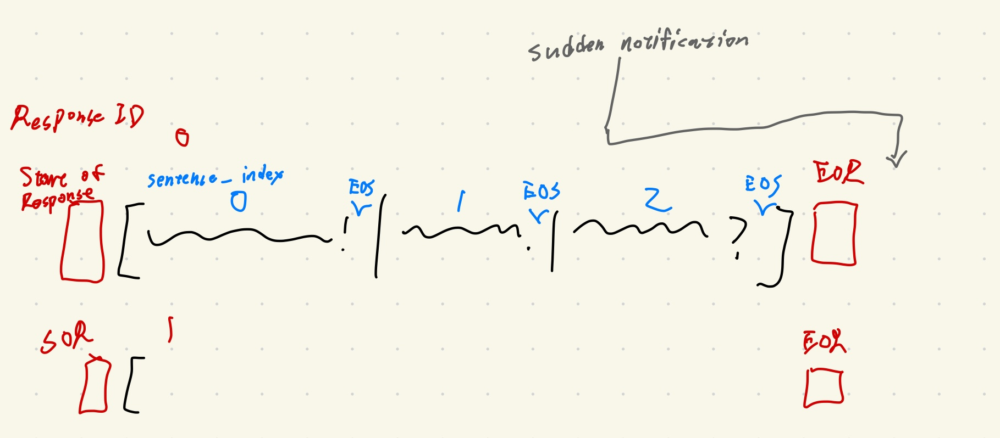
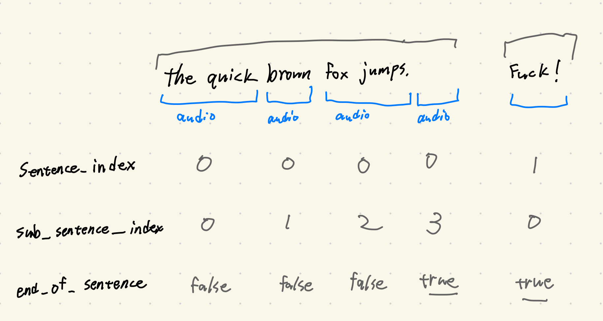

# tts

这个页面描述了在项目实装了 **流式TTS** 功能之后，新的 TTS API。预计在 1.3.0 版本发布。




一个 sentence 单位以下，实现 audio chunk 传输的逻辑。

- 如果启用了 tts streaming，交互逻辑就类似左边那个句子。最后一个 audio pack 会是空的。
- 如果关闭了 tts streaming，那每个 audio 就是一个 sentence，所以每个 audio pack 的 end_of_sentence 都是 true。

概念:
- Response 指 LLM 一次完整的回应，一般包含很多句子。(上图红字)
    - response 的开始和结束都有明确的信号。结束信号可能乱序抵达，但起码能告诉前端最后一个 sentence 的 index 是多少。
    - 如果 response id 是空的 (None)，就看作只包含了一个 sentence 的 response。
- Sentence 指句子，从属于某个 response。(上图蓝字)
    - 句子的正确播放顺序由 `sentence_index` 决定。
    - `sentence_index` 由 0 开始。
    - sentence 可能会乱序抵达。
    - 在 tts streaming 启用时，sentence 下面会有多个音频块，反之则只有一个音频块。
    - 每个 sentence 最后面都会有个终止信号 (EOS)。如果非流式 tts 则终止信号就是音频块本身。后面细说。
- Audio 音频块数据包
    - tts streaming 启用时，是音频块。没启用时，是句子的完整音频。但不管是哪个，音频块永远是可以直接播放的 wav 音频。


### Audio 数据包

audio 的数据包长这样。

```json
{
  "type": "audio",
  "response_id": "iso8601-timestamp_uuid4[:8]", // NEW parameter
  "audio": None, // wav in base64
  "sentence_index": sentence_index, // NEW parameter
  "sub_sentence_index": sub_sentence_index, // NEW parameter
  "end_of_sentence": false,
  "volumes": [], // Root Mean Square (RMS) every 20ms. Used to control l2d lips.
  "slice_length": chunk_length_ms, // constant, 20ms
  "display_text": display_text, // subtitle displayed
  "actions": actions.to_dict() if actions else None,
  "forwarded": forwarded,
}
```

`response_id` 表示这个 audio 归属在那个 response 下面。格式是iso8601 的时间戳_uuid4 的前八位。
- `f"{datetime.now().isoformat()}_{str(uuid.uuid4())[:8]}"`
- 如果 `response_id` 是 None，就代表这个 audio 不属于任何一个 response group，就塞在当前的 response block 播放之后就行了。目前用到 `response_id` 为 None 的应该只有在 `websocket_handler.py` 里的 `_handle_audio_play_start` 函数里面，这里要在字幕那边展示其他 AI 群友说的话，但不播放。

`sentence_index` 确定这个 audio 归属在那个 sentence 下面。

`sub_sentence_index` 确定这个 audio 切片在 sentence 里的位置。如果非流式，这个 index 就永远是 0。

`end_of_sentence` 描述这个 audio 是否是这个 sentence 的最后一个 audio。如果非流式，这个值就永远是 true (因为一个 sentence 只会有一个 audio，所以包含数据的那个 audio 的 `end_of_sentence` 就是 true)。


我们单独发送一个信号来表示句子结束

```json
{
  "type": "audio",
  "response_id": "iso8601-timestamp_uuid4", // NEW parameter
  "sentence_index": sentence_index,
  "sub_sentence_index": sub_sentence_index, // NEW parameter
  "end_of_sentence": true
}
```


Start of response
```json
{
    "type": "control",
    "text": "start-of-response",
    "response_id": "iso8601-timestamp_uuid4[:8]"
}
```

- 在 LLM 开始生成的时候，发送 start of response 在前端给这个 response 的音频预留空间。
- 前端播放最先预留空间的 response。response 里面会有很多乱序的 audio pack，但 response 是有序的，没有 index。
- response 的意思是 LLM 一次完整的回答，包含很多句子，很多段落。划分 response 的目的是帮助前端划分音频的归属和播放顺序。
- 如果打断了 response，把 response 预留的空间丢弃，不再接受跟这个 response 相关的音频。 


End of response
```json
{
    "type": "control",
    "text": "end-of-response",
    "response_id": "iso8601-timestamp_uuid4[:8]",
    "sentence_index": sentence_index,
}
```

- *会在 response 所有消息发送完之前抵达。* `sentence_index` 会告诉前端这个 response 下面一共有多少 sentence。
- `sentence_index` 是这个 `end-of-response` 在 response 的位置 (最后一个)，所以如果 response 里最后一个句子的 `sentence_index` 为 `n`，这个 EOS 的 `sentence_index` 就是 n+1
- 作用是让前端确定释放这个 response block 的播放独占权的时机。

