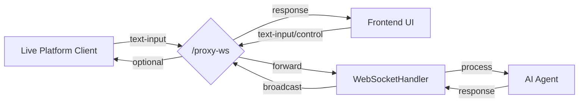

# 直播开发

:::info 架构概览
本项目的直播集成功能采用**分离进程**架构，并依赖 **WebSocket 代理端点 (`/proxy-ws`)**。

- **直播平台客户端 (独立进程)**: 连接特定直播平台 (如 Bilibili)，监听事件 (如弹幕)。    
- **Open-LLM-VTuber 主进程**: 运行 AI、TTS 等核心服务。
- **前端 UI (用户界面)**: 展示 Live2D 模型、接收用户 (直播间管理员) 输入、播放音频等。

**关键连接拓扑:**



**图例说明:**
- Live Platform Client: 直播平台客户端（如Bilibili）向代理发送弹幕消息（格式化为text-input）
- Frontend UI: 前端界面也向同一个代理发送用户输入和控制消息
- /proxy-ws: 核心代理端点，接收所有消息并进行转发和广播
- WebSocketHandler: 处理消息并与AI交互
- AI Agent: 生成回复
- 最终AI回复通过代理广播给所有连接的客户端（包括前端和直播客户端）

**核心要求:** 为了使直播弹幕能够被 AI 处理，并且 AI 的回复能够正确显示在前端，**所有客户端（包括前端 UI 和 直播平台客户端）都必须连接到同一个 `/proxy-ws` 端点**。

**`/proxy-ws` 的作用 (`ProxyHandler`):**
- **统一入口:** 为所有类型的客户端提供单一的连接点。
- **消息路由:** 接收来自所有客户端的消息，并根据类型（如 `text-input`, `interrupt-signal` 等）进行处理或直接转发给后端的 `WebSocketHandler`。
- **消息队列:** 对 `text-input` 类型的消息（来自前端或直播平台）进行排队处理，确保 AI 顺序响应。
- **状态同步:** 管理连接状态，例如标记对话是否活跃 (`conversation_active`)。
- **广播:** 将来自后端 `WebSocketHandler` 的消息（如 AI 回复、状态更新）广播给所有连接的客户端。

:::

## 1. 核心组件与数据流

以 Bilibili 直播为例，梳理**弹幕输入**到 **AI 回应** 的完整流程 (假设前端和 Bilibili 客户端都已连接到 `/proxy-ws`):

1.  **观众** -> **Bilibili 服务器**: 发送弹幕。
2.  **Bilibili 服务器** -> **`run_bilibili_live.py` (独立进程)**: `blivedm` 库接收弹幕事件。
3.  **`run_bilibili_live.py`** -> **`/proxy-ws` (主进程)**: `BiliBiliLivePlatform` 将弹幕格式化为 `{"type": "text-input", "text": "弹幕内容"}` 并通过 WebSocket 发送给 `/proxy-ws`。
4.  **`/proxy-ws` (`ProxyHandler`)** -> **`WebSocketHandler`**: `ProxyHandler` 接收到消息，因其类型为 `text-input`，将其放入消息队列 (`ProxyMessageQueue`)。
5.  **`ProxyMessageQueue`** -> **`ProxyHandler.forward_to_server`**: 当轮到此消息处理时，队列将其取出并通过 `forward_to_server` 发送给 `WebSocketHandler`。
6.  **`WebSocketHandler`**: 接收到 `text-input` 消息，触发对话处理逻辑 (`_handle_conversation_trigger`)。
7.  **`WebSocketHandler`** -> **AI Agent**: 将弹幕文本 (`"弹幕内容"`) 作为用户输入，调用 AI 模型。
8.  **AI Agent** -> **`WebSocketHandler`**: AI 返回回复文本流。
9.  **`WebSocketHandler`** -> **TTS/表情/动作处理**: 处理 AI 回复。
10. **`WebSocketHandler`** -> **`/proxy-ws` (`ProxyHandler`)**: 将处理后的结果（文本、音频、指令等）发送回 `ProxyHandler` 进行广播。
11. **`/proxy-ws` (`ProxyHandler`)** -> **所有连接的客户端 (包括前端 UI)**: `ProxyHandler` 调用 `broadcast_to_clients` 将 AI 的回复广播给所有连接到 `/proxy-ws` 的客户端。
12. **前端 UI**: 接收到广播的消息，播放音频、显示文本、执行表情/动作。

## 2. 关键接口与实现

### 2.1 `LivePlatformInterface` (接口定义)

(位于 `src/open_llm_vtuber/live/live_interface.py`)

所有直播平台客户端实现必须遵守的抽象基类。核心要求是实现 `connect` 方法以连接到**代理端点 `/proxy-ws`**，并在 `run` 方法中实现监听平台事件并将事件**格式化为 `{"type": "text-input", ...}`** 后通过 `_send_to_proxy` 发送给代理。

### 2.2 WebSocket 代理 (`/proxy-ws` 与 `ProxyHandler`)

(端点定义于 `src/open_llm_vtuber/routes.py`, 实现于 `src/open_llm_vtuber/proxy_handler.py`)

**核心组件**，负责：
- 接收来自**所有**连接客户端（前端 UI、直播客户端）的消息。
- 将 `text-input` 消息排队后转发给 `WebSocketHandler`。
- 将其他控制消息直接转发给 `WebSocketHandler`。
- 将来自 `WebSocketHandler` 的回复**广播**给所有连接的客户端。

### 2.3 `BiliBiliLivePlatform` (Bilibili 实现示例)

(位于 `src/open_llm_vtuber/live/bilibili_live.py`)

`LivePlatformInterface` 的实现。关键在于 `_send_to_proxy` 方法将弹幕**格式化为 `{"type": "text-input", ...}`** 后发送给 `/proxy-ws`。

### 2.4 启动脚本 (`run_bilibili_live.py`)

(位于 `scripts/run_bilibili_live.py`)

独立的进程启动器，负责实例化 `BiliBiliLivePlatform` 并调用其 `run` 方法，使其连接到 `/proxy-ws` 并开始监听 Bilibili 事件。

## 3. 开发新平台支持步骤

### 3.1 创建平台实现类

1.  创建新类 `MyPlatformLive` 继承 `LivePlatformInterface`。
2.  实现所有抽象方法，特别是 `connect` (连接到 `/proxy-ws`) 和 `run`。
3.  在 `run` 或其调用的事件处理函数中，获取平台消息 (如弹幕)。
4.  **实现 `_send_to_proxy(self, text: str)`**: **必须**将 `text` 包装成 `{"type": "text-input", "text": text}` JSON，并通过 `self._websocket.send()` 发送给代理 (`/proxy-ws`)。

```python
# src/open_llm_vtuber/live/my_platform_live.py (关键部分示例)
# ... (imports) ...

class MyPlatformLive(LivePlatformInterface):
    # ... (实现 __init__, connect, disconnect, run 等方法) ...

    async def _handle_platform_event(self, event_data):
        message_text = event_data.get('message')
        if message_text:
            logger.info(f"Received from My Platform: {message_text}")
            # 调用发送给代理的方法
            await self._send_to_proxy(message_text)

    async def _send_to_proxy(self, text: str) -> bool:
        if not self.is_connected:
            logger.error("Cannot send message: Not connected to proxy")
            return False
        try:
            # !!! 核心：格式化为 text-input 类型 !!!
            payload = {"type": "text-input", "text": text}
            await self._websocket.send(json.dumps(payload))
            logger.info(f"Sent formatted message to proxy: {text}")
            return True
        except Exception as e:
            # ... (错误处理)
            return False

    async def run(self) -> None:
        # 确保连接到代理 proxy_url = "ws://localhost:12393/proxy-ws"
        # ... (连接逻辑) ...
        # --- 你的平台事件监听逻辑 --- #
        # while self._running:
        #     event = await my_platform_sdk.get_next_event()
        #     await self._handle_platform_event(event)
        # ----------------------------- #
        # ... (清理逻辑) ...
```

### 3.2 添加配置项

为了让你的直播平台客户端能够被正确配置和初始化，你需要：

1.  **定义 Pydantic 配置模型**: 在 `src/open_llm_vtuber/config_manager/live.py` 文件中，参照 `BiliBiliLiveConfig` 创建一个新的配置类。例如，如果你的平台需要 `channel_id` 和 `api_token`：

    ```python
    # src/open_llm_vtuber/config_manager/live.py
    from pydantic import BaseModel, Field
    from typing import Dict, ClassVar, List # 确保导入 BaseModel
    from .i18n import I18nMixin, Description

    # ... (BiliBiliLiveConfig 定义) ...

    class MyPlatformConfig(I18nMixin): # 继承 I18nMixin (可选, 用于国际化描述)
        """Configuration for My Platform Live integration."""
        channel_id: str = Field("", alias="channel_id")
        api_token: str = Field("", alias="api_token")
        # 添加其他你需要的配置项，并提供默认值

        DESCRIPTIONS: ClassVar[Dict[str, Description]] = {
            "channel_id": Description(en="Channel ID for My Platform", zh="My Platform 的频道 ID"),
            "api_token": Description(en="API Token for My Platform", zh="My Platform 的 API Token"),
        }

    class LiveConfig(I18nMixin):
        """Configuration for live streaming platforms integration."""
        bilibili_live: BiliBiliLiveConfig = Field(
            default_factory=BiliBiliLiveConfig, alias="bilibili_live"
        )
        # !!! 添加你的平台配置到 LiveConfig !!!
        my_platform: MyPlatformConfig = Field(
            default_factory=MyPlatformConfig, alias="my_platform"
        )
        # ... 可能还有其他平台 ...

        DESCRIPTIONS: ClassVar[Dict[str, Description]] = {
            "bilibili_live": Description(
                en="Configuration for BiliBili Live platform", zh="B站直播平台配置"
            ),
            "my_platform": Description(
                en="Configuration for My Platform", zh="My Platform 配置"
            ),
        }
    ```

2.  **更新默认配置文件**: 在项目根目录的 `conf.default.yaml` 和 `conf.ZH.default.yaml` 文件中的 `live_config:` 部分，添加你的平台配置项和默认值。这会让用户知道有哪些配置项可以修改。

    ```yaml
    # conf.default.yaml / conf.ZH.default.yaml
    live_config:
      bilibili_live:
        room_ids: []
        sessdata: ""
      # 添加你的平台配置
      my_platform:
        channel_id: ""
        api_token: ""
        # 其他默认值...
    ```

### 3.3 创建运行脚本

运行脚本是启动你的独立直播平台客户端进程的入口。你需要创建一个类似于 `scripts/run_bilibili_live.py` 的脚本。

1.  在 `scripts/` 目录下创建新文件，例如 `run_my_platform_live.py`。
2.  脚本的核心逻辑是：
    *   导入必要的模块，包括你的 `MyPlatformLive` 类和配置工具。
    *   读取主配置文件 (`conf.yaml`)。
    *   验证配置并提取出你平台的特定配置部分 (例如 `config.live_config.my_platform`)。
    *   实例化你的 `MyPlatformLive` 类，并将配置传递给它 (通常使用 `.model_dump()` 将 Pydantic 模型转为字典)。
    *   调用 `platform.run()` 启动客户端。
    *   包含基本的异步运行和异常处理逻辑。

```python
# scripts/run_my_platform_live.py
import asyncio
import sys
import os
from loguru import logger

# 确保能导入 src 目录下的模块
project_root = os.path.abspath(os.path.join(os.path.dirname(__file__), ".."))
sys.path.insert(0, project_root)

# !!! 导入你的平台实现类 !!!
from src.open_llm_vtuber.live.my_platform_live import MyPlatformLive
from src.open_llm_vtuber.config_manager.utils import read_yaml, validate_config

async def main():
    logger.info("Starting My Platform Live client")
    try:
        # 读取主配置
        config_path = os.path.join(project_root, "conf.yaml")
        config_data = read_yaml(config_path)
        config = validate_config(config_data)

        # !!! 获取你的平台配置 !!!
        my_platform_config = config.live_config.my_platform

        # !!! (可选) 检查关键配置是否存在 !!!
        # if not my_platform_config.channel_id or not my_platform_config.api_token:
        #     logger.error("Missing required configuration for My Platform (channel_id or api_token)")
        #     return

        logger.info(f"Attempting to connect to My Platform channel: {my_platform_config.channel_id}")

        # !!! 实例化你的平台客户端，传入配置 !!!
        # 将 Pydantic 模型转为字典传入
        platform = MyPlatformLive(config=my_platform_config.model_dump())

        # !!! 启动客户端 !!!
        await platform.run()

    except ImportError as e:
         logger.error(f"Failed to import required modules: {e}")
         # 可能需要提示用户安装特定依赖: logger.error("Did you install my_platform_sdk?")
    except Exception as e:
        logger.error(f"Error starting My Platform Live client: {e}")
        import traceback
        logger.debug(traceback.format_exc())

if __name__ == "__main__":
    try:
        # 使用 asyncio 运行主函数
        asyncio.run(main())
    except KeyboardInterrupt:
        # 优雅退出
        logger.info("Shutting down My Platform Live client")
```

### 3.4 运行与测试

1.  安装依赖。
2.  配置 `conf.yaml`。
3.  启动主程序 (`uv run run_server.py`)。
4.  **确保前端 UI 连接到 `/proxy-ws`** (修改前端设置中的 WebSocket URL)。
5.  在另一个终端启动平台脚本 (`uv run python scripts/run_my_platform_live.py`)。
6.  在直播平台发送消息，观察主程序日志和**前端 UI 的反应**。
