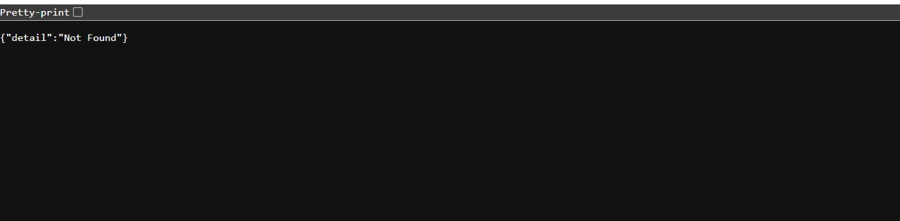

# 常见问题

快速跳转:
- [普通问题](#普通问题)
- [后端报错问题](#后端报错问题)
- [网页/客户端相关](#网页客户端相关)

## 普通问题

### 我太喜欢这个项目了。我该怎么帮到你们？

普通人
- 让我们知道你喜欢这个项目 ❤️。
- 跟朋友介绍我们项目，在 GitHub 上点星星
- 录视频然后发到社交平台上，不管是聊天视频或是安装教学或是别的都非常欢迎! (如果你愿意发给我们看就更好了，省的我自己去找😎)
- 到社群 (QQ, Discord) 中帮忙其他人 (这对我们帮助真的很大！)
- 在 QQ, Discord 群，或是其他渠道让我们知道我们项目真的有活人在用！

熟悉项目的普通人
- 帮忙补充文档，记录自己遇到的问题
- 如果不知道要怎么编辑文档，可以直接给我发消息

程序员
- 可以看看贡献指南，阅读项目 issue，看看有没有感兴趣的 issue，来贡献一下。
- 我们十分欢迎 Pull Requests。


### 要怎么使用 `xxx` 大语言模型 API 服务？
请将相关设置，比如 API key, base url 等，填入 `openai_compatible_llm` 的设置下。 `openai_compatible_llm` 的意思是所有支持 OpenAI API 格式的 LLM API 都可以填在这里。

### 如何选择合适的 LLM?
- 如果你希望快速部署且不想下载模型,建议使用 OpenAI Compatible API 或 Groq API
- 如果你想使用本地部署,建议根据显存大小选择合适的模型
- 详细说明请参考[LLM 配置指南](./user-guide/backend/llm.md)

### 项目支持哪些使用模式?
- Web 模式:通过浏览器访问
- 窗口模式:桌面客户端的默认模式
- 桌宠模式:提供背景透明、全局置顶的桌面伴侣体验
- 详细说明请参考[模式介绍](./user-guide/frontend/mode.md)

### 怎么启动桌宠模式
- 桌宠模式:提供背景透明、全局置顶的桌面伴侣体验
- 详细说明请参考[模式介绍](./user-guide/frontend/mode.md)


### 这个项目可以在手机上用吗？

目前，手机端的支持较为薄弱，有许多问题。

- 项目后端必须运行在电脑上。
- Web 前端可以在手机上访问，但必须配置 `https`，否则麦克风无法启动。这是浏览器的限制。
- iOS 端需要不断点击才能使说话功能正常运行

有两个大佬正在做 [Unity 版本的前端](https://github.com/Open-LLM-VTuber/Open-LLM-VTuber-Unity)，希望能解决这些问题。期待他们完成的那一天。

### 如何获取前端最新版本?
- 目前前端不支持自动更新，可以关注 [Github Release](https://github.com/Open-LLM-VTuber/Open-LLM-VTuber/releases) 页面获取最新版本。
- 详细说明请参考[模式介绍](./user-guide/frontend/mode.md)

---

## 后端报错问题

### uv 安装后无法找到
- 如果你是用 `winget` 或者 `curl` 安装的 uv，需要重启命令行或者重新加载 shell 配置文件才能使环境变量生效。
- 详细说明请参考[快速开始](./quick-start.md)


### 遇到代理相关问题怎么办?
:::note
关键字: `HTTP`, `SSL error`, `timeout`, `Failed to connect to github. com port 443 after 21` 等等
:::
- 如果你在中国大陆,建议开启代理下载资源
- 如果本地服务无法访问,需要设置代理绕过本地地址
- 详细说明请参考[快速开始](./quick-start.md)

### 遇到 "Error calling the chat endpoint..." 错误怎么办?
:::note 症状
AI 会把报错念出来，并且不管你说什么，只会重复以这段话开头的句子。
```markdown
Error calling the chat endpoint
```
这段话的中文大概是
```markdown
调用聊天端点出错
```
:::

这说明大语言模型 (LLM) 调用失败了。出现这个问题，说明 Open-LLM-VTuber 在调用你指定的大语言模型 API 的过程中失败了。请检查 `llm_configs` 的相关设置，确保模型名称，端点 url (`base_url`) 以及 API key 正确无误。

#### 报错信息解析
由于安全考量，前端页面**并不会**显示完整的报错细节。请前往后端阅读相关的报错信息。

**1. 无法连接 LLM API**
> Error calling the chat endpoint: Connection error. Failed to connect to the LLM API. Check the configurations and the reachability of the LLM backend. See the logs for details. Troubleshooting with documentation
> 用聊天端点出错： 连接错误。连接 LLM API 失败。检查配置和 LLM 后端的可达性。详情请查看日志。使用文档排除故障

这意味着你所设置的 LLM 无法被正常访问。

- 请检查你的 `base_url` 是否正确填写。
- 请检查填写的 API 是否可用，是否能被正常访问
- 如果你使用的是 Ollama，请确保 Ollama 已经启动。用浏览器访问 `http://localhost:11434/` (或是你的 Ollama 地址，把结尾的 `/v1` 删掉)，如果没有显示类似 `Ollama is running` 的文字，说明你 Ollama 没有启动或是无法被本机访问。
- 如果你使用的是 LM Studio，请确保 LM Studio Server 已经正常启动，且模型已经加载。
- 如果你的代理软件没有绕过本地地址，会导致 Ollama 或其他本地 LLM  推理引擎无法连接。尝试临时关闭代理，或参考前文设置代理绕过本地地址。

**2. 模型名称填错了**
- 请确保你填写的模型名称正确无误。注意冒号 `:` 与 `：`的区别，注意模型名称中一般没有空格。
- Ollama 用户，请确保你填写的模型名称是 `ollama list` 命令显示的模型的其中一个。
- 报错中提示`Model not found, try pulling it...`，请使用 `ollama list` 查看已安装的模型名称，确保配置文件中的模型名称与列表中的完全一致。
- LM Studio 用户请确保你填写的模型是被加载到内存中的那个模型。


**3. Rate limit exceeded**
> Error calling the chat endpoint: Rate limit exceeded
> 调用聊天端点出错： 超过速率限制

你聊得太猛了，你超过了你使用的 LLM API 的速率限制。

#### 常见原因和解决方案:
1. 检查 Ollama 服务是否正常运行。如果你用的是其他 API，请确保 API 能正常访问，API key 正确，网络通畅。
2. 确认模型名称是否与 `ollama list` 列出的完全一致
- 详细说明请参考[快速开始](./quick-start.md)


### 遇到 `AttributeError: 'NoneType' object has no attribute 'emo_str'` 错误怎么办
- `model_dict.json` 中的模型名与 `conf.yaml` 中的不对应
- `model_dict.json` 格式错误 (`Error decoding JSON from model dictionary file at model_dict.json`)


### 遇到 `error while attempting to bind on address （'127.0.0.1'，12393）：通常每个套接字地址（协议/网络地址/端口）只允许使用一次。` 错误怎么办？


请不要同一台电脑上开两个 Open-LLM-VTuber 后端，这没啥意义，请把另一个关了。

如果不觉得自己开了两个 Open-LLM-VTuber 后端，可以重启电脑试试。

这个报错信息的意思是 `:12393` 端口已经被占用了。这是本项目后端预设占用的端口，且一般没别的程序会占用这个端口。

如果你一定要同时开启两个 Open-LLM-VTuber 后端，或是其他应用占据了这个端口，可以在 `conf.yaml` 文件中，`system_config` 下的 `port` 设置中修改项目绑定的端口。

---

## 网页/客户端相关

### Web 显示 `{"detail": "Not Found"}` 怎么办



- 前端代码没有被拉取到本地。出现这个报错说明你没有获取到完整的项目代码。请在项目目录下运行 `git submodule update --init --recursive` 来拉取项目代码。
- 详细请参考 [快速开始/1. 获取项目代码](quick-start#1-获取项目代码) 中提到的两种获取项目代码的方式。

### 使用远程的 Live2D 模型链接，报错 `Failed to load LiveD model: Error: Network error` 怎么办
- 这通常是因为 Web 使用 HTTP 协议无法加载 HTTPS 资源导致的
- 可以在浏览器设置中允许网站加载不安全内容(Insecure content)来解决:
  - Chrome: 点击地址栏右侧的盾牌图标 -> 网站设置 -> 不安全内容 -> 允许
  - Firefox: 点击地址栏左侧的锁图标 -> 关闭连接保护
  - Edge: 点击地址栏右侧的锁图标 -> 网站权限 -> 不安全内容 -> 允许

### 麦克风无法使用怎么办
- 请确保已授予浏览器或应用程序麦克风使用权限
- 检查麦克风输入音量是否合适 - 声音过小或过短可能无法触发语音检测。你可以在设置中调整检测阈值，详细设置请参考 [Web 模式](./user-guide/frontend/web.md)
- 如果你使用的是 Electron 桌面应用，尝试重启应用。
- 如果以上方法都无效，可以访问 https://www.vad.ricky0123.com/ 测试麦克风功能。如果该网站也无法正常使用麦克风，可能是系统音频设置或硬件问题

### 桌面客户端无法安装(Windows 已保护你的电脑)或者提示"已损坏"怎么办
- Windows 用户可以点击"更多信息"然后选择"仍要运行"
- macOS 用户需要调整系统设置并执行特定命令
- 详细解决方案请参考[模式介绍](./user-guide/frontend/mode.md)

### 远程访问 Web 界面时麦克风/摄像头/录屏无法使用怎么办 (`Failed to start screen capture: NotSupportedError: Not supported`)
- 这是因为这些功能需要安全上下文(HTTPS 或 localhost)
- 如需远程使用,必须为 Web 服务器配置 HTTPS
- 详细说明请参考[模式介绍](./user-guide/frontend/mode.md)

### iOS 设备上语音功能异常怎么办?
- 这是由于 iOS 的安全限制导致的已知问题
- 需要不断点击才能使说话功能正常运行
- 详细说明请参考[模式介绍](./user-guide/frontend/mode.md)

