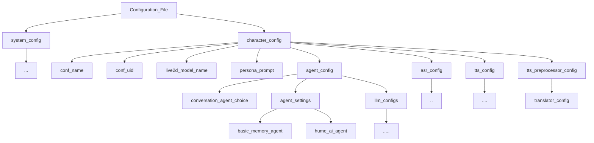

# 配置文件 (Config)

下图是 `v1.0.0` 版本 配置文件的基本结构。

```mermaid
graph TD
  Configuration_File --> system_config
  Configuration_File --> character_config
  
  system_config --> ...

  character_config --> conf_name
  character_config --> conf_uid
  character_config --> live2d_model_name
  character_config --> persona_prompt
  character_config --> agent_config
  character_config --> asr_config
  character_config --> tts_config
  character_config --> tts_preprocessor_config

  agent_config --> conversation_agent_choice
  agent_config --> agent_settings
  agent_config --> llm_configs
  
  llm_configs --> .....

  agent_settings --> basic_memory_agent
  agent_settings --> hume_ai_agent

  asr_config --> ..
  tts_config --> ....

  tts_preprocessor_config --> translator_config

```

