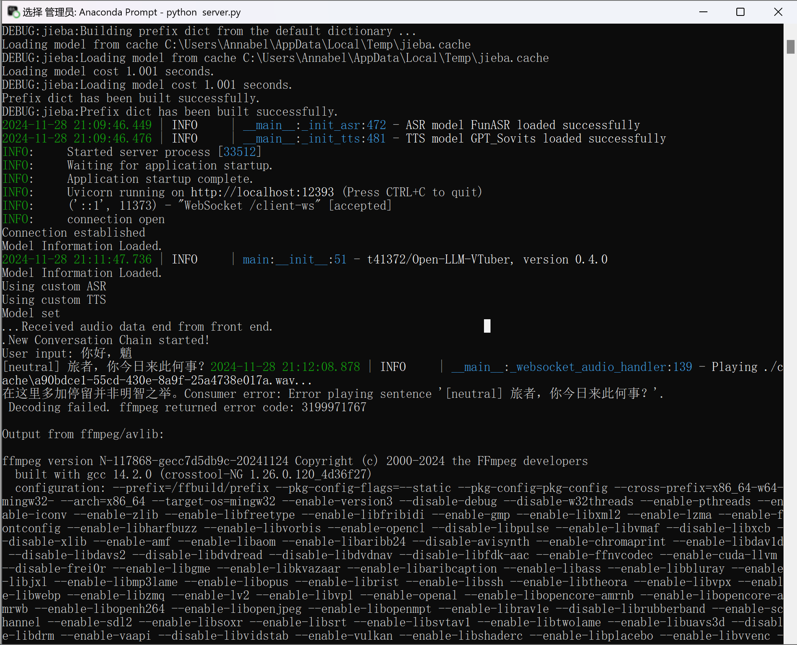
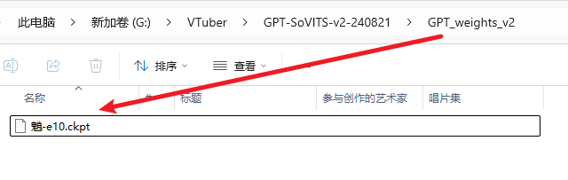

# 语音合成 (TTS)

安装所需的依赖并在 `conf.yaml` 进行配置后后，通过修改 `conf.yaml` 中的 `TTS_MODEL` 选项来启用相应的语音合成引擎。


## sherpa-onnx（本地 & 推荐）
> 自 `v0.5.0-alpha.1` 版本起可用（[PR#50](https://github.com/t41372/Open-LLM-VTuber/pull/50)）

sherpa-onnx 是一个强大的推理引擎，支持多种 TTS 模型（包括 MeloTTS）。项目已内置支持，默认使用 CPU 推理。

**配置步骤：**
1. 从 [sherpa-onnx TTS models](https://github.com/k2-fsa/sherpa-onnx/releases/tag/tts-models) 下载所需模型
2. 参考 `config_alts` 中的配置示例修改 `conf.yaml` 

:::tip
如需使用 GPU 推理（仅支持 CUDA），请参考 [CUDA推理](/docs/user-guide/backend/asr#cuda-推理)。
:::

## pyttsx3（轻量快速）
简单易用的本地 TTS 引擎，使用系统默认语音合成器。使用 `py3-tts` 而不是更著名的 `pyttsx3`，因为 `pyttsx3` 似乎无人维护，且在测试电脑上无法运行。

**配置步骤：**
1. 执行 `uv pip install py3-tts` 安装
2. 在 `conf.yaml` 中设置 `tts_model: pyttsx3_tts`

- 1. 使用命令 `uv pip install py3-tts` 安装。
- 2. 这个 TTS 引擎没有任何配置项，直接在 `conf.yaml` 中设置 `tts_model: pyttsx3_tts` 即可。

:::info
这个包将使用您系统上的默认 TTS 引擎:
- Windows 使用 sapi5 引擎
- macOS 使用 nsss 引擎
- 其他平台使用 espeak 引擎
:::


## MeloTTS（本地部署）
:::warning 重要提示
- 强烈推荐通过 sherpa-onnx 使用 MeloTTS，而非安装较为复杂的官方版本
- MeloTTS 与 Coqui-TTS 存在依赖冲突，请勿同时安装
- MeloTTS 官方版本在 macOS 上可能出现 mps 相关错误（欢迎提供解决方案）
:::

### 安装步骤
> 从项目 `v1.0.0` 版本开始，我们采用 `uv` 管理依赖，这大大简化了 MeloTTS 的安装流程。

1. 安装 MeloTTS 和必要组件：
```sh
# 安装 MeloTTS
uv add git+https://github.com/myshell-ai/MeloTTS.git

# 下载 unidic
python -m unidic download
```

2. 下载额外依赖：
```sh
# 进入 Python 解释器
python

# 下载必要的 NLTK 数据
>>> import nltk
>>> nltk.download('averaged_perceptron_tagger_eng')
# 完成后按 Ctrl+D 退出解释器
```

3. 配置启用：
- 编辑项目的 `conf.yaml` 文件
- 将 `tts_model` 设置为 `melo_tts`

### 补充说明
- 官方文档：[MeloTTS Installation Guide](https://github.com/myshell-ai/MeloTTS/blob/main/docs/install.md)
- 如遇到 `mecab-python` 相关问题，可尝试使用此[分支](https://github.com/polm/MeloTTS)（注：截至 2024/7/16 尚未合并至主分支）


## Coqui-TTS（本地部署）
:::warning 重要提示
- MeloTTS 与 Coqui-TTS 存在依赖冲突，请勿同时安装
:::

Coqui-TTS 是一个开源语音合成工具包，支持多种模型和语言。推理速度取决于所选模型的大小和复杂度。

### 安装步骤
```sh
# 安装 Coqui-TTS 及其语言支持
uv add transformers "coqui-tts[languages]"
```

### 模型配置
1. 查看可用模型：
```sh
uv run tts --list_models
```

2. 在 `conf.yaml` 中配置：
```yaml
 coqui_tts:
      # 要使用的 TTS 模型的名称。如果为空，将使用默认模型
      # 执行 "tts --list_models" 以列出 coqui-tts 支持的模型
      # 一些示例：
      # - "tts_models/en/ljspeech/tacotron2-DDC"（单说话人）
      # - "tts_models/zh-CN/baker/tacotron2-DDC-GST"（中文单说话人）
      # - "tts_models/multilingual/multi-dataset/your_tts"（多说话人）
      # - "tts_models/multilingual/multi-dataset/xtts_v2"（多说话人）
      model_name: "tts_models/en/ljspeech/tacotron2-DDC" # 模型名称
      speaker_wav: "" # 参考音频文件路径
      language: "en" # 语言
      device: "" # 设备
```

- **单语言模型**：
   - 默认配置为英文单语言模型
   - 如需中文支持，请更换为中文模型 (如 `tts_models/zh-CN/baker/tacotron2-DDC-GST`)

- **多语言模型**：
   - `speaker_wav`：参考音频文件路径
     - 支持相对路径（如 `./voices/reference.wav`）
     - Windows 使用绝对路径时注意将 `\` 改为 `\\`
     - 确保参考音频文件存在于指定位置
   
   - `language`：设置优先使用的语言
     - 中文设置为 `"zh"`
     - 英文设置为 `"en"`
     - 此参数与 `speaker_wav` 对应


## GPTSoVITS（本地部署，性能适中）
> 在 [PR #40](https://github.com/t41372/Open-LLM-VTuber/pull/40) 中引入，于 v0.4.0 版本正式发布

GPT-SoVITS 是一个强大的语音合成引擎，可实现高质量的声音克隆。

:::note
GPTSoVITS的官方教程目前尚不完善。
以下部分内容整理自 QQ 群的 [腾讯文档](https://docs.qq.com/doc/DTHR6WkZ3aU9JcXpy)，由v1.0.0版本发布前 QQ 群的用户们共同编辑完成（文档因不明原因被腾讯封锁，现已停止维护）。若您在阅读过程中遇到问题，或希望参与教程完善，可通过本页面最下方的编辑按钮提交修改建议，也可直接联系我进行反馈。
:::

### [GPTSoVITS-V2 整合包](https://www.yuque.com/baicaigongchang1145haoyuangong/ib3g1e/dkxgpiy9zb96hob4#KTvnO)

### [米哈游一键包](https://www.bilibili.com/video/BV1D7421R7Rn)

#### 如果你是用的米哈游一键包：
先启动 GPT SoVITS，然后启动本项目 (`uv run run_server.py`)。

需要修改以下设置：

1: conf.yaml里的tts选项改成GPT_Sovits（应该没人会忽略这步吧）

- 这个截图是在 `v1.0.0` 版本之前截的图，请填入 `gpt_sovits`，不要填 `GPT_Sovits`

2: 修改下方GPT_Sovits中对应配置的参数：


提示GPT-Sovits加载成功但是ffmpeg提示decoding失败就是没加/tts：


#### 如果你是用的GPT-SovitsV2整合包：
1: conf.yaml里的修改与上一步相同，不过对应的模型放在相应位置，GPT模型（ckpt后缀）放入GPT_weights_v2文件夹，SoVITS模型（pth后缀）放入SoVITS_weights_v2文件夹，参考音频如果不改位置就是放在GPT-Sovits根目录下，跟api_v2.py放在一起；



2: 运行GPT-SovitsV2，切到GPT-Sovits根目录，在prompt里面运行python api_v2.py -a 0.0.0.0，如果没反应就用整合包自带的python，在prompt里面运行runtime\python.exe api_v2.py，提示TTS config就表示加载好了，放后台就行


## Bark (本地部署、较慢)
1. 安装依赖：
    ```sh
    uv pip install git+https://github.com/suno-ai/bark.git
    ```
2. 在 `conf.yaml` 中设置 `tts_model: bark_tts`
3. 首次启动时会自动下载所需模型
## CosyVoice TTS（本地部署、较慢）
1. 按照 [CosyVoice 官方文档](https://github.com/FunAudioLLM/CosyVoice) 配置并启动 WebUI
2. 参考 WebUI 中的 API 文档，在 `conf.yaml` 的 `cosyvoice_tts` 部分进行相应配置

## CosyVoice2 TTS（本地部署）

1. 按照 [CosyVoice 官方文档](https://github.com/FunAudioLLM/CosyVoice) 配置环境
2. 下载 CosyVoice2 模型 `CosyVoice2-0.5B`
3. 修改 CosyVoice 的 `webui.py` 文件
   - ```
     audio_output = gr.Audio(label="合成音频", autoplay=True, streaming=True) 
     改为 ->
     audio_output = gr.Audio(label="合成音频", autoplay=True, streaming=False)
     ```
    - ```
         logging.info('get instruct inference request')
         set_all_random_seed(seed)
         for i in cosyvoice.inference_instruct(tts_text, sft_dropdown, instruct_text, stream=stream, speed=speed):
             yield (cosyvoice.sample_rate, i['tts_speech'].numpy().flatten())
      改为 ->
              logging.info('get instruct inference request')
              prompt_speech_16k = postprocess(load_wav(prompt_wav, prompt_sr))
              set_all_random_seed(seed)
              for i in cosyvoice.inference_instruct2(tts_text, instruct_text, prompt_speech_16k, stream=stream, speed=speed):
                  yield (cosyvoice.sample_rate, i['tts_speech'].numpy().flatten())
      ```
4. 启动 CosyVoice WebUI
5. 使用命令`uv add gradio_client`在本项目下安装 gradio_client
6. 在 `conf.yaml` 的 `cosyvoice2_tts` 部分进行配置

目前官方只放出了CosyVoice2的基座模型——`CosyVoice2-0.5B`，该模型仅支持"3s极速复刻", "跨语种复刻", "自然语言控制"
- 在"3s极速复刻"模式下，需要填写 prompt_wav_upload_url 和 prompt_wav_record_url 作为参考音频，填写 prompt_text 为参考音频对应的文本
- 在"跨语种复刻"模式下，需要填写 prompt_wav_upload_url 和 prompt_wav_record_url 作为参考音频，在生成音频与参考音频语种不同时效果最好
- 在"自然语言控制"模式下，需要填写 prompt_wav_upload_url 和 prompt_wav_record_url 作为参考音频，填写 instruct_text 为控制生成的指令，如“说粤语”，“用激昂的语气”

:::warning 
prompt_wav_upload_url 和 prompt_wav_record_url 请填写为相同路径
stream（流式生成）推荐填 False，因为本项目已包含语音分段合成（才不是因为填 True 会有bug
:::

## X-TTS（本地部署、较慢）
> 自 `v0.2.4` 版本起可用（[PR#23](https://github.com/t41372/Open-LLM-VTuber/pull/23)）

推荐使用 xtts-api-server，提供了清晰的 API 文档且部署相对简单。

## Edge TTS（在线、无需 API 密钥）
- 特点：
  - 响应速度快
  - 需要保持网络连接
- 配置：在 `conf.yaml` 中设置 `tts_model: edge_tts`

## Fish Audio TTS（在线、需要 API 密钥）
> 自 `v0.3.0-beta` 版本起可用

1. 安装依赖：
```sh
uv pip install fish-audio-sdk
```
2. 配置步骤：
   - 在 [Fish Audio](https://fish.audio/) 注册账号并获取 API 密钥
   - 选择所需声音并复制其 Reference ID
   - 在 `conf.yaml` 中设置：
     - `tts_model: fish_api_tts`
     - 在 `fish_api_tts` 部分填写 `api_key` 和 `reference_id`

## Azure TTS（在线、需要 API 密钥）
> 与 neuro-sama 相同的 TTS 服务

1. 从 Azure 获取文本转语音服务的 API 密钥
2. 在 `conf.yaml` 的 `azure_tts` 部分填写相关配置
:::warning
自 `v0.2.5` 版本起，`api_key.py` 已弃用，请务必在 `conf.yaml` 中设置 API 密钥
:::
:::tip
`conf.yaml` 中默认使用的是 neuro-sama 同款语音
:::

## SiliconFlow TTS（在线、需 API 密钥）  
硅基流动提供的在线文本转语音服务，支持自定义音频模型和音色配置。  

### 配置步骤  
1. **上传音频**：  
   硅基流动目前有FunAudioLLM/CosyVoice2-0.5B，需要上官网上传参考音频，网址如下：
   https://docs.siliconflow.cn/cn/api-reference/audio/upload-voice。  

3. **填写 `conf.yaml` 配置**：  
   在配置文件的 `siliconflow_tts` 段落中，按以下格式填写参数（示例）：  

```yaml
siliconflow_tts:
  api_url: "https://api.siliconflow.cn/v1/audio/speech"  # 服务端点，固定值
  api_key: "sk-yourkey"  # 官网获取的API密钥
  default_model: "FunAudioLLM/CosyVoice2-0.5B"  # 音频模型名称（支持列表见官网）
  default_voice: "speech:Dreamflowers:aaaaaaabvbbbasdas"  # 音色ID，需在官网上传自定义音色后获取
  sample_rate: 32000  # 输出采样率，声音异常时可尝试调整（如16000、44100）
  response_format: "mp3"  # 音频格式（mp3/wav等）
  stream: true  # 是否启用流式传输
  speed: 1  # 语速（0.5~2.0，1为默认）
  gain: 0  # 音量增益

## MiniMax TTS（在线、需要API密钥）
MiniMax提供的在线的TTS服务，`speech-02-turbo`等模型具有强大的TTS性能，并且可以自由定制音色

### 配置步骤
1. **获取`group_id`和`api_key`**
  您可以通过Minimax官网注册来获取`group_id`和`api_key`，[官方教程文档](https://platform.minimaxi.com/document/Fast)

2. **填写`conf.yaml`配置**
  在配置文件的 `minimax_tts` 段落中，按以下格式填写参数（示例）：
```yaml
    minimax_tts:
      group_id: '' # 你在 Minimax官网获取到 的 group_id
      api_key: '' # 你在 Minimax官网获取到 的 api_key
      # 支持的模型: 'speech-02-hd', 'speech-02-turbo'（推荐使用 'speech-02-turbo'）
      model: 'speech-02-turbo' # minimax 模型名称
      voice_id: 'female-shaonv' # minimax 语音 id，默认 'female-shaonv'
      # 自定义发音字典，默认为空。
      # 示例: '{"tone": ["测试/(ce4)(shi4)", "危险/dangerous"]}'
      pronunciation_dict: ''
```
其中`voice_id`是可以配置的声音音色，具体的支持声音列表可以查看[官方文档中查询可用声音ID的部分](https://platform.minimaxi.com/document/get_voice)。`pronunciation_dict`是可以支持的自定义发声规则，比如您可以把`牛肉`发音为`neuro`,可以用类似示例的方法来定义这个发声规则。
