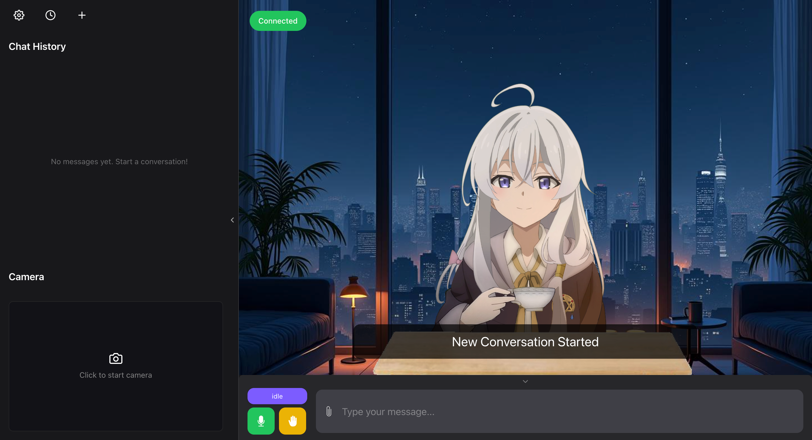
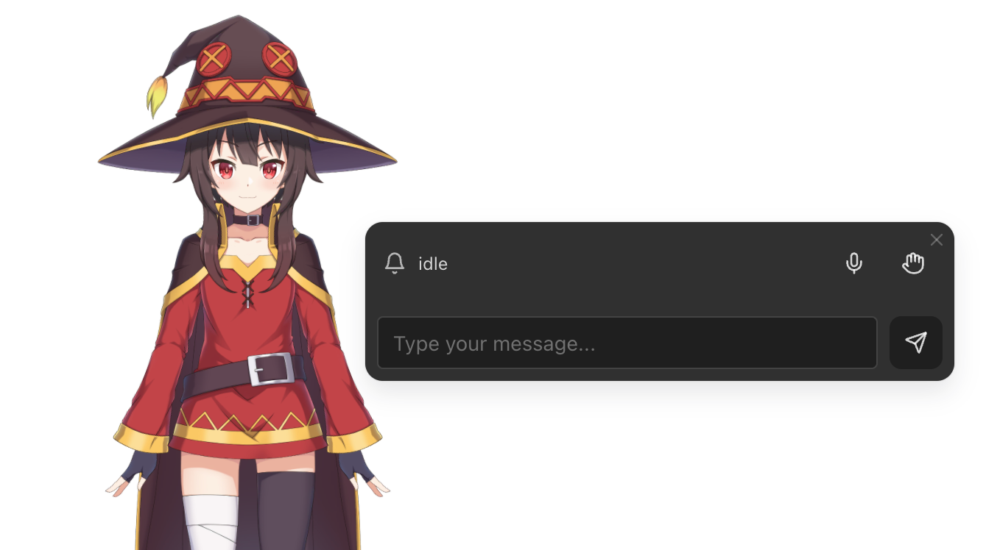

# 模式介绍

Open LLM VTuber 提供了三种使用模式，以满足不同用户的需求：[Web 模式](web-window-mode)、[窗口模式](web-window-mode)和[桌宠模式](pet-mode)。Web 模式需要通过部署或访问他人部署的网页链接来使用。

三种模式都使用 localStorage 来存储用户的个性化设置。

窗口模式和桌宠模式是基于 Electron 应用的两个模式，支持 Windows 和 Mac 系统，但暂时不支持移动设备。你可以直接从 Github Release 下载对应平台的安装包（推荐），或者下载源码进行测试或打包。

Window 模式和 Pet 模式共享上下文，这意味着你可以在两种模式之间任意切换的同时，保持当前的设置、状态、和连接不变。

:::note 详细说明

关于每种模式的具体使用方法和功能特性，请参考
- [Web 模式 使用指南](./web.md)
- [窗口&桌宠模式 使用指南](./electron.md)
:::

## Web 模式

Web 模式是一个独立的网页版本，通过部署后，无需安装即可在任何平台的现代浏览器中在线使用。

:::tip 浏览器选择
为确保最佳体验，建议使用 Google Chrome 浏览器访问
:::

:::warning 关于 iOS
iOS 禁止浏览器播放音频，需要不断点击才能使说话功能正常运行。
:::

:::warning 远程访问注意事项
当你在远程访问部署的 Web 应用时（即部署服务器与访问设备不在同一台机器上，即使使用相同局域网也视为远程访问），请注意麦克风和摄像头仅能在安全上下文（HTTPS 或 localhost）中使用。详细说明请参考 [MDN Web 文档](https://developer.mozilla.org/zh-CN/docs/Web/Security/Secure_Contexts)。因此，如需在远程设备上正常使用这些功能，你必须为 Web 服务器配置 HTTPS 协议。
:::

## 窗口模式

窗口模式是桌面客户端的默认显示模式，界面和功能与 Web 模式基本一致。

## 桌宠模式

桌宠模式将角色转变为背景透明、全局置顶、自由拖拽的桌面伴侣，提供更加沉浸的体验。

