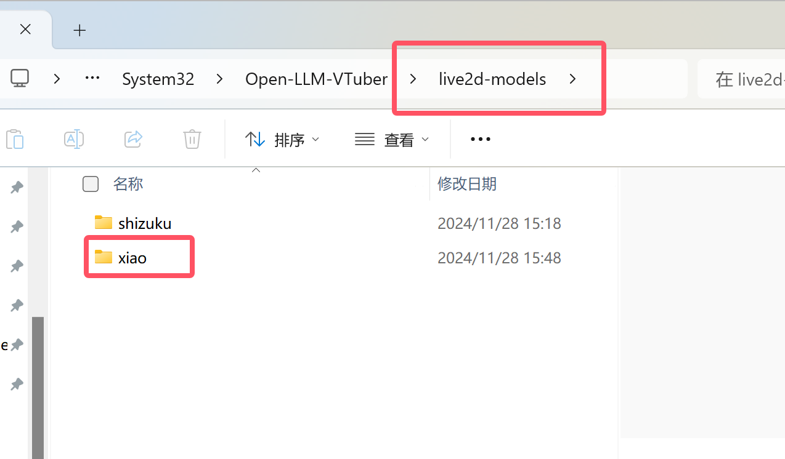
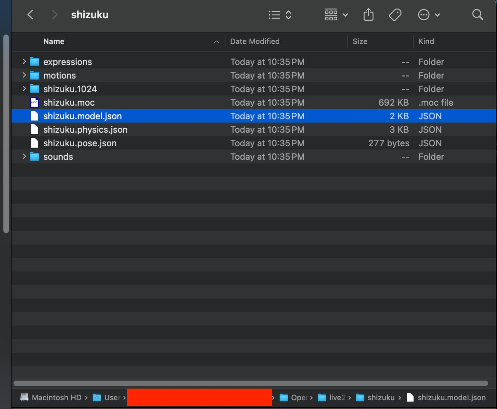
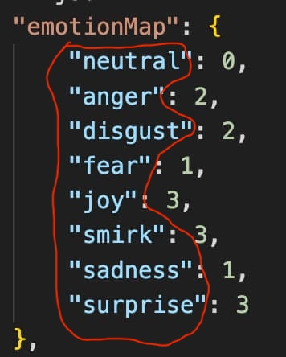
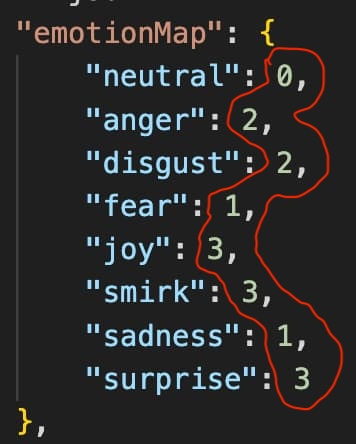
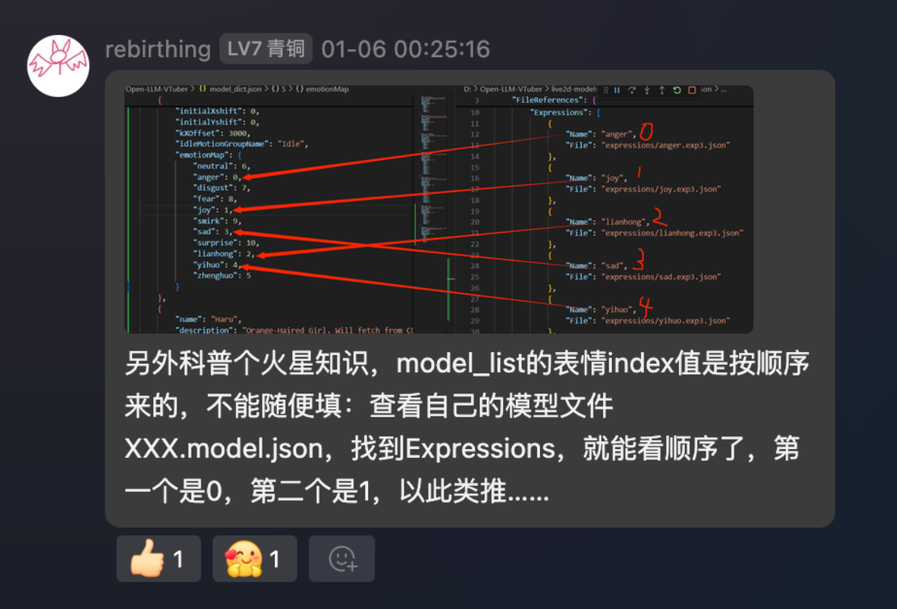

# Live2D 修改指南

## 概览：

总体来说，往项目中添加新的 live2d 模型，要进行以下几个操作:

1. 将 live2d 模型文件放在 `live2d-models` 文件夹中。
2. 往 `model_dict.json` 文件中添加 live2d 模型的相关信息。
3. 在 `conf.yaml` (或是 `characters` 目录下的角色设定文件) 中，指定角色使用的 live2d 模型。



conf.yaml文件中的模型改成对应的模型文件夹名字：

## 步骤1: 将 live2d 模型文件放在 `live2d-models` 文件夹中

本项目中的 Live2D 模型文件都存放在 `live2d-models` 文件夹中。请把你的 Live2D 模型文件放到这个目录下。


## 步骤2: 前往 `model_dict.json` 文件中添加 live2d 模型的相关信息

`model_dict.json` 文件中，包含了这个项目所有 Live2D 的配置。包括模型名，模型文件路径，缩放大小，中心位置以及表情定义等等内容。

这里，我们以 `shizuku` 的模型为例:

```json
{
    "name": "shizuku-local",
    "description": "Orange-Haired Girl, locally available. no internet required.",
    "url": "/live2d-models/shizuku/shizuku.model.json",
    "kScale": 0.000625,
    "initialXshift": 0,
    "initialYshift": 0,
    "idleMotionGroupName": "idle",
    "emotionMap": {
        "neutral": 0,
        "anger": 2,
        "disgust": 2,
        "fear": 1,
        "joy": 3,
        "smirk": 3,
        "sadness": 1,
        "surprise": 3
    },
    "tapMotions": {
        "body": {
            "tap_body": 30,
            "shake": 30,
            "pinch_in": 20,
            "pinch_out": 20
        },
        "head": {
            "flick_head": 40,
            "shake": 20,
            "pinch_in": 20,
            "pinch_out": 20
        }
    }
},
```
我们由上往下，逐行解释。

### `name`
- 模型名，这个 Live2D 模型的唯一标识符。可以随便写，建议写不带空格的英文名，避免错误。
- 接下来的步骤中，我们需要在 `conf.yaml` 中，角色设定的设置部分，用这个名字来指定使用的 Live2D 模型。

### `description`
- 这个 Live2D 模型的描述。告诉你这模型大概长啥样。程序上没什么用，可以不填。

### `url`
- 模型的 `model.json` 文件的位置。

请观察你的 Live2D 模型文件的目录 (Live2D 模型是个文件夹)。
以 `shizuku` 模型为例


可以看到，模型目录下有个叫做 `shizuku.model.json` 的文件。这个文件的路径，就是我们要填写在 `url` 中的内容。

上面的 `shizuku` 例子中填写的路径，实际上是相对路径。

`/live2d-models/shizuku/shizuku.model.json`

`/live2d-models/` 是本项目存放 Live2D 模型的位置 (就是刚刚让你放模型的位置)。

如果你想使用的 Live2D 模型文件在一个 url 上，你也可以在这里填写 `xxx.model.json` 的 url。

#### 碎碎念

至于为什么叫 `url`，是因为项目早期只支持填写网址来添加 Live2D 模型。后来才添加了本地模型文件的支持。

(还有其实这个 `model_dict.json` 的结构是从[其他开源项目](https://github.com/SchwabischesBauernbrot/unsuperior-ai-waifu)偷过来的。当然，我做了一些修改。不过 MIT 协议开源的项目能叫偷吗！)

### `kScale`

控制 Live2D 的初始大小。

你可能已经知道，在前端页面，滚动滚轮可以直接调整 Live2D 模型的大小。

kScale 可以确保 Live2D 初始化时就是正确的大小。

我推荐你先使用实例中的数值或是随便填一个数值，之后如果觉得太大或太小再做调整。


### `initialXshift` 和 `initialXshift`

控制 Live2D 模型的初始位置。

你可能知道，在前端页面，可以直接拖动 Live2D 模型来改变其位置。

Live2D 模型一般来说会被放在中间，但每个 Live2D 模型的位置不一样(...)。这两个数值可以调整 Live2D 模型的预设位置。默认是 (0, 0) (中心)。如果你发现 Live2D 模型的位置有点怪，可以用这两个数值调整。

### `idleMotionGroupName`

Live2D 待机动画的动作组。基本不用管。

Live2D 模型的动作动画一般会被分成一些动作组。待机动作一般是从一堆放在 `idle` (或是 `Idle`，该死的 Live2D) 组里面的动作随机选一个播放的。不需要修改，除非你知道自己在做什么。

### `emotionMap`

本文档的重点。

`emotionMap` 是个描述 Live2D 表情的字典。

看看这个例子:

```json
"emotionMap": {
    "neutral": 0,
    "anger": 2,
    "disgust": 2,
    "fear": 1,
    "joy": 3,
    "smirk": 3,
    "sadness": 1,
    "surprise": 3
},
```
#### 表情关键字

左侧的文字，比如 `neutral`, `anger` 等等，是表情的关键字。AI会阅读这些关键字，并透过使用这些关键字来做表情。

举个例子。当AI 想要使用愤怒表情时，他会说出这样的句子:
```
噢，该死的！[anger] 你说的这番话简直比约翰森叔叔家的鸡蛋豆腐面还要难以下咽。
```
当程序识别到 `[anger]` 这个关键字时，就会让 Live2D 模型做愤怒的表情。

由于这些关键字是AI 对这个表情的所有理解 (AI 看不到自己做的表情具体长啥样)，所以请写的具体些，简单些，好理解些。比如，如果你写了类似 `oesivr934ri` 之类的表情关键字，AI 会不知道这是什么表情。由于 AI 需要一字不漏，正确的写出这些表情关键字，请避免写句子或是把关键字写的过于长。

#### 表情索引数字


右侧的数字是 Live2D 表情的索引，这个数字是对应表情在 Live2D 模型中的索引值。前端将会使用这个索引调用表情。




## 步骤3: 在角色设定中设定 Live2D 模型

前往 `conf.yaml` 文件，把 `live2d_model_name` 选项设置成你上面写在 `model_dict.json` 中的 `name`。

完成。现在你已经成功自定义 Live2D 模型了。
