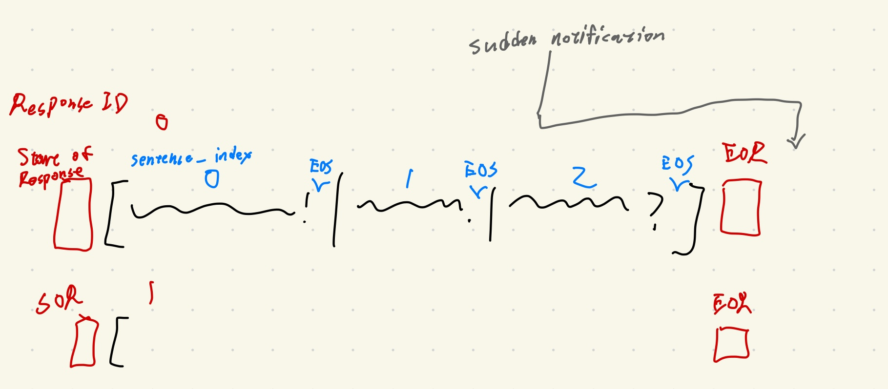
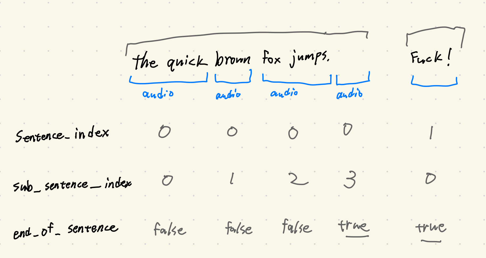

# tts

This page describes the new TTS API after the **Streaming TTS** feature was implemented in the project. It is expected to be released in version 1.3.0.



The logic for transmitting audio chunks at a granularity finer than a sentence.


  - If TTS streaming is enabled, the interaction flow resembles the diagram on the left. The final audio pack will be empty.
  - If TTS streaming is disabled, then each audio packet represents a complete sentence, so the `end_of_sentence` flag in each audio pack is true.

Concepts:

  - **Response**: A complete reply generated by the LLM in one turn, typically containing multiple sentences. (Red text in the diagram above)
      - A response has distinct start and end signals. The end signal might arrive out of order, but it at least informs the frontend of the index of the final sentence.
      - If the `response_id` is empty (None), it's treated as a response containing only a single sentence.
  - **Sentence**: A sentence belonging to a specific response. (Blue text in the diagram above)
      - The correct playback order of sentences is determined by `sentence_index`.
      - `sentence_index` starts from 0.
      - Sentences may arrive out of order.
      - When TTS streaming is enabled, a sentence consists of multiple audio chunks; otherwise, it has only one.
      - Each sentence concludes with an end-of-sentence (EOS) signal. For non-streaming TTS, the audio chunk itself serves as this signal. More details below.
  - **Audio**: Audio chunk data packet.
      - When TTS streaming is enabled, it's an audio chunk. When disabled, it's the complete audio for a sentence. In either case, the audio chunk is always a directly playable WAV audio file.

### Audio Data Packet

The audio data packet structure is as follows:

```json
{
  "type": "audio",
  "response_id": "iso8601-timestamp_uuid4[:8]", // NEW parameter
  "audio": null, // wav in base64
  "sentence_index": sentence_index, // NEW parameter
  "sub_sentence_index": sub_sentence_index, // NEW parameter
  "end_of_sentence": false,
  "volumes": [], // Root Mean Square (RMS) every 20ms. Used to control l2d lipsync.
  "slice_length": chunk_length_ms, // constant, 20ms
  "display_text": display_text, // subtitle displayed
  "actions": actions.to_dict() if actions else None,
  "forwarded": forwarded,
}
```

`response_id`: Indicates which response this audio belongs to. The format is an ISO 8601 timestamp followed by an underscore and the first eight characters of a UUIDv4.

  - `f"{datetime.now().isoformat()}_{str(uuid.uuid4())[:8]}"`
  - If `response_id` is `null`, it means this audio doesn't belong to any specific response group; it should simply be queued for playback after the current response block. Currently, `response_id` being `null` is likely only used in the `_handle_audio_play_start` function within `websocket_handler.py`. This is used to display messages from other AI group members in the subtitles without playing them back.

`sentence_index`: Determines which sentence this audio belongs to.

`sub_sentence_index`: Determines the position of this audio slice within the sentence. For non-streaming TTS, this index is always 0.

`end_of_sentence`: Indicates whether this audio chunk is the last one for the sentence. For non-streaming TTS, this value is always `true` (because a sentence only has one audio packet, the one containing data has `end_of_sentence` set to `true`).

We send a separate signal to indicate the end of a sentence:

```json
{
  "type": "audio",
  "response_id": "iso8601-timestamp_uuid4", // NEW parameter
  "sentence_index": sentence_index,
  "sub_sentence_index": sub_sentence_index, // NEW parameter
  "end_of_sentence": true
}
```

### Control Signals

**Start of response**

```json
{
    "type": "control",
    "text": "start-of-response",
    "response_id": "iso8601-timestamp_uuid4[:8]"
}
```

  - When the LLM starts generating, a `start-of-response` signal is sent to allow the frontend to pre-allocate space for this response's audio.
  - The frontend plays back responses in the order their space was allocated. Inside a response, there will be many audio packs which may arrive out of order, but the responses themselves are processed sequentially (ordered relative to each other).
  - A "response" refers to a complete answer from the LLM, potentially containing many sentences and paragraphs. The purpose of segmenting into responses is to help the frontend manage audio ownership and playback order.
  - If a response is interrupted, the pre-allocated space for it is discarded, and no further audio related to this response is accepted.

**End of response**

```json
{
    "type": "control",
    "text": "end-of-response",
    "response_id": "iso8601-timestamp_uuid4[:8]",
    "sentence_index": sentence_index,
}
```

  - *Arrives before all messages for the response have finished sending.* The `sentence_index` tells the frontend the total number of sentences expected within this response.
  - The `sentence_index` here indicates the position of this `end-of-response` signal relative to the sentences within the response (it comes *after* the last sentence). So, if the `sentence_index` of the last actual sentence in the response is `n`, this end-of-response signal's `sentence_index` will be `n+1`.
  - Its purpose is to signal to the frontend when it can release the exclusive playback lock for this response block, knowing that all sentences up to the indicated index have either arrived or been finalized.