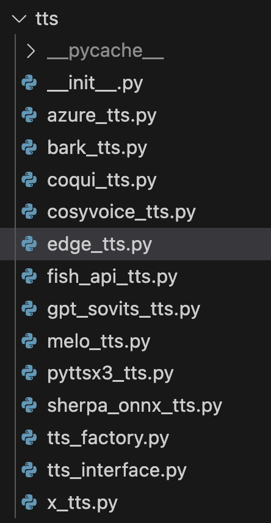

# TTS


# How to Add New TTS Support?

:::info
tim: TTS installation is always the most difficult step in adding TTS support. The second most difficult is getting others to install this TTS as well.
:::

The steps to add TTS are relatively fixed and do not require a deep understanding of the Open-LLM-VTuber project code, so it is relatively suitable for newcomers to familiarize themselves with the project (Pull Requests are also easier to merge).

## 0. Overview

### 0.1 Requirements
- Open-LLM-VTuber version higher than `v1.0.0`.
- Ability to write Python (though you'll know if you can as you follow the steps below. You can learn as you go)
- Basic understanding of GitHub open source workflow. Specifically, understanding the concepts of fork and Pull Request.
- Understanding of how to use uv to manage Python project dependencies. (If you don't know uv, [learn here](https://docs.astral.sh/uv/getting-started/features/#projects))
- A little knowledge of Pydantic (or... AI knowledge is fine too)

### 0.2 Step Overview

:::info
This project directory follows the src structure, with all backend code stored in the `src/open_llm_vtuber` directory. The `tts` and `config_manager` mentioned later are both in the `src/open_llm_vtuber` directory.

Frontend code references, configuration files, a very small amount of code and other non-code files are stored in the project root directory.
:::

#### Development
1. Add new TTS implementation to the `tts` directory
2. Add code to initialize your implemented tts class in the `tts_factory` factory class.
3. Add tts configuration items in `conf.yaml` and `conf.CN.yaml` files
4. Add the configuration related to your tts to the configuration file data validation code in the `config_manager/tts.py` file.

#### Testing
1. Switch to your tts implementation and test it, ensuring it works normally with empty input and strange punctuation.
2. Organize the code and submit a pull request

#### Documentation
1. Please go to [User Guide/Backend User Guide/Text-to-Speech (TTS)](https://github.com/Open-LLM-VTuber/open-llm-vtuber.github.io/blob/main/docs/user-guide/backend/tts.md), edit the source code of the TTS documentation and add installation guide for the TTS you implemented.
- If you encounter difficulties at this step, you can contact me directly, and I can help you add the documentation to the documentation website (but you need to write the installation guide yourself!)

## 1. Development:

### 2.1 Add new TTS implementation to the `tts` directory

Go to the `src/open_llm_vtuber/tts` directory.



There are several important files in the directory:

`tts_interface.py`
- This is the interface class for the tts class. All tts must inherit from this interface.

`tts_factory.py`
- The factory class for tts. The backend will use configuration items to call this factory class to initialize tts and get tts instances.

The remaining files are implementations of tts supported by the project. I recommend referring to the implementation of `edge_tts.py`, which is also the default tts for the project.

Please refer to `tts_interface.py` and other tts implementations to add new tts.

You can choose to implement either `async_generate_audio` or `generate_audio`. The project backend is mainly asynchronous code. In `tts_interface.py`, if you choose to implement the synchronous `generate_audio` function, the `async_generate_audio` function will wrap the `generate_audio` function into an asynchronous function.

The `generate_audio` function will not be called externally, so if your tts supports asynchronous operations, you can only implement the `async_generate_audio` function.

#### Input Values
You will most likely want to get some parameters from the configuration file when initializing this tts class to customize some options like voice and language. Please write these configurable parameters as parameters of the constructor.

### 2.2 Add code to initialize your implemented tts class in the `tts_factory` factory class.

Go to the `tts_factory.py` file and add initialization logic for the new tts in the `get_tts_engine` function.

The `get_tts_engine` function will be called by external logic and return an instance of tts.

- `engine_type` indicates what the user wrote in the `tts_model` option in `conf.yaml`, which is the choice of tts.
- `kwargs` is a dictionary containing the configuration under `tts_config` for this `tts_model` in `conf.yaml`.

For example:

```yaml
  tts_config:
    tts_model: "edge_tts"
    # text to speech model options:
    #   "azure_tts", "pyttsx3_tts", "edge_tts", "bark_tts",
    #   "cosyvoice_tts", "melo_tts", "coqui_tts",
    #   "fish_api_tts", "x_tts", "gpt_sovits_tts", "sherpa_onnx_tts"

    azure_tts:
      api_key: "azure-api-key"
      region: "eastus"
      voice: "en-US-AshleyNeural"
      pitch: "26" # percentage of the pitch adjustment
      rate: "1" # rate of speak

    bark_tts:
      voice: "v2/en_speaker_1"

    edge_tts:
      # Check out doc at https://github.com/rany2/edge-tts
      # Use `edge-tts --list-voices` to list all available voices
      voice: "en-US-AvaMultilingualNeural" # "en-US-AvaMultilingualNeural" #"zh-CN-XiaoxiaoNeural" # "ja-JP-NanamiNeural"
```

When `tts_model` is set to `edge_tts`:
- The input value of `engine_type` will be `edge_tts`.
- `kwargs` will be a dictionary like this:
```python
{"voice": "en-US-AvaMultilingualNeural"}
```

### 2.3 Add tts configuration items in `conf.yaml` and `conf.CN.yaml` files

Go to `conf.yaml` and `conf.CN.yaml` (Chinese version of conf.yaml by default), and add configuration items needed for the new tts to `tts_config`.

### 2.4 Add the configuration related to your tts to the configuration file data validation code in the `config_manager/tts.py` file.

Since version `v1.0.0`, the project has introduced Pydantic-based configuration file data validation, so if we want to add configurable options in `conf.yaml`, we need to modify the corresponding Pydantic model.

Go to the `src/open_llm_vtuber/config_manager/tts.py` file. Refer to other tts implementations, add configuration classes in tts.py, and add tts to `TTSConfig` at the bottom.

## 3. Testing and Submitting Code

Test the tts you added, confirm that the project can run normally, and all configuration items can be used normally.

Then use the `uv run ruff format` command in the command line to format the code.

After that, you can submit a pull request.

:::danger
Please put default options in the `conf.yaml` and `conf.CN.yaml` files. Please do not randomly change other options in the configuration files.
:::

:::danger
Please do not push your own API key to the branch. Please check the code you are about to submit before submitting.
:::

## 4. Supplementary Documentation

Please go to [User Guide/Backend User Guide/Text-to-Speech (TTS)](https://github.com/Open-LLM-VTuber/open-llm-vtuber.github.io/blob/main/docs/user-guide/backend/tts.md), edit the source code of the TTS documentation and add installation guide for the TTS you implemented.

Note that our documentation is available in both Chinese and English. If possible, you can complete one language first and then use AI to translate it into the other language.
