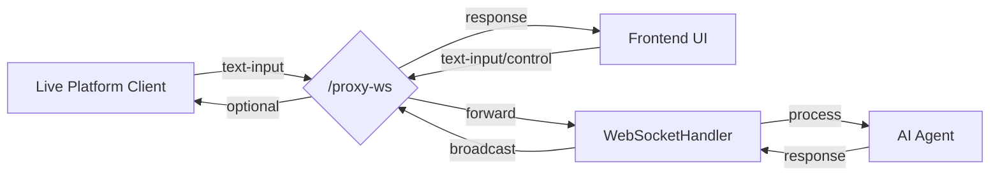

# Live Streaming Development

:::info Architecture Overview
The live streaming integration in this project adopts a **separate process** architecture, relying on a **WebSocket proxy endpoint (`/proxy-ws`)**.

- **Live Platform Client (Independent Process)**: Connects to specific live streaming platforms (like Bilibili), monitors events (such as danmaku/comments).
- **Open-LLM-VTuber Main Process**: Runs AI, TTS, and other core services.
- **Frontend UI (User Interface)**: Displays the Live2D model, receives user (the room admin) input, plays audio, etc.



- Live Platform Client: Live platform client (e.g., Bilibili) sends comments to the proxy (formatted as text-input)
- Frontend UI: Front-end interface also sends user input and control messages to the same proxy
- /proxy-ws: Core proxy endpoint, receives all messages and handles forwarding and broadcasting
- WebSocketHandler: Processes messages and interacts with AI
- AI Agent: Generates responses
- AI responses are ultimately broadcast via the proxy to all connected clients (including the frontend and live platform client)

For live comments to be processed by the AI, and for AI responses to be correctly displayed in the frontend, **all clients (including the frontend UI and live platform client) must connect to the same `/proxy-ws` endpoint**.

**The Role of `/proxy-ws` (`ProxyHandler`):**
- **Unified Entry Point:** Provides a single connection point for all types of clients.
- **Message Routing:** Receives messages from all clients and processes or forwards them to the `WebSocketHandler` based on type (e.g., `text-input`, `interrupt-signal`, etc.).
- **Message Queue:** Queues `text-input` type messages (from frontend or live platform) to ensure AI responds sequentially.
- **State Synchronization:** Manages connection states, such as marking whether a conversation is active (`conversation_active`).
- **Broadcasting:** Broadcasts messages from the backend `WebSocketHandler` (such as AI responses, status updates) to all connected clients.

:::

## 1. Core Components and Data Flow

Using Bilibili live streaming as an example, here's the complete flow from **comment input** to **AI response** (assuming both the frontend and Bilibili client are connected to `/proxy-ws`):

1.  **Viewer** -> **Bilibili Server**: Sends a comment.
2.  **Bilibili Server** -> **`run_bilibili_live.py` (Independent Process)**: The `blivedm` library receives the comment event.
3.  **`run_bilibili_live.py`** -> **`/proxy-ws` (Main Process)**: `BiliBiliLivePlatform` formats the comment as `{"type": "text-input", "text": "comment content"}` and sends it to `/proxy-ws` via WebSocket.
4.  **`/proxy-ws` (`ProxyHandler`)** -> **`ProxyMessageQueue`**: `ProxyHandler` receives the message and, because its type is `text-input`, places it in the message queue (`ProxyMessageQueue`).
5.  **`ProxyMessageQueue`** -> **`ProxyHandler.forward_to_server`** -> **`WebSocketHandler`**: When it's this message's turn to be processed, the queue retrieves it and sends it to `WebSocketHandler` via `forward_to_server`.
6.  **`WebSocketHandler`** -> **ConversationHandler**: Receives the `text-input` message, triggering conversation processing logic (`_handle_conversation_trigger`).
7.  **ConversationHandler** -> ... -> **`WebSocketHandler`**: AI returns response text stream.
8.  **`WebSocketHandler`** -> **`/proxy-ws` (`ProxyHandler`)**: Sends the processed results (text, audio, instructions, etc.) back to `ProxyHandler` for broadcasting.
9.  **`/proxy-ws` (`ProxyHandler`)** -> **All Connected Clients (including Frontend UI)**: `ProxyHandler` calls `broadcast_to_clients` to broadcast the AI's response to all clients connected to `/proxy-ws`.

## 2. Key Interfaces and Implementations

### 2.1 `LivePlatformInterface` (Interface Definition)

(Located in `src/open_llm_vtuber/live/live_interface.py`)

An abstract base class that all live platform client implementations must adhere to. The core requirement is to implement the `connect` method to connect to the **proxy endpoint `/proxy-ws`**, and implement the `run` method to monitor platform events and format them as **`{"type": "text-input", ...}`** before sending them to the proxy via `_send_to_proxy`.

### 2.2 WebSocket Proxy (`/proxy-ws` and `ProxyHandler`)

(Endpoint defined in `src/open_llm_vtuber/routes.py`, implemented in `src/open_llm_vtuber/proxy_handler.py`)

**Core component**, responsible for:
- Receiving messages from **all** connected clients (frontend UI, live platform clients).
- Queuing `text-input` messages before forwarding them to `WebSocketHandler`.
- Directly forwarding other control messages to `WebSocketHandler`.
- **Broadcasting** responses from `WebSocketHandler` to all connected clients.

### 2.3 `BiliBiliLivePlatform` (Bilibili Implementation Example)

(Located in `src/open_llm_vtuber/live/bilibili_live.py`)

An implementation of `LivePlatformInterface`. The key is the `_send_to_proxy` method which formats comments as **`{"type": "text-input", ...}`** before sending them to `/proxy-ws`.

### 2.4 Launcher Script (`run_bilibili_live.py`)

(Located in `scripts/run_bilibili_live.py`)

An independent process launcher, responsible for instantiating `BiliBiliLivePlatform` and calling its `run` method, enabling it to connect to `/proxy-ws` and start monitoring Bilibili events.

## 3. Steps to Develop Support for a New Platform

### 3.1 Create Platform Implementation Class

1.  Create a new class `MyPlatformLive` inheriting from `LivePlatformInterface`.
2.  Implement all abstract methods, especially `connect` (connects to `/proxy-ws`) and `run`.
3.  In `run` or its called event handlers, receive platform messages (like comments).
4.  **Implement `_send_to_proxy(self, text: str)`**: **Must** package `text` as `{"type": "text-input", "text": text}` JSON, and send it to the proxy (`/proxy-ws`) via `self._websocket.send()`.

```python
# src/open_llm_vtuber/live/my_platform_live.py (key parts example)
# ... (imports) ...

class MyPlatformLive(LivePlatformInterface):
    # ... (implement __init__, connect, disconnect, run, etc.) ...

    async def _handle_platform_event(self, event_data):
        message_text = event_data.get('message')
        if message_text:
            logger.info(f"Received from My Platform: {message_text}")
            # Call method to send to proxy
            await self._send_to_proxy(message_text)

    async def _send_to_proxy(self, text: str) -> bool:
        if not self.is_connected:
            logger.error("Cannot send message: Not connected to proxy")
            return False
        try:
            # !!! Core: Format as text-input type !!!
            payload = {"type": "text-input", "text": text}
            await self._websocket.send(json.dumps(payload))
            logger.info(f"Sent formatted message to proxy: {text}")
            return True
        except Exception as e:
            # ... (error handling)
            return False

    async def run(self) -> None:
        # Ensure connection to proxy proxy_url = "ws://localhost:12393/proxy-ws"
        # ... (connection logic) ...
        # --- Your platform event monitoring logic --- #
        # while self._running:
        #     event = await my_platform_sdk.get_next_event()
        #     await self._handle_platform_event(event)
        # ----------------------------- #
        # ... (cleanup logic) ...
```

### 3.2 Add Configuration Items

To allow your live platform client to be configured and initialized correctly, you need to:

1.  **Define a Pydantic Configuration Model**: In the `src/open_llm_vtuber/config_manager/live.py` file, create a new configuration class similar to `BiliBiliLiveConfig`. For instance, if your platform requires a `channel_id` and an `api_token`:

    ```python
    # src/open_llm_vtuber/config_manager/live.py
    from pydantic import BaseModel, Field
    from typing import Dict, ClassVar, List # Ensure BaseModel is imported
    from .i18n import I18nMixin, Description

    # ... (BiliBiliLiveConfig definition) ...

    class MyPlatformConfig(I18nMixin): # Inherit I18nMixin (optional, for i18n descriptions)
        """Configuration for My Platform Live integration."""
        channel_id: str = Field("", alias="channel_id")
        api_token: str = Field("", alias="api_token")
        # Add other necessary configuration items with default values

        DESCRIPTIONS: ClassVar[Dict[str, Description]] = {
            "channel_id": Description(en="Channel ID for My Platform", zh="My Platform 的频道 ID"),
            "api_token": Description(en="API Token for My Platform", zh="My Platform 的 API Token"),
        }

    class LiveConfig(I18nMixin):
        """Configuration for live streaming platforms integration."""
        bilibili_live: BiliBiliLiveConfig = Field(
            default_factory=BiliBiliLiveConfig, alias="bilibili_live"
        )
        # !!! Add your platform config to LiveConfig !!!
        my_platform: MyPlatformConfig = Field(
            default_factory=MyPlatformConfig, alias="my_platform"
        )
        # ... potentially other platforms ...

        DESCRIPTIONS: ClassVar[Dict[str, Description]] = {
            "bilibili_live": Description(
                en="Configuration for BiliBili Live platform", zh="B站直播平台配置"
            ),
            "my_platform": Description(
                en="Configuration for My Platform", zh="My Platform 配置"
            ),
        }
    ```

2.  **Update Default Configuration Files**: In the `conf.default.yaml` and `conf.ZH.default.yaml` files in the project root, add your platform's configuration keys and default values under the `live_config:` section. This informs users about the available settings.

    ```yaml
    # conf.default.yaml / conf.ZH.default.yaml
    live_config:
      bilibili_live:
        room_ids: []
        sessdata: ""
      # Add your platform's configuration
      my_platform:
        channel_id: ""
        api_token: ""
        # Other default values...
    ```

### 3.3 Create Run Script

The run script serves as the entry point for launching your independent live platform client process. You need to create a script similar to `scripts/run_bilibili_live.py`.

1.  Create a new file in the `scripts/` directory, e.g., `run_my_platform_live.py`.
2.  The core logic of the script involves:
    *   Importing necessary modules, including your `MyPlatformLive` class and configuration utilities.
    *   Reading the main configuration file (`conf.yaml`).
    *   Validating the configuration and extracting the specific configuration section for your platform (e.g., `config.live_config.my_platform`).
    *   Instantiating your `MyPlatformLive` class, passing the configuration to it (usually by converting the Pydantic model to a dictionary using `.model_dump()`).
    *   Calling `platform.run()` to start the client.
    *   Including basic asynchronous execution and exception handling logic.

```python
# scripts/run_my_platform_live.py
import asyncio
import sys
import os
from loguru import logger

# Ensure modules from the src directory can be imported
project_root = os.path.abspath(os.path.join(os.path.dirname(__file__), ".."))
sys.path.insert(0, project_root)

# !!! Import your platform implementation class !!!
from src.open_llm_vtuber.live.my_platform_live import MyPlatformLive
from src.open_llm_vtuber.config_manager.utils import read_yaml, validate_config

async def main():
    logger.info("Starting My Platform Live client")
    try:
        # Read the main configuration
        config_path = os.path.join(project_root, "conf.yaml")
        config_data = read_yaml(config_path)
        config = validate_config(config_data)

        # !!! Get your platform's configuration !!!
        my_platform_config = config.live_config.my_platform

        # !!! (Optional) Check if critical configurations exist !!!
        # if not my_platform_config.channel_id or not my_platform_config.api_token:
        #     logger.error("Missing required configuration for My Platform (channel_id or api_token)")
        #     return

        logger.info(f"Attempting to connect to My Platform channel: {my_platform_config.channel_id}")

        # !!! Instantiate your platform client, passing the config !!!
        # Pass the Pydantic model as a dictionary
        platform = MyPlatformLive(config=my_platform_config.model_dump())

        # !!! Start the client !!!
        await platform.run()

    except ImportError as e:
         logger.error(f"Failed to import required modules: {e}")
         # May need to prompt user to install specific dependencies: logger.error("Did you install my_platform_sdk?")
    except Exception as e:
        logger.error(f"Error starting My Platform Live client: {e}")
        import traceback
        logger.debug(traceback.format_exc())

if __name__ == "__main__":
    try:
        # Run the main function using asyncio
        asyncio.run(main())
    except KeyboardInterrupt:
        # Graceful shutdown
        logger.info("Shutting down My Platform Live client")
```

### 3.4 Run and Test

1.  Install dependencies.
2.  Configure `conf.yaml`.
3.  Start the main program (`uv run run_server.py`).
4.  **Ensure the frontend UI connects to `/proxy-ws`** (modify the WebSocket URL in frontend settings).
5.  In another terminal, start the platform script (`uv run python scripts/run_my_platform_live.py`).
6.  Send a message on the live platform, observe the main program logs and the **frontend UI's response**.
