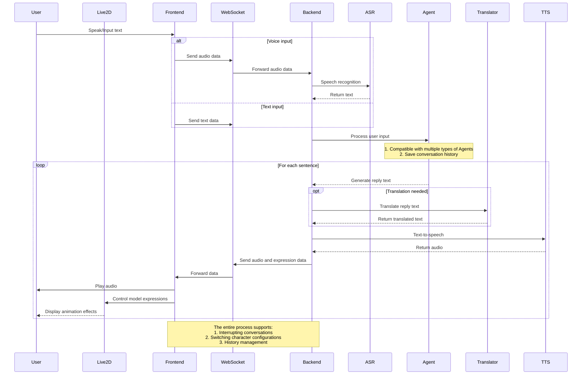

# Backend Architecture Overview

## Core Component Interaction Flow



## Code Structure

```
├── background/                # Background image resource directory
├── characters/               # Character configuration file directory
├── frontend/                # Frontend page file directory
├── live2d-models/           # Live2D model resource directory
├── logs/                    # Log file directory
├── models/                  # AI model file directory
├── prompts/                 # Prompt template directory
│   ├── presona/            # Character persona prompts
│   ├── utils/              # Utility prompts
│   └── prompt_loader.py    # Prompt loader
├── src/                     # Source code directory
│   └── open_llm_vtuber/    # Main code package
│       ├── agent/          # AI dialogue agent module
│       │   ├── agents/     # Different types of dialogue agent implementations
│       │   └── stateless_llm/  # Stateless LLM interface implementation
│       ├── asr/            # Speech recognition module
│       ├── tts/            # Text-to-speech module
│       ├── chat_history_manager.py  # Chat history manager
│       ├── conversation.py          # Conversation management
│       ├── live2d_model.py          # Live2D model manager
│       ├── routes.py                # FastAPI route definitions
│       ├── server.py                # WebSocket server
│       └── service_context.py       # Service context manager
├── conf.yaml                # Default configuration file
└── run_server.py           # Startup script
```
