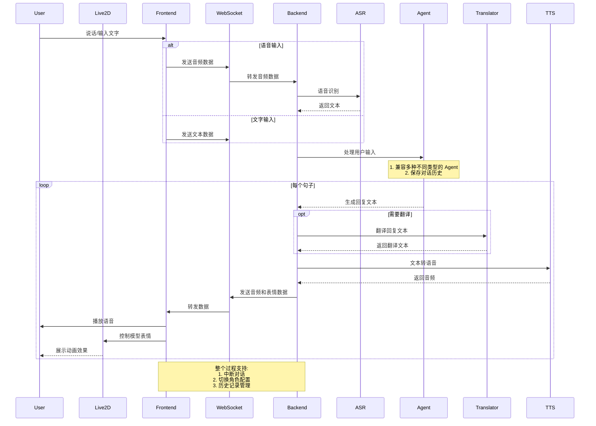

# 后端架构概览

## 核心组件交互流程



## 代码结构

```
├── background/                # 背景图片资源目录
├── characters/               # 角色配置文件目录
├── frontend/                # 前端页面文件目录
├── live2d-models/           # Live2D 模型资源目录
├── logs/                    # 日志文件目录
├── models/                  # AI 模型文件目录
├── prompts/                 # 提示词模板目录
│   ├── presona/            # 角色人设提示词
│   ├── utils/              # 工具类提示词
│   └── prompt_loader.py    # 提示词加载器
├── src/                     # 源代码目录
│   └── open_llm_vtuber/    # 主要代码包
│       ├── agent/          # AI 对话代理模块
│       │   ├── agents/     # 不同类型的对话代理实现
│       │   └── stateless_llm/  # 无状态 LLM 接口实现
│       ├── asr/            # 语音识别模块
│       ├── tts/            # 语音合成模块
│       ├── chat_history_manager.py  # 聊天历史管理器
│       ├── conversation.py          # 对话管理
│       ├── live2d_model.py          # Live2D 模型管理器
│       ├── routes.py                # FastAPI 路由定义
│       ├── server.py                # WebSocket 服务器
│       └── service_context.py       # 服务上下文管理器
├── conf.yaml                # 默认配置文件
└── run_server.py           # 启动脚本
```

